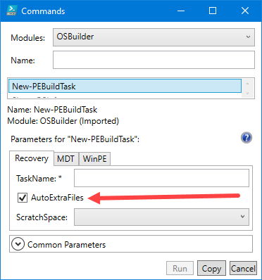
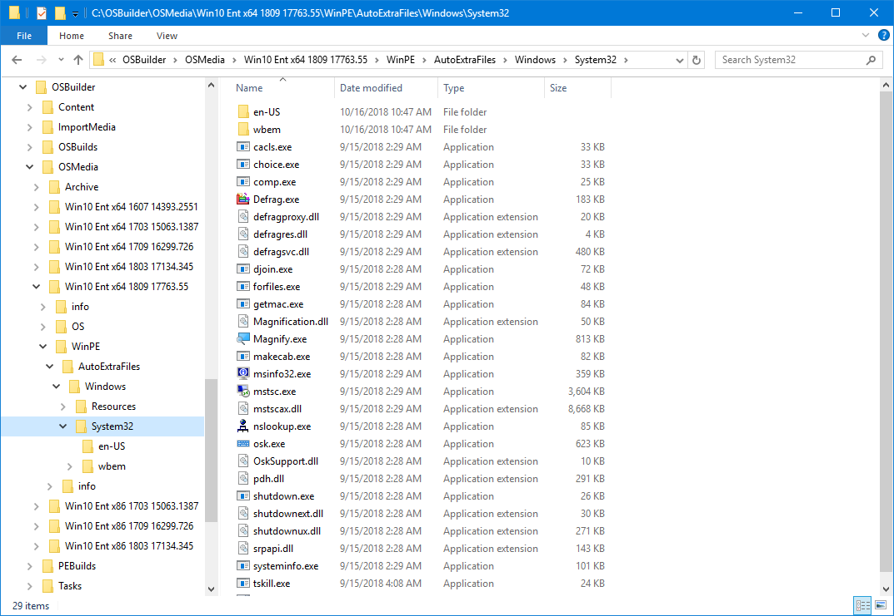
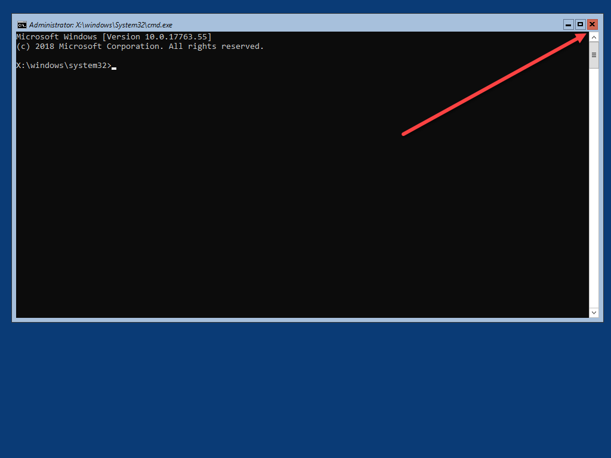
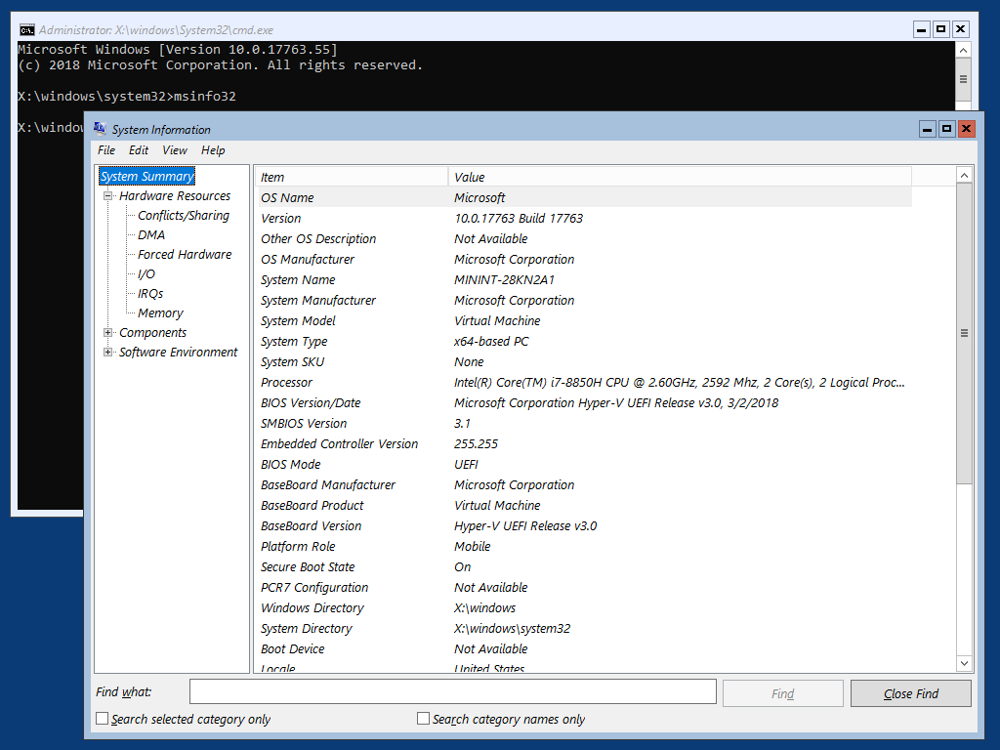
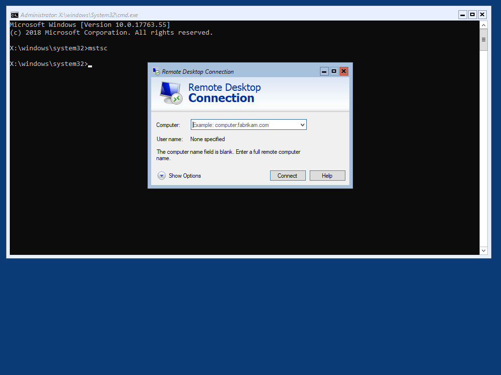
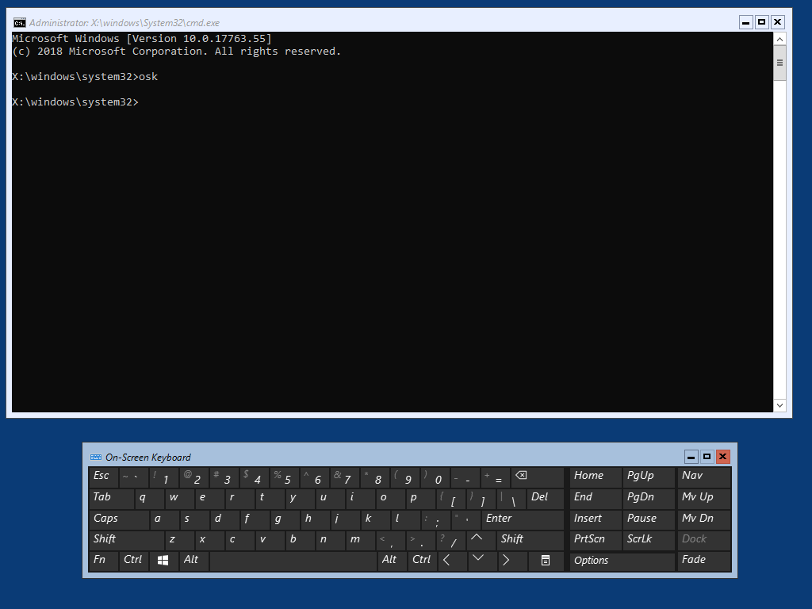
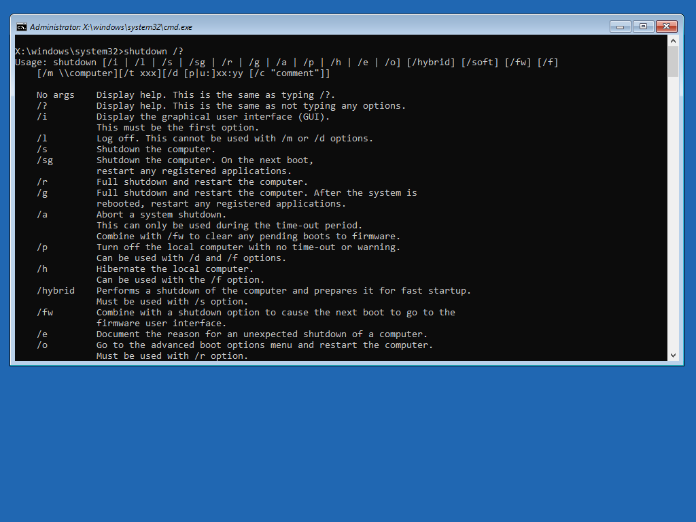
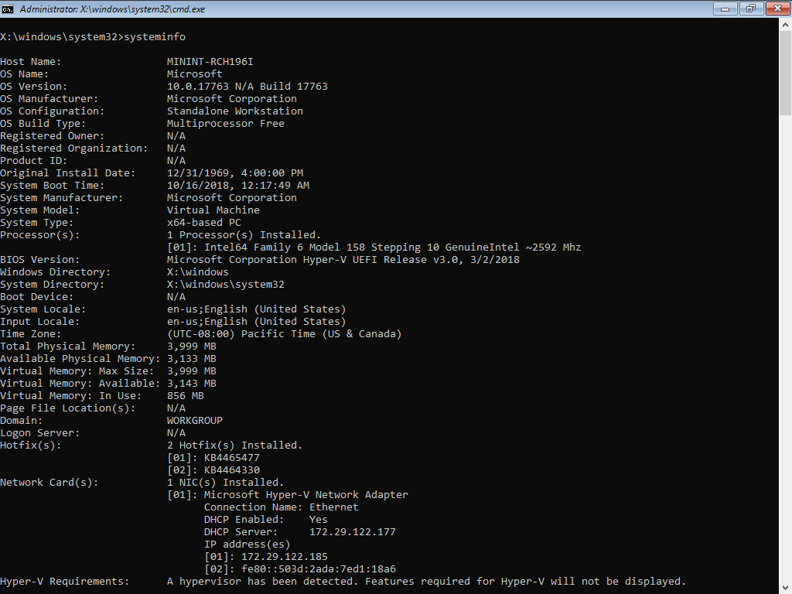
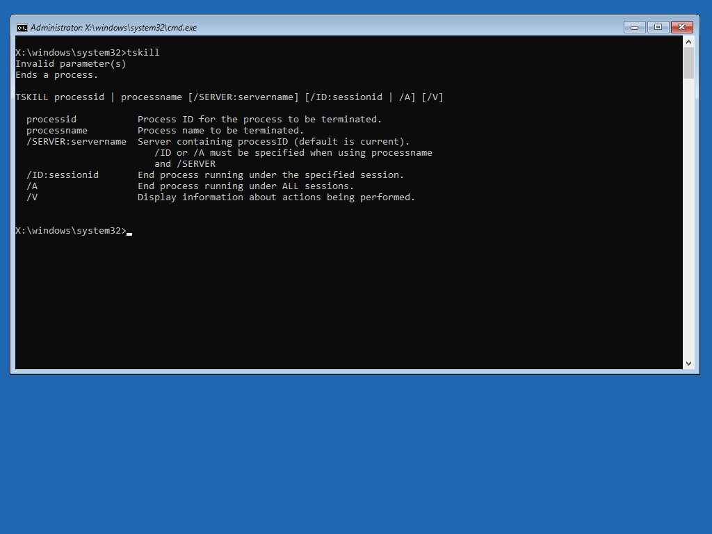
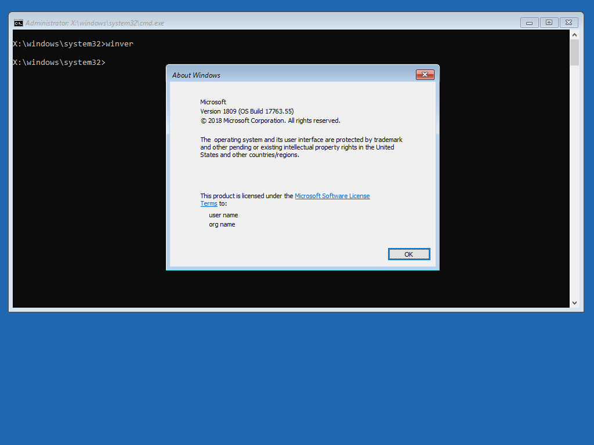

# Auto ExtraFiles

Auto ExtraFiles are files that are copied from a Windows Install.wim during an [**`Import-OSMedia`**](../osmedia/import-osmedia/), [**`Update-OSMedia`**](../osmedia/update-osmedia/), or an [**`New-OSBuildTask`**](../osbuild/new-osbuildtask/).  They are then copied to WinPE\AutoExtraFiles.  The purpose is to inject these files into WinPE when executing a PEBuild Task.


To add Auto ExtraFiles to your already up to date OSMedia, simply run [**`Update-OSMedia`**](../osmedia/update-osmedia/) again.  You will have to manually rename the new OSMedia to remove the random 4 digits at the end of the OSMedia name


##  New-PEBuildTask

When creating a [**`New-PEBuildTask`**](new-pebuildtask/), you will have the option to copy the Auto ExtraFiles to WinPE using the -AutoExtraFiles parameter

## Collected Files

The following files are collected \(contact me if I need to add things\) to be used for Auto ExtraFiles

* AeroLite Theme
* Cacls
* Choice
* Comp
* Defrag
* Djoin
* ForFiles
* GetMac
* MakeCab
* MSInfo32
* MSTSC \(Remote Desktop Connection\)
* OSK \(On Screen Keyboard\)
* Shutdown
* SystemInfo
* TSKill
* WinVer

## WinPE Examples

When adding Auto ExtraFiles to a PEBuild, you will be able to execute the commands in a completed PEBuild.  

