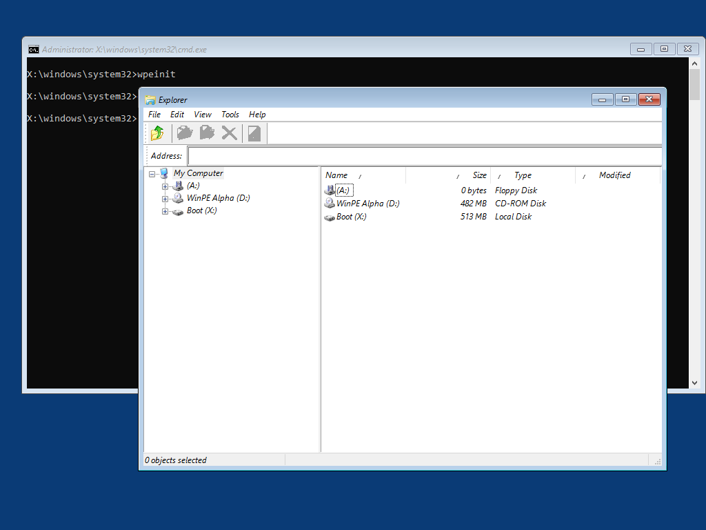
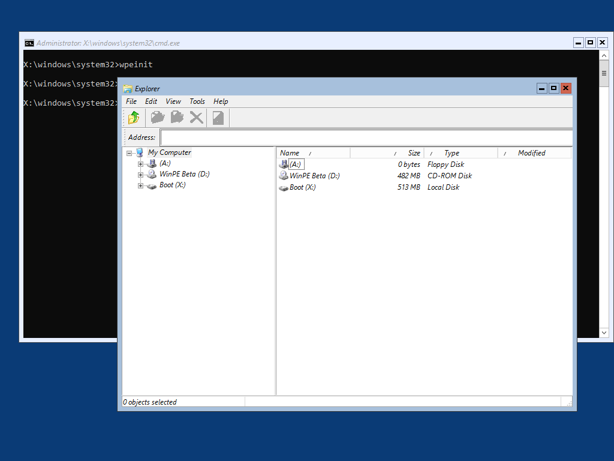

# RegAdd AeroLite Theme



If you are using the Auto ExtraFiles option for creating WinPE, you can change the WinPE Theme from Aero to AeroLite in WinPE by adding this Driver.  With this theme, the Windows will have a flatter Title Bar and Title Bar Buttons.  This is more in line with the Visual Style in Windows 10.

Remember, you need to use Auto ExtraFiles in OSBuilder because **aerolite\*.\*** and **shellstyle\*.\*** need to be added to WinPE

## OSBuilder.Public Repository

This Driver is included in the OSBuilder.Public Repository at: **OSBuilder.Public\Content\WinPE\Drivers\RegAdd AeroLite Theme**



