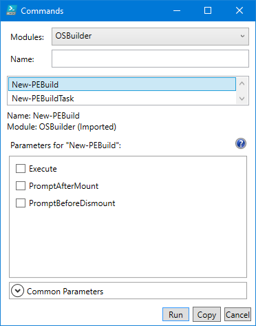
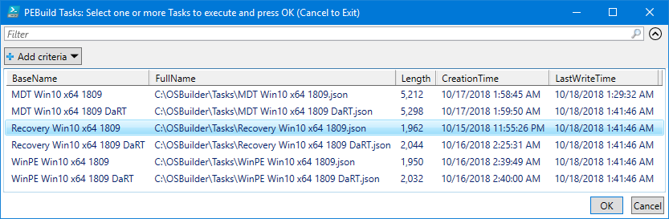
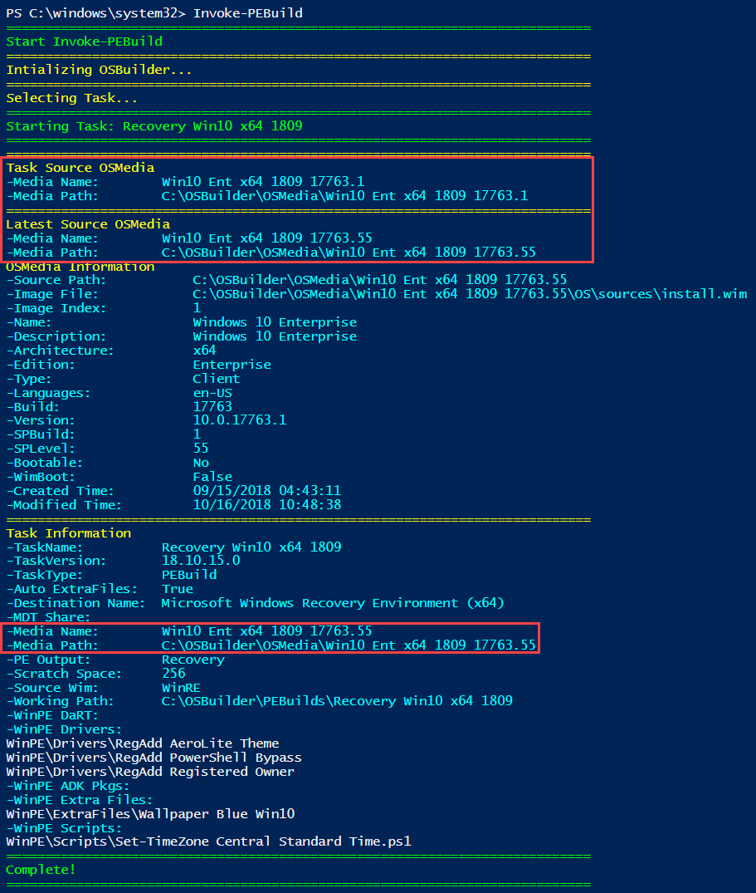
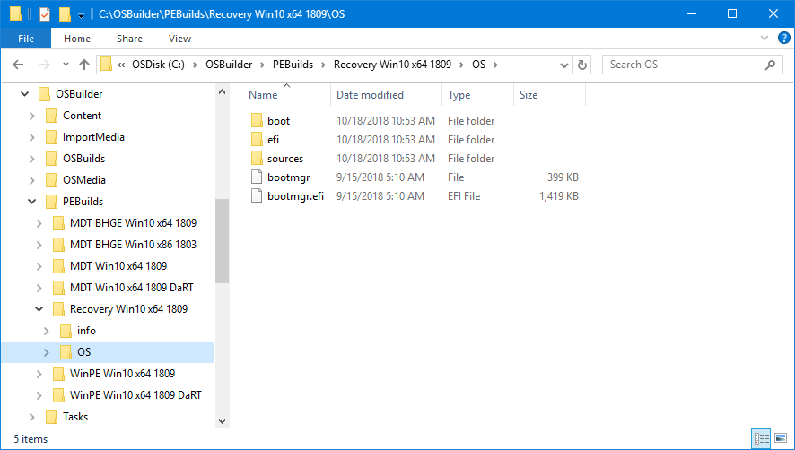
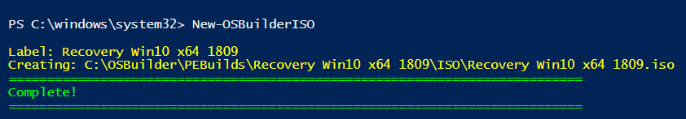
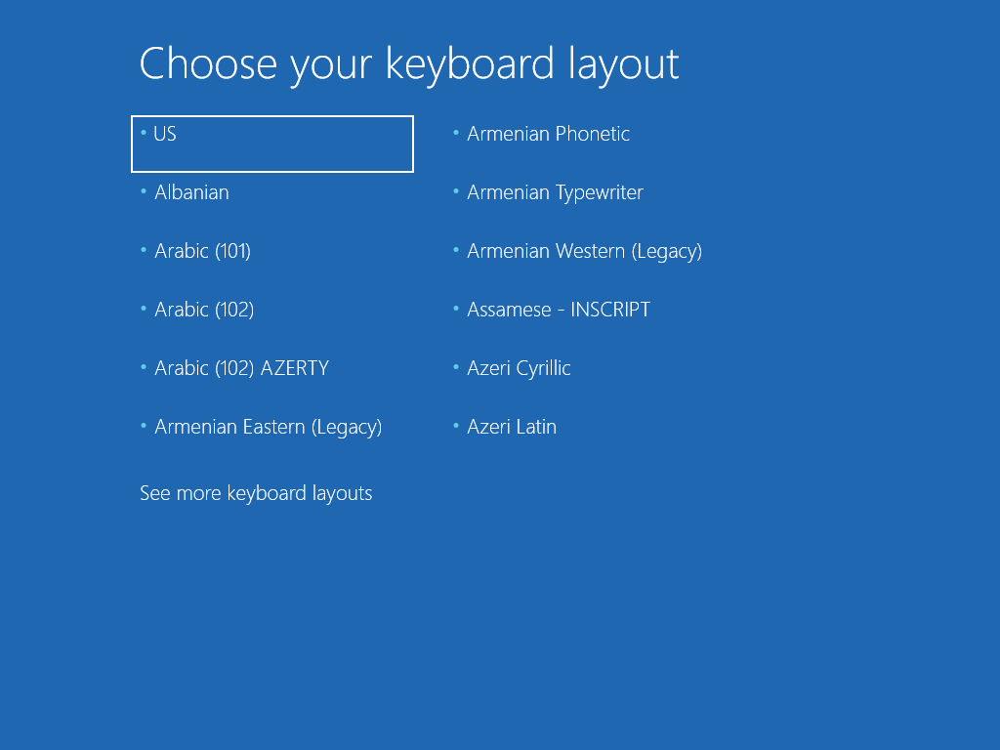

# New-PEBuild

This is used to execute the Task that was created using [**`New-PEBuildTask`**](new-pebuildtask/).  I always recommend running **`New-PEBuild`** without the Execute parameter first, to make sure that everything looks good.

## Select PEBuild Task

You will be prompted to select a Task to process.  You can select multiple Tasks

## PEBuild Information

Since the `Execute` parameter was not selected, we get to see information only on the PEBuild.  One thing that sticks out the most is that the Task was created using Win10 Ent x64 1809 with a UBR or 17763.1, but OSBuilder will look for the latest version of the Operating System.  In this case it has selected the one with a UBR of 17763.55.  So there is no need to modify or change Tasks after they have been created, they should continue to work from month to month.

At the bottom is the Task information where we can see in this case the PE Output is Recovery.

## New-PEBuild -Execute

If everything looks good, run **`New-PEBuild`** again with the Execute Parameter.  Within a few minutes, you have a complete build of WinPE.

## New-MediaISO

You can convert this to an ISO using [**`New-MediaISO`**](../osbuilder/new-osbiso.md).

## Demo

Everything looks good

