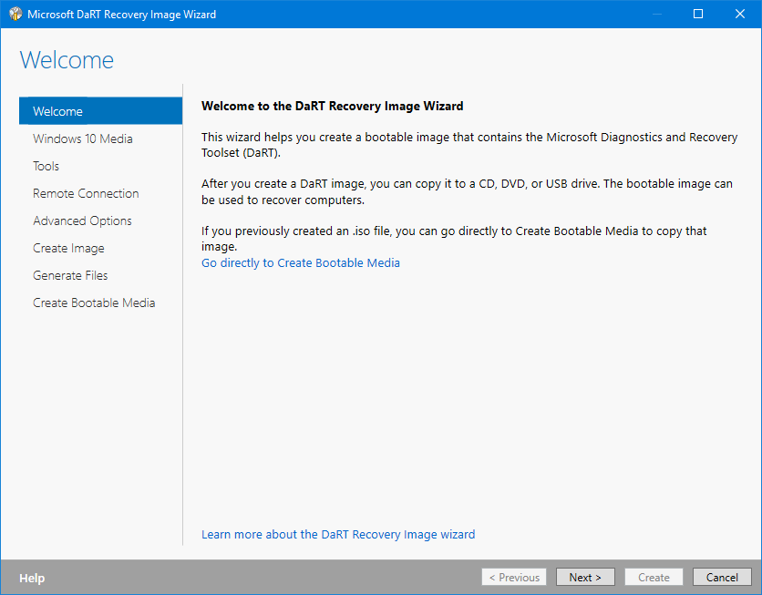

# Recovery DaRT

Microsoft DaRT is also used to create Recovery Image with DaRT integration



## New-PEBuildTask

Before you can create a Recovery DaRT WinPE, you need to create a `New-PEBuildTask`.  WinRE.wim will be automatically used for this Task.  Use the following PowerShell command:

```text
New-PEBuildTask -TaskName "Win10 x64 1809" -AutoExtraFiles -ScratchSpace 256
```

If you have added MS DaRT to OSBuilder, you will be prompted to add it.  When complete, a Task JSON file will be created which can be used with `New-PEBuild`

The Recovery Prefix will be added automatically to the Task Name, so unless you want '**Recovery Recovery Win10 x64 1809**' as your Task Name, just leave it out.

## Task JSON

```text
{
    "TaskName":  "Recovery Win10 x64 1809 DaRT",
    "TaskVersion":  "18.10.15.0",
    "TaskType":  "PEBuild",
    "AutoExtraFiles":  "True",
    "DeploymentShare":  "",
    "MediaName":  "Win10 Ent x64 1809 17763.1",
    "PEOutput":  "Recovery",
    "ScratchSpace":  "256",
    "SourceWim":  "WinRE",
    "WinPEAddADK":  null,
    "WinPEAddDaRT":  "WinPE\\DaRT\\DaRT 10\\Toolsx64.cab",
    "WinPEAddWindowsDriver":  null,
    "WinPEInvokeScript":  null,
    "WinPERobocopyExtraFiles":  null
}
```

## Demo


