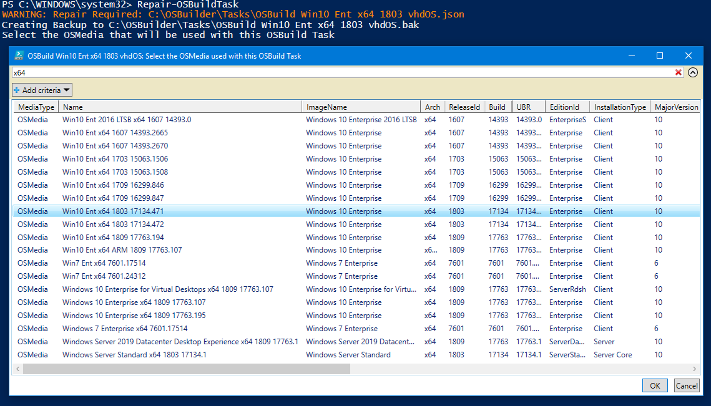
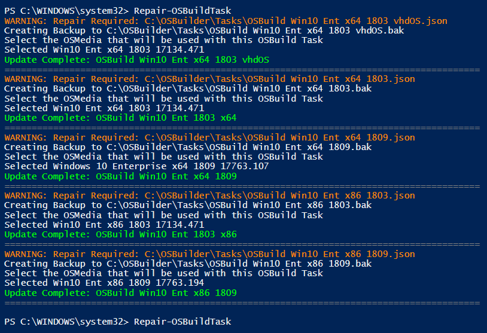

# Repair-OSBuildTask

## Purpose

The purpose of Repair-OSBuildTask is to update an existing OSBuild Task to the current version.  This function requires PowerShell ISE for Gridview to function properly.

## Usage

In PowerShell ISE, simply execute Repair-OSBTask.  You will be prompted to select an existing OSMedia to associate with the OSBuild Task.

This will be repeated for every OSBuild Task that needs to be repaired.

One all OSBuild Tasks have been updated, no results should be returned in subsequent executions of **Repair-OSBuildTask**

