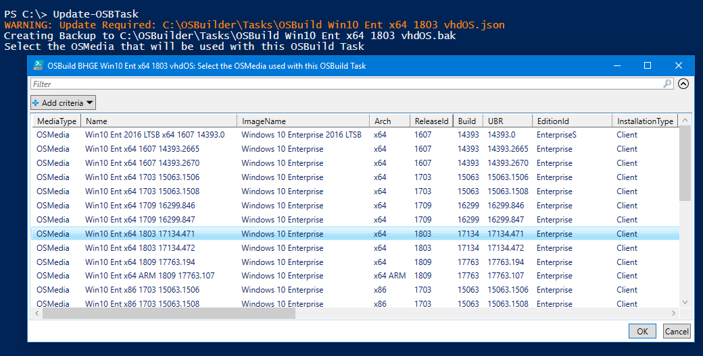

# Repair-OSBuildTask

## Purpose

The purpose of Repair-OSBuildTask is to update an existing OSBuild Task to the current version.  This function requires PowerShell ISE for Gridview to function properly.

## Usage

