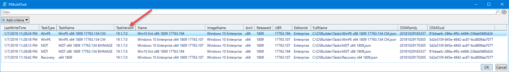

# Repair-PEBuildTask

## Purpose 

The purpose of **Repair-PEBuildTask** is to update an old PEBuild Task to the current version. This function requires **PowerShell ISE** for Gridview to function properly.

## Example 

In this example I have some PEBuild Tasks which can be identified by the prefix in the Json File Name \(MDT, Recovery, and WinPE\)

A current [**New-PEBuildTask**](../pebuild/new-pebuildtask/) contains more information and can no longer be used with [**New-PEBuild**](../pebuild/new-pebuild.md)\*\*\*\*

When using an old PEBuild Task with [**New-PEBuild**](../pebuild/new-pebuild.md), you will receive an error

In this case, in PowerShell ISE,  execute **Repair-PEBuildTask** without any Parameters.  You will be prompted to select an existing [**OSMedia**](../../instructions/detailed/osmedia/) for use with each of the PEBuild Tasks that need to be updated

Repeat this process for every PEBuild Task that needs an update.  Once Repair-PEBuildTask is complete, there should be no results in subsequent executions

Everything should look good after this process is complete

A backup of all your files will be created in a Repair subdirectory

