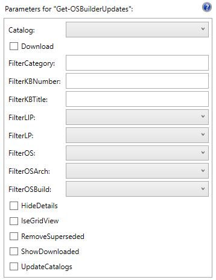
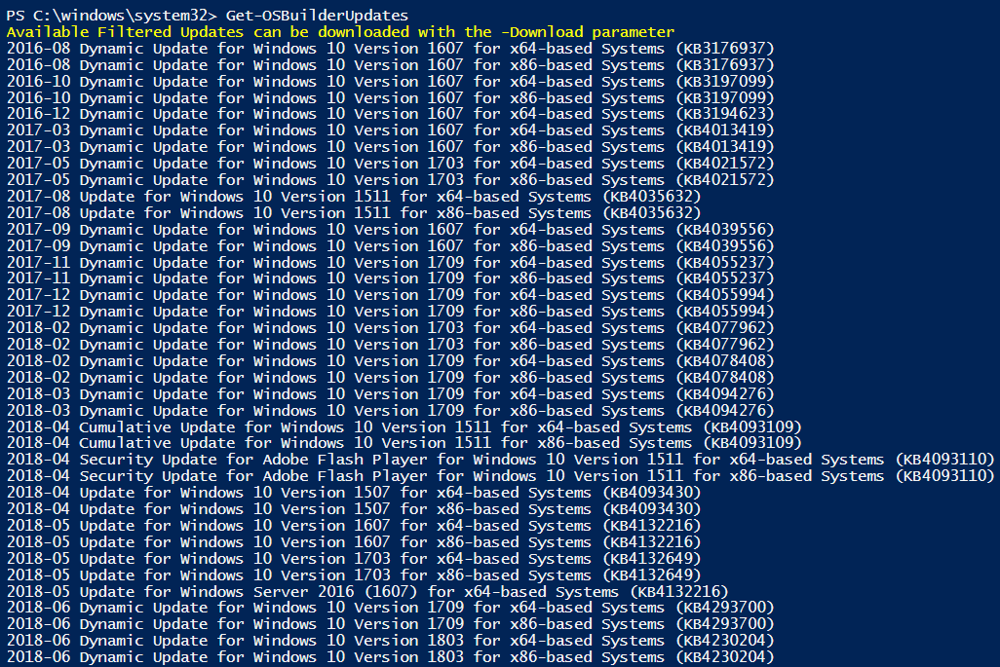
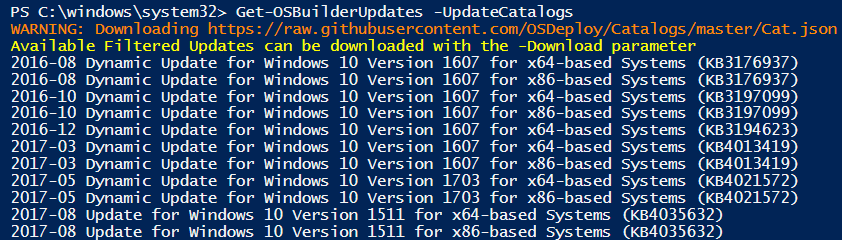
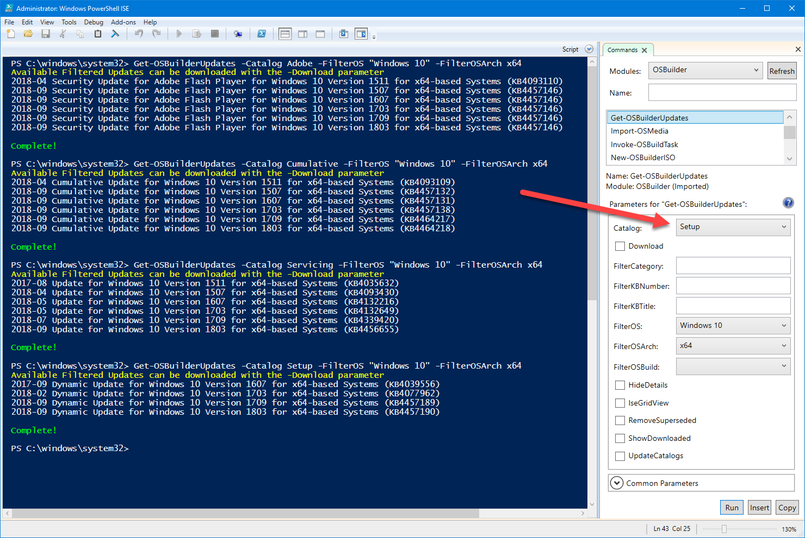
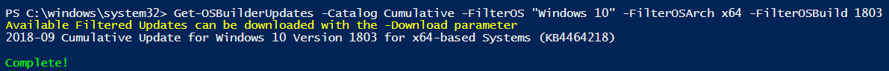
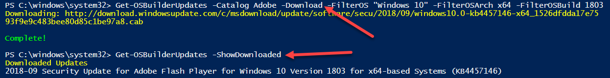
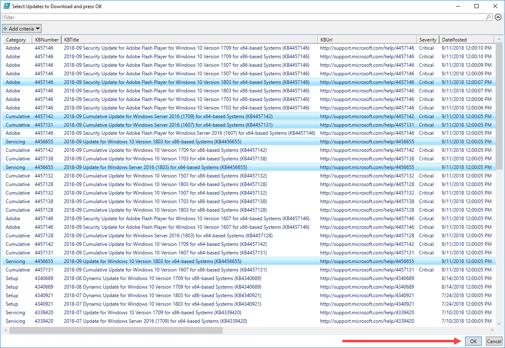
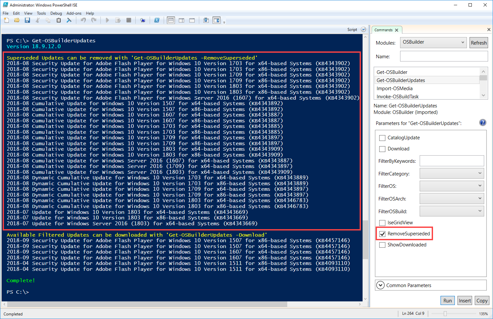

# Get-OSBuilderUpdates

You may want to download the Microsoft Updates you need before Updating any Operating Systems.  **This is not required as you can let** [**`Update-OSMedia`**](../osmedia/update-osmedia/) **download what you need**, but if you want to get them downloaded first, us this function

When running Get-OSBuilderUpdates without any parameters, a complete list of downloads will be listed.  ****Optional Downloads like Language Packs, Language Interface Packs, and Features on Demand are not displayed by default.  Files that have already been downloaded will not be shown in the list

## Get-OSBuilderUpdates -UpdateCatalogs

It is necessary to check for updated Catalogs from time to time . . . use this Parameter

## Get-OSBuilderUpdates -Catalog

You can filter Updates by Catalog.  Catalogs are saved in OSBuilder\Updates as JSON files

## Get-OSBuilderUpdates -FilterOS -FilterOSArch -FilterOSBuild

Use these parameters to narrow down the OS Compatibility that you need updates for

## Get-OSBuilderUpdates -Download -ShowDownloaded

The Download parameter will download the files that are available, and ShowDownloaded will include a listing of the Downloaded Updates

## PowerShell ISE GridView

If you are in PowerShell ISE, you can use the **IseGridView** parameter to display a list of available updates.  Select the ones you want to download \(use the **Download** parameter\) and press OK

## Remove Superseded

When Catalogs get new updates, old updates will need to be removed.  They will be displayed and you can use the **RemoveSuperseded** parameter to delete them

