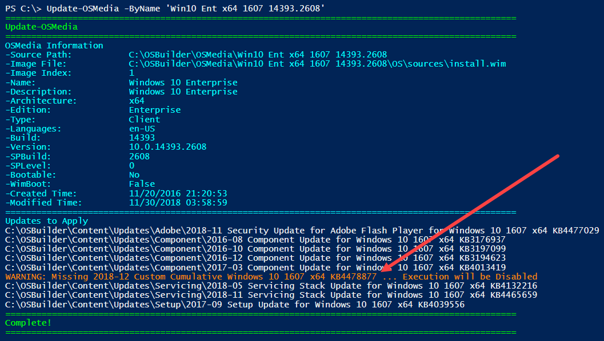
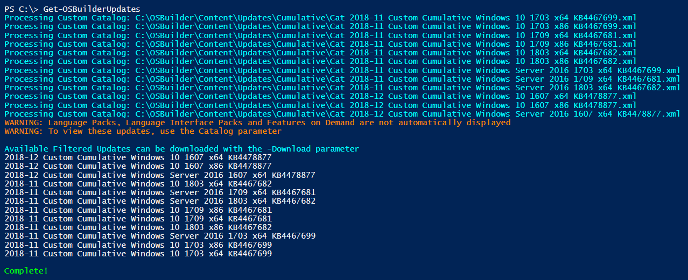

# New-OSBUpdate

OSBuilder uses the Latest Cumulative Update from WSUS, as I have detailed in the previous page



but this may not be the Latest Latest Cumulative Update.  In this case I am trying to update Windows 10 1607 with a UBR of 14393.2608.  A quick check using [**`Update-OSMedia`**](../osmedia/update-osmedia/) without the **`Execute`** parameter identifies the Cumulative Update as KB4467691

## Windows 10 Update History

According to [Windows 10 Update History](https://support.microsoft.com/en-us/help/4000825), this is not the Latest Latest Cumulative Update, so I need a method to add KB4478877 to OSBuilder

## Microsoft Update Catalog

The Latest Latest Cumulative Update that I need is posted in the [Microsoft Update Catalog](https://www.catalog.update.microsoft.com/Search.aspx?q=2018-11%20Cumulative%201607%20x64)

Clicking on the Download button will let me 'Copy link address' to my clipboard

## New-OSBUpdate

From there its a simple Copy / Paste into **`New-OSBUpdate`**

Which will create a Custom Catalog XML with the Update information

The new Update will be available as a Download using [**`Get-OSBuilderUpdates`**](get-osbupdate.md)**\`\`**

and[**`Update-OSMedia`**](../osmedia/update-osmedia/) will recognize the new Cumulative Update as a requirement

## Things To Know

* Don't forget to remove the Custom XML files that are no longer needed
* OSBuilder will only install the latest Adobe, Cumulative, and Setup Updates
* There can be multiple Component and Servicing Updates, and they will be installed by OSBuilder in chronological order
* Multiple Updates can be added easily to OSBuilder :\)

