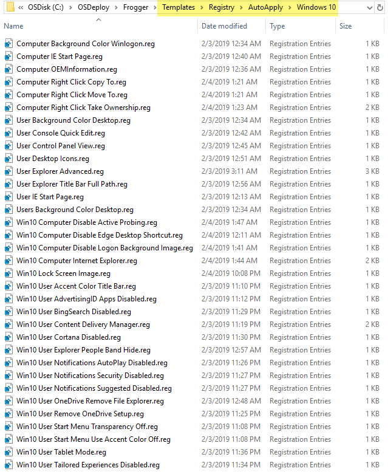
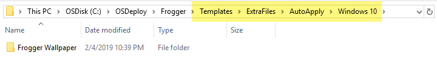

# Frogger

Its time to have a little fun and get some learning done at the same time.  This name of this game is **Frogger**.

## New OSBuilder Home

To make things easier to follow and not clutter things up, I am going to start with a brand new OSBuilder Home.  I'll use the following command

```text
OSBuilder -SetPath C:\OSDeploy\Frogger
```


## Import-OSMedia

I'll import a brand new Operating System using the following command

```text
Import-OSMedia
```


You will want to have your OSMedia updated by using **`Update-OSMedia`**, but for this game, it is not really necessary

## Frogger Arcade Pack

Now its time to download the Frogger Arcade Pack.  Download and Unzip the attached Zip file




Now its time to place the Zip contents in the proper locations

## Frogger Registry

Move the contents of Frogger Registry into your **Templates\Registry\AutoApply\Windows 10**.  This will ensure that the Registry entries get applied to every Windows 10 OSBuild



## Frogger Wallpaper

Copy the entire Frogger Wallpaper directory into the **Templates\ExtraFiles\AutoApply\Windows 10** directory.  This will ensure that the contents of Frogger Wallpaper are copied into the OS of every Windows 10 OSBuild



## PowerShell Script

To have the PowerShell Script executed with every OSBuild, no matter the Operating System, copy it into the **Templates\Scripts\AutoApply\Global** directory


## Start Layout

Finally, copy the **Windows 10.xml** file into the **Content\StartLayout** directory


## New-OSBuildTask

Now create a New-OSBuildTask with the following command line

```text
New-OSBuildTask -TaskName Frogger -CustomName Frogger
```

You will select the Operating System, and then be prompted to select a Start Layout.  Select the one that was added from the Frogger Arcade Pack


## New-OSBuild

Now its time to execute the OSBuild.  The SkipUpdates parameter is used to prevent the Windows Updates from being applied.  This will save a significant amount of time and should be used for testing only.  The MediaISO will create an ISO \(ADK required\) and allow us to test the image in a Virtual Machine

```text
New-OSBuild -SkipUpdates -Execute -MediaISO
```


During the OSBuild process, the following steps will be completed

* **Frogger Wallpaper added to Templates\ExtraFiles will be added automatically**
* **Start Layout.xml from the Task will be applied**
* **TimeZone Script added to the Templates\Scripts will be added automatically**
* **Registry REG files added Templates\Registry will be converted to Offline Registry files**


* **Offline Registry files will be applied**
* **ISO will be created**


## Virtual Machine Testing

Now time to do some setup


