# OSBuild Templates

So I had this idea for creating some type of Template for **OSBuilds** that will be used for every **OSBuild** that gets created.  I had planned on creating a new function called **New-OSBTemplate** to do just this.  You can read all about that here





Scratch the idea of a new function

Hidden in **OSBuilder** 19.1.20 is a **pre-release method** to do just this, but much easier than a separate function.  Let me get some warnings out of the way


**OSBuild Templates are for testing only!  Things will probably change when things are officially released**

**Language Features are not processed for the time being**


## Create a Blank OSBuildTask

Start by creating a New-OSBuild Task without any settings

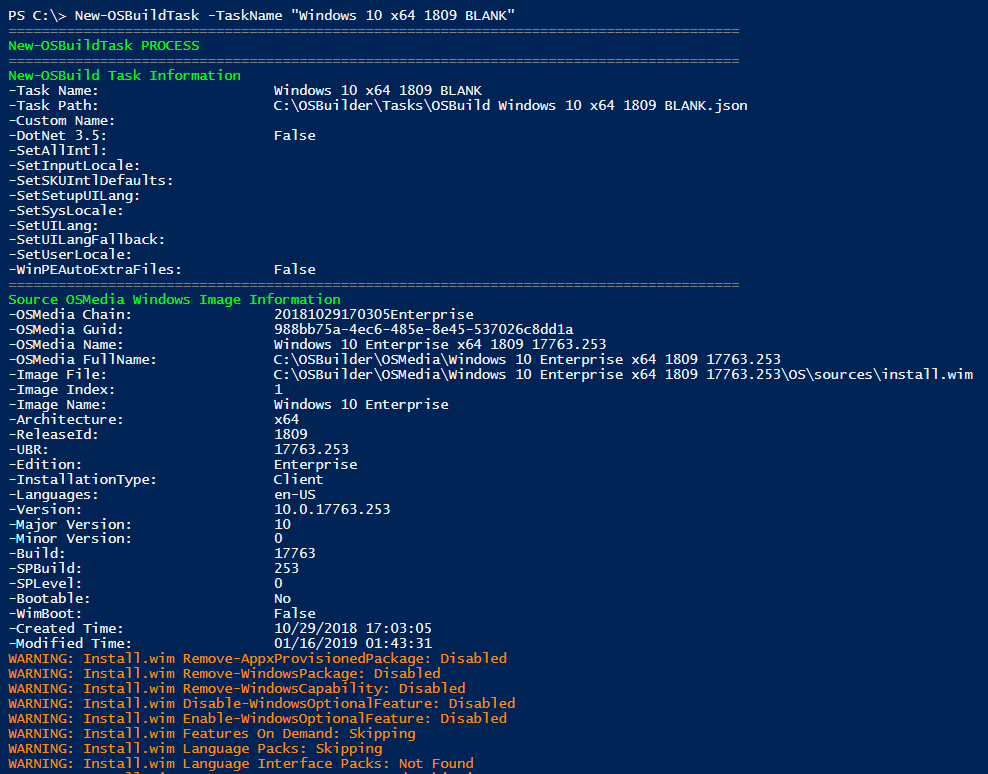

This can easily be validated by using the task in New-OSBuild

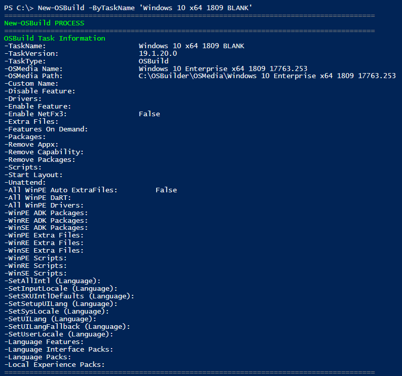

## Create a Templates Directory

Create a Templates\Enabled directory in your OSBuilder Home.  This path will typically be **C:\OSBuilder\Templates\Enabled**

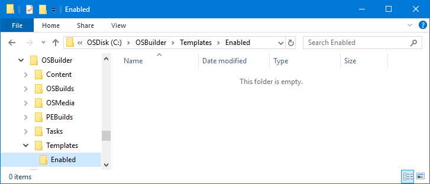

## Create a Global Template

A Global Template is one that will be applied to every OSBuild that is processed, so it is important to select items that are not OS specific like PowerShell Scripts \(Appx and Features are OS specific, so don't pick those\).  **Make sure the word Global is in the TaskName**

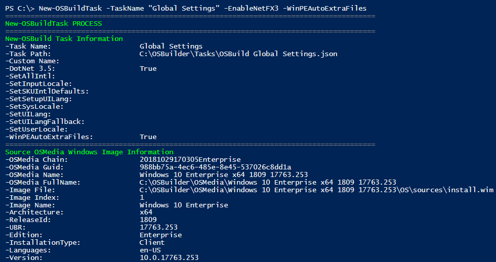

Here you can see my complete Task with non-OS Specific Settings

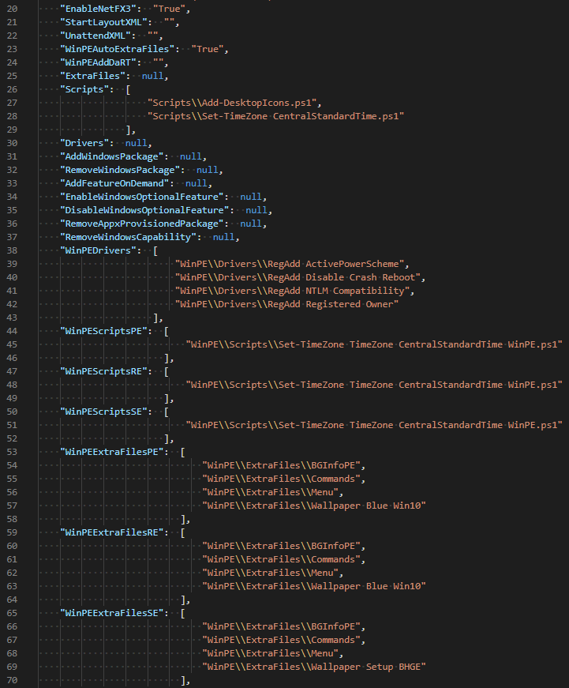

Move this Task to **C:\OSBuilder\Templates\Enabled**

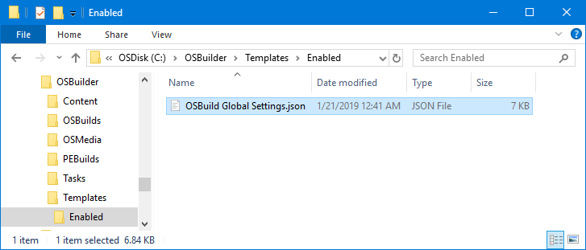

## Test Global Settings

To test the Global Settings, run **New-OSBuild** and select the **BLANK Task**

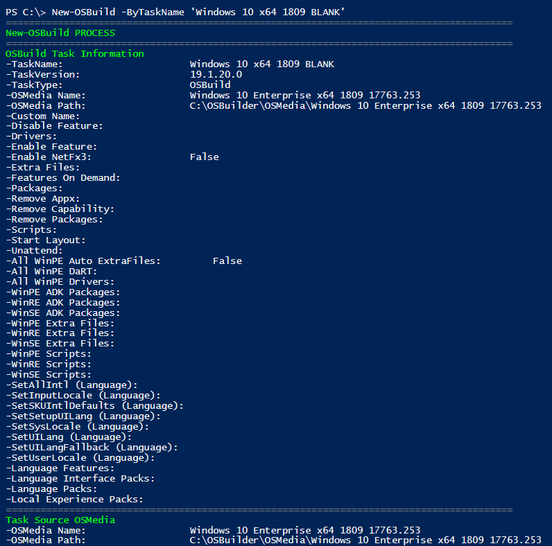

After a few seconds, the Global Template should be picked up, and the results will be displayed.  Congratulations, you have now created and applied your first Template

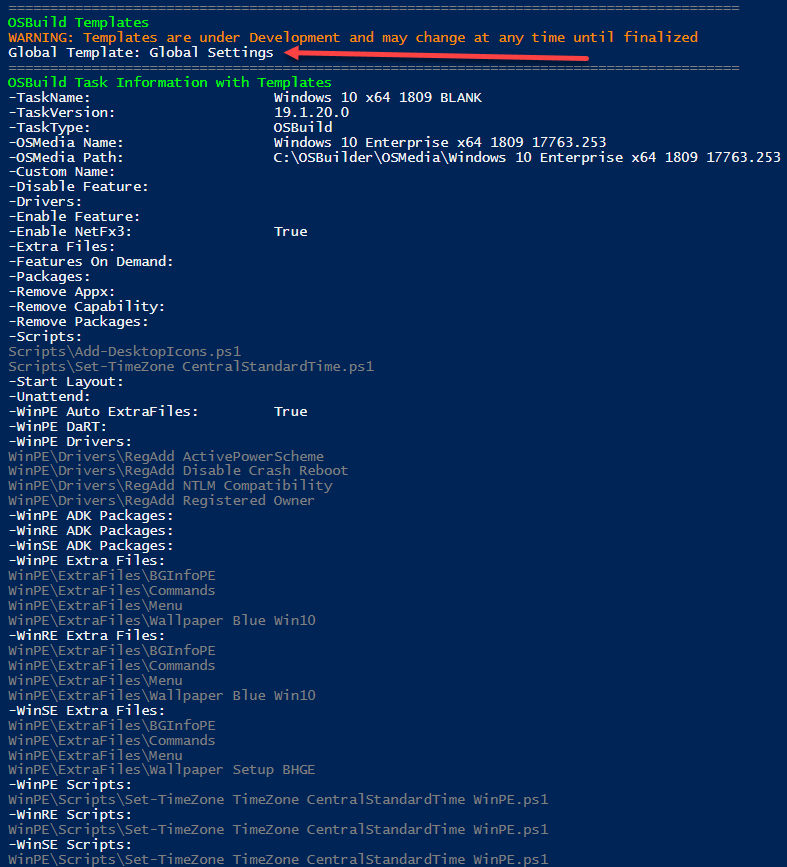

## OS Specific Template

Creating an OS Specific Template is just as easy.  I want to make one for Windows 10 x64 1809 to remove some Appx Provisioned Packages

```text
New-OSBuildTask -TaskName "Windows 10 x64 1809 Appx" -RemoveAppxProvisionedPackage
```

So in this Task, those are the only things I set

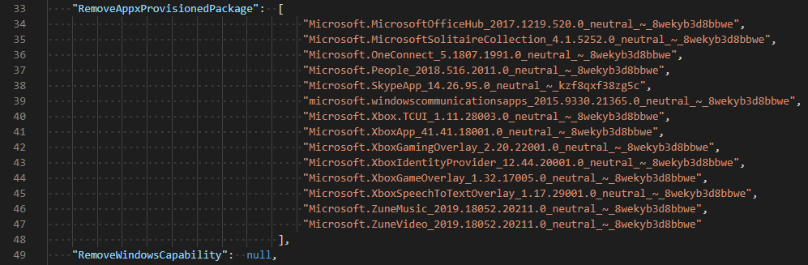

After moving this Task into the Enabled Templates it will be processed every time I create an OSBuild with this Operating System.  When I do, these Appx Provisioned Packages will be removed

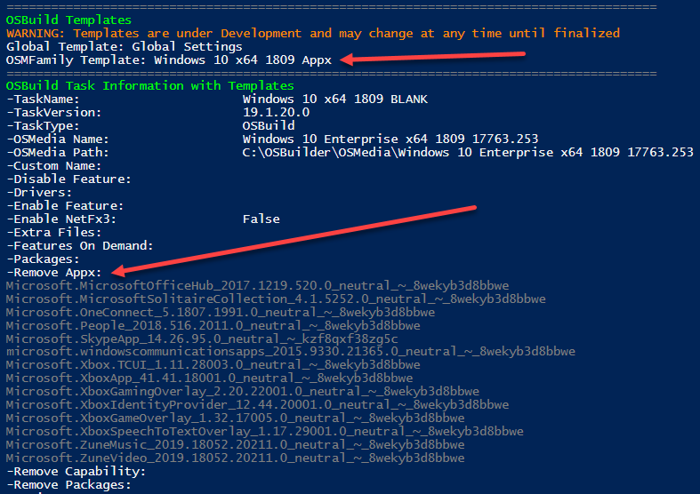

## OSMedia Family Link

Operating Systems are grouped by OSMedia Family, so when a Template is not Global, it uses this to determine if the Operating System is a match.  In the case of this Server OS, it does not match the Windows 10 x64 1809 Appx Template, and it is skipped

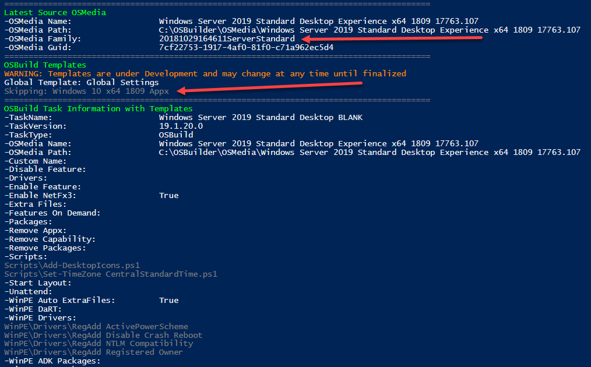

## Wrapping Up

Have fun playing with this new feature, and make sure to give some feedback because I keep hearing crickets!

