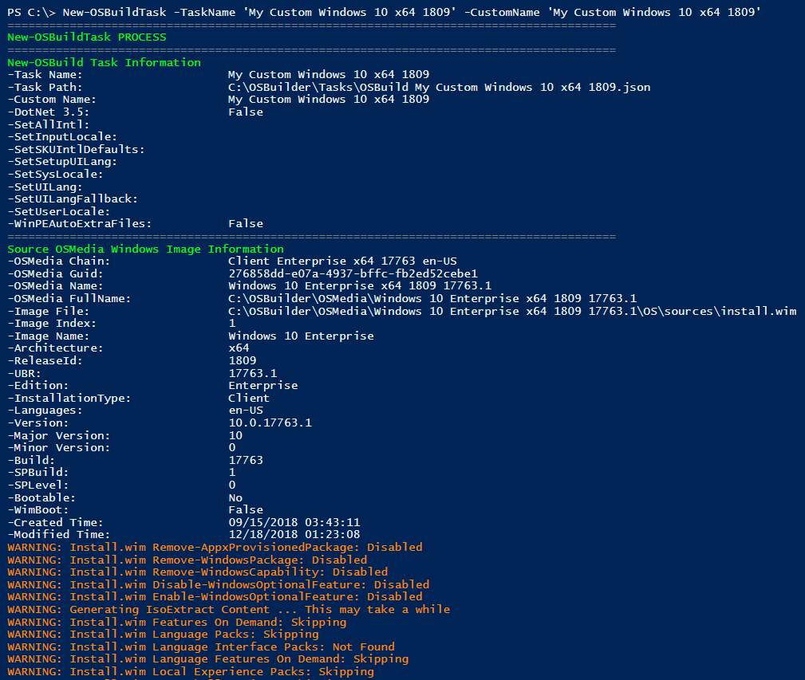
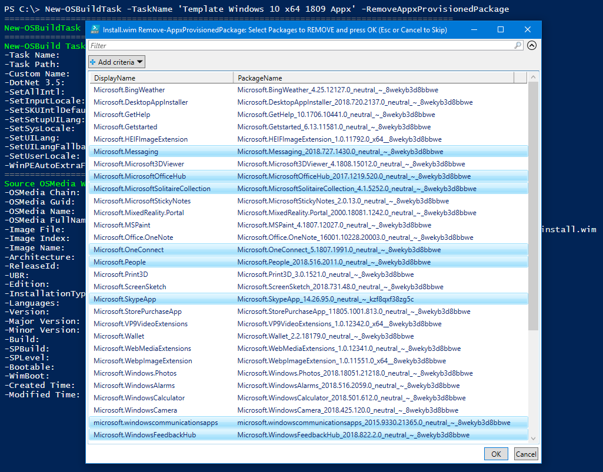
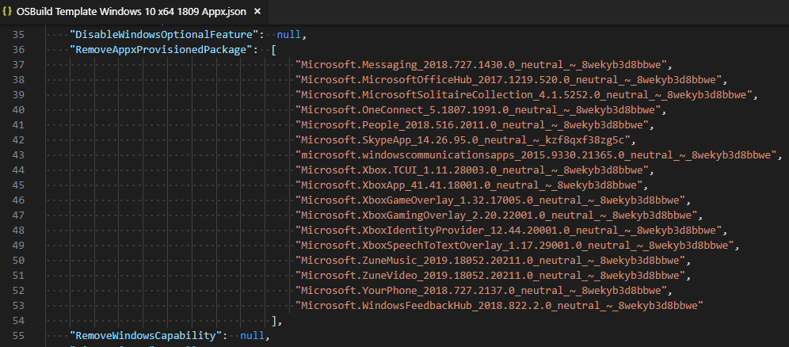
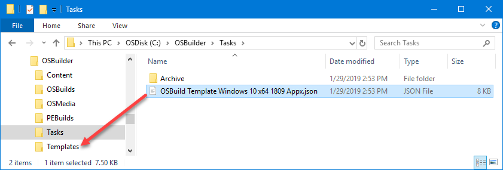
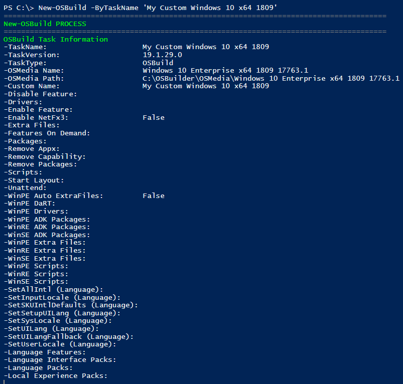
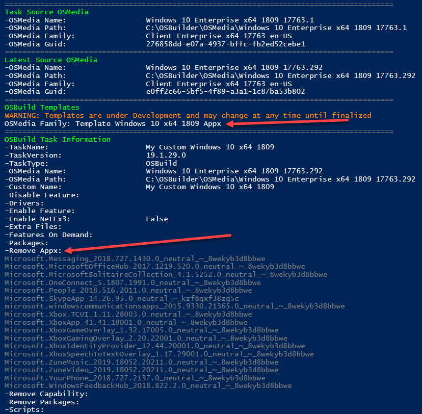
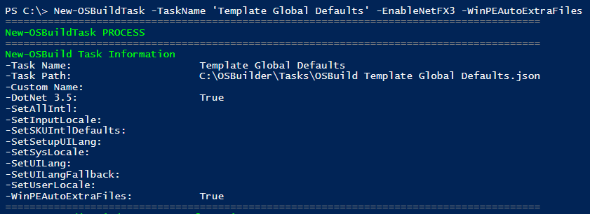

# Perfecting OSBuild with Templates

Creating a custom OSBuild in a single Task can get quite complicated, with more options to configure than an Apple Watch.  This is where **OSBuilder 19.1.31 "San Antonio"** makes things easier.

## Baby Steps

When working with Templates, Baby Steps are important.  Instead of trying to create a perfect OSBuild Task which make take weeks to develop, spend time creating Templates that are perfected due to the smaller scope.

## New-OSBuildTask with Custom Name

Create a New-OSBuild Task without any customizations and give it a CustomName.  This will be used as a Control Task

```text
New-OSBuildTask -TaskName 'My Custom Windows 10 x64 1809' -CustomName 'My Custom Windows 10 x64 1809'
```



## Remove Appx Provisioned Package Template

By now you should know what Appx Provisioned Packages you want to remove.  Use the following PowerShell command line to create an OSBuild Task to remove the ones you don't want.

```text
New-OSBuildTask -TaskName 'Template Windows 10 x64 1809 Appx' -RemoveAppxProvisionedPackage
```

You will need to select an Operating System and then multi-select the Appx Provisioned Packages to remove and press OK



When complete, the Task will be saved in the OSBuilder Tasks directory.  Here is what the selection above looks like in the Task JSON file.  In this format, it should be easy to edit manually if you need to make changes



Move the Task JSON file into the OSBuilder Templates directory



## New-OSBuild -ByTaskName

You can easily validate the Template by using New-OSBuild with the ByTaskName parameter.  When using New-OSBuild without the Execute parameter, it will only validate the OSBuild

```text
New-OSBuild -ByTaskName 'My Custom Windows 10 x64 1809'
```

The command above will start the New-OSBuild process.  The first step is to display the Task information



New-OSBuild will then select the latest UBR for this Task OSMedia automatically.  After the newest OSMedia is selected, Templates will be processed.  In the example below, the Appx Template that was create is applied



## Global Defaults Template

By design, all Templates will be applied to a matching **OSMedia Family**, meaning if you create a Template with Windows 10 x64 1809 the Template will only apply to that specific **&lt;OS&gt;&lt;Arch&gt;&lt;ReleaseId&gt;**

To create a Template for **All** OSBuilds, use the word **Global** \(not case sensitive\) in the **`TaskName`**

```text
New-OSBuildTask -TaskNAme 'Template Global Defaults' -EnableNetFX3 -WinPEAutoExtraFiles
```

The command above will allow me to ensure that all my OSBuilds have these two settings enabled



## Global Scripts Template


