# OSBuild Registry

There are always changes that need to be made to the Registry of a Custom Image.  The way to do this in Offline Servicing is to either use a [custom Driver \(can't do Default User\) like I have detailed for WinPE](../instructions/detailed/pebuild/drivers/regadd-activepowerscheme.md), or to use a [PowerShell Script](../../../osconfig/docs/customization/scripts.md).

To make things eaiser, **OSBuild Registry** is being introduced.  In a new OSBuilder installation, a Registry directory is created in the OSBuilder Content directory

## Registry Filters

As Operating Systems are added to OSMedia, a directory in Registry called AutoApply will be created automatically.  Inside AutoApply are Filters

If an OSBuild uses an OSMedia that matches an AutoApply Filter, the contents of the AutoApply Filter will be automatically processed.  The screenshots below show the AutoApply Filter for each existing OSMedia

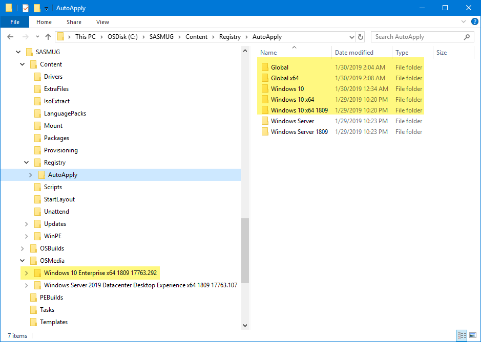

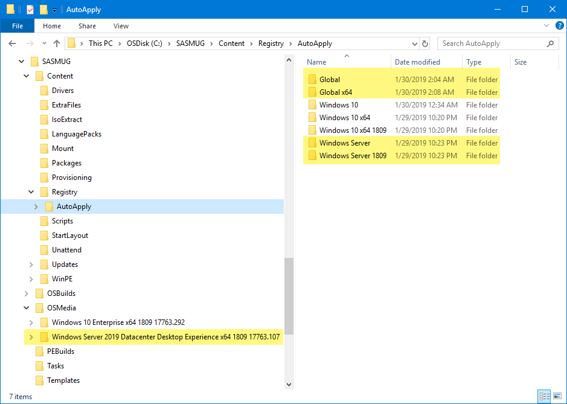

## Registry XML

Instead of using REG files, **OSBuild Registry uses Registry XML files**.  I'll get into how to create them a little further down, but here is an example of what a Registry XML file for adding Desktop Icons in a User's registry looks like.  As you can see in the XML file, the Registry will make changes in the Current User's Hive.



The Registry XML file should be placed inside an appropriate AutoApply Filter directory.  In this example, I have placed this XML file in the Global Filter with two other Registry XML files for setting the default Internet Explorer Start Page.  Since this exists in Global, it will be applied to every OSBuild that gets created

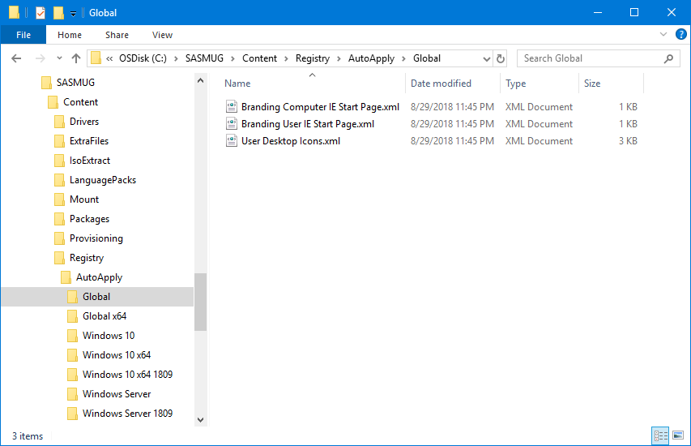

## New-OSBuild

During a New-OSBuild, the three Registry XML files are processed and added to the mounted Offline Registry automatically

The results should speak for themselves.  I have successfully customized the Default User profile with minimal effort

## Group Policy Preferences

So why XML?  Because you are probably already using Registry XML in Group Policy Preferences.  Read more about GPP Registry in the following link



If you take a look at a Group Policy Object on your Domain's Sysvol that has an enabled GPP Registry, then you should have a Registry.xml file for Machine Preferences and User Preferences

You can easily just copy the whole GPO into the proper Registry AutoApply Filter

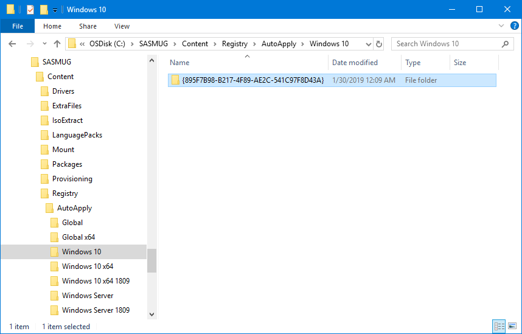

And watch it rain.  **Keep in mind this will not import the entire Group Policy**, just settings in the Registry.xml files.  Ideally, you should create a separate unlocked GPO and configure all your OSBuild settings in there, and use that GPO for settings to your OSBuild

## Converting REG to XML

There are a few ways to convert a regular REG file to an XML.  I find it easy enough to use an online converter





But you can also download a PowerShell script to do the work



## Samples

Feel free to download some Registry XML samples on my GitHub



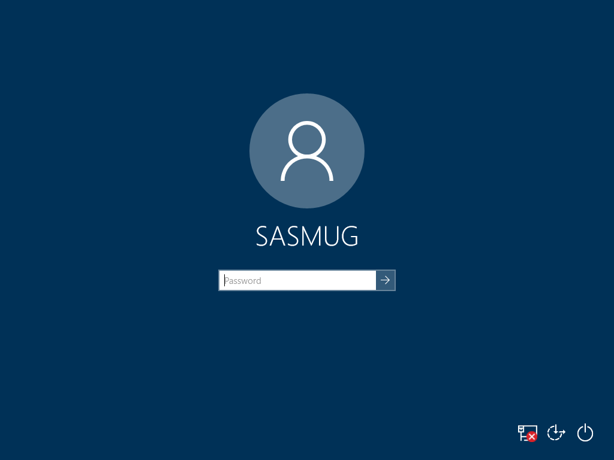

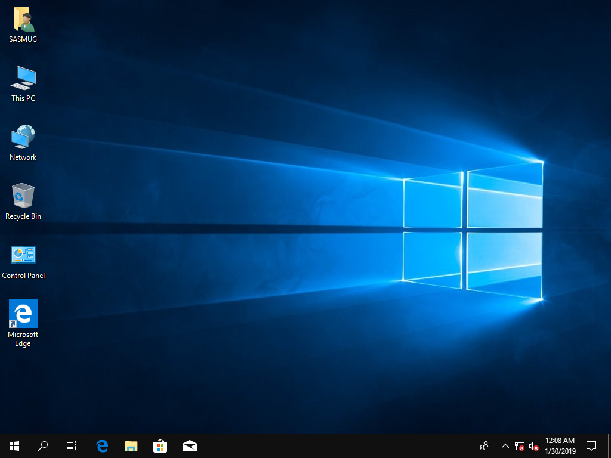

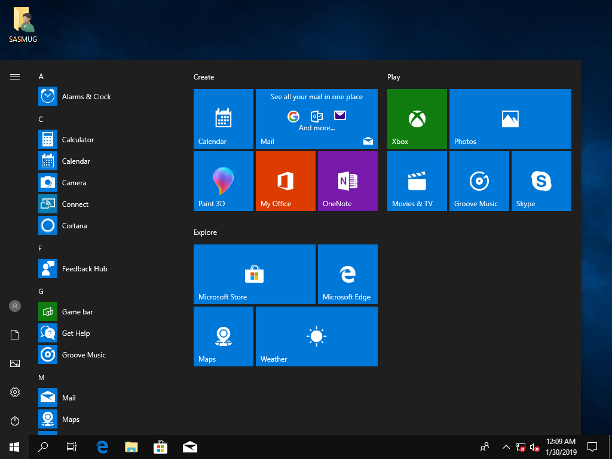

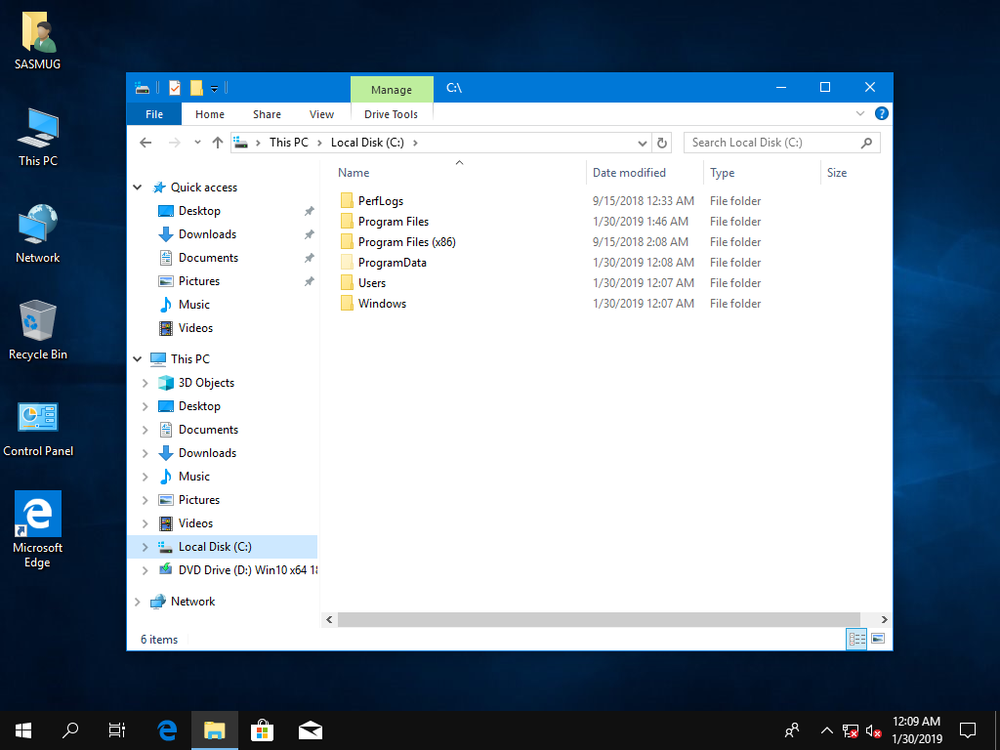

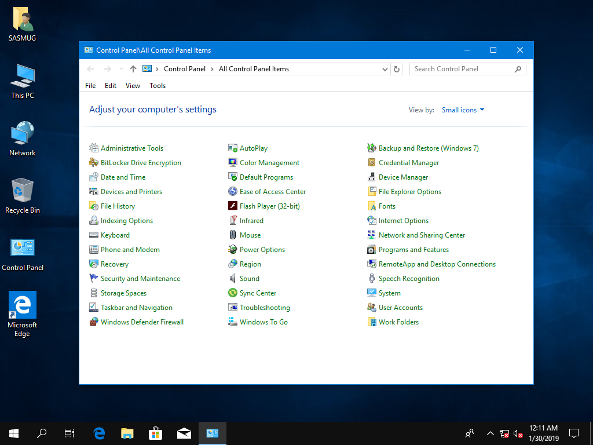

## Known Issues

There are a few things to know.  Some Registry Keys are protected by Trusted Installer.  These keys cannot be overwritten.  I have not seen many keys like this, but they do exist

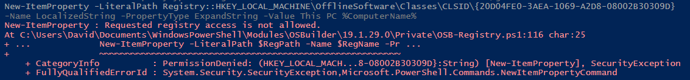

And some Registry Keys should not exist until Windows Setup is complete, like setting Default Associations.  This is easy enough to test by creating a Media ISO and installing on a Virtual Machine

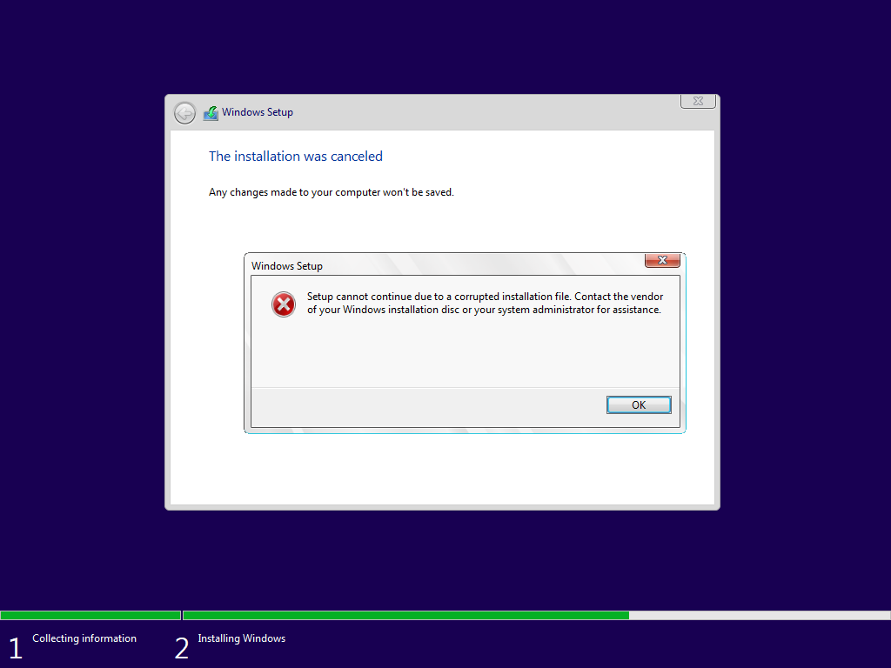

In some tests I have had the Registry not unload properly, usually if I am doing a large amount of changes.  I'm still trying to narrow down what is causing it \(could be some System Protection\).  If a Registry Hive doesn't unload properly, then OSBuilder will halt the New-OSBuild process to allow you to manually open Regedit and unload the Hive.  This must be done in Regedit as the Reg Unload command does not work as it is locked

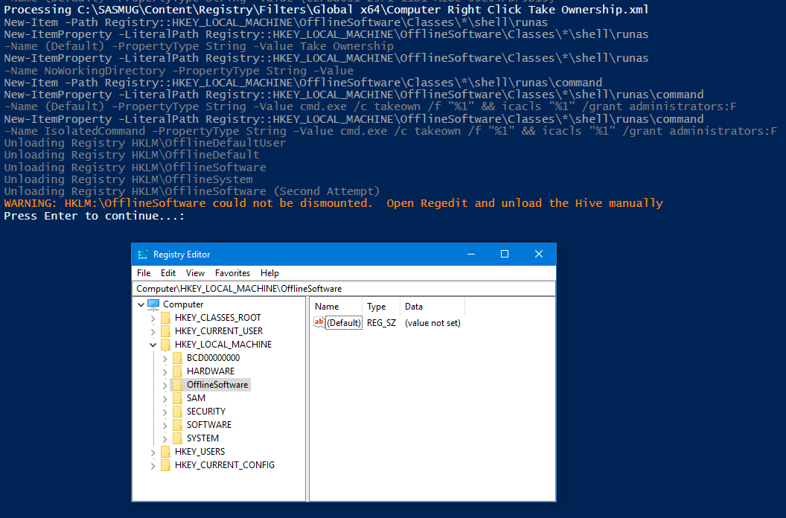

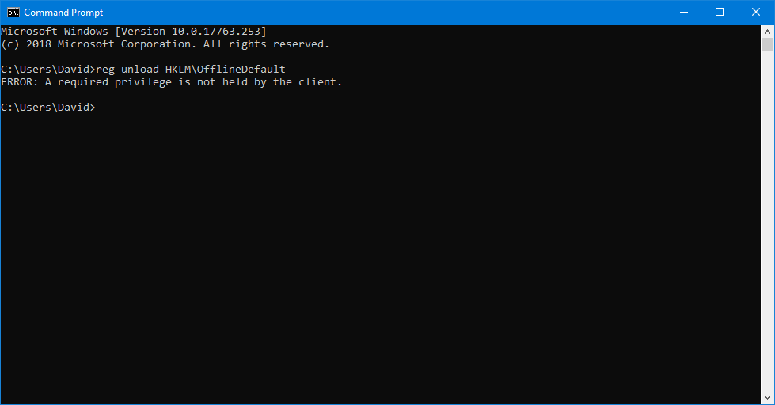

