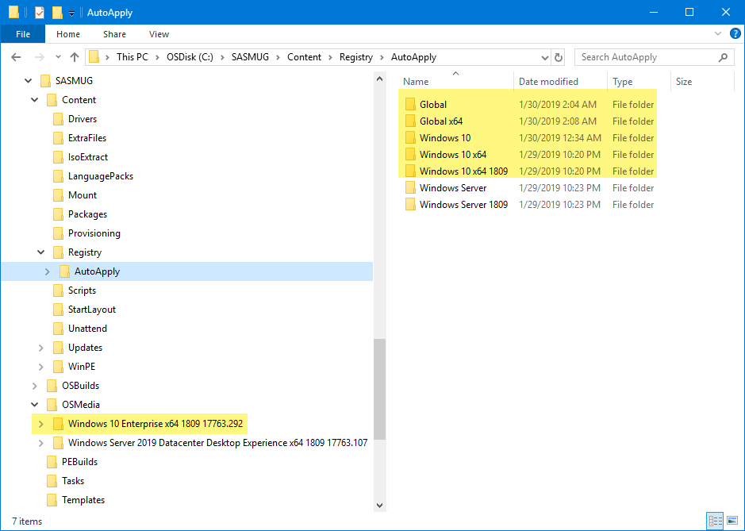
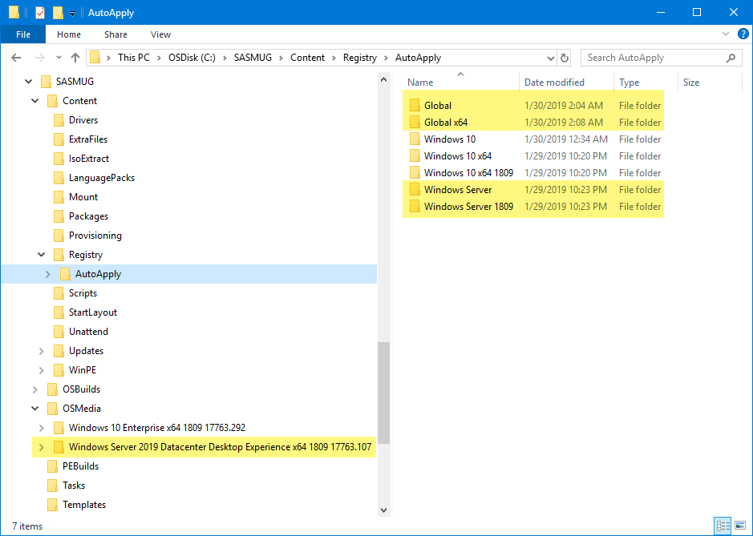

# OSBuild Registry


**OSBuilder 19.2.5 has moved Registry to OSBuilder\Templates\Registry  
This guide will be updated soon**


There are always changes that need to be made to the Registry of a Custom Image.  The way to do this in Offline Servicing is to either use a [custom Driver \(can't do Default User\) like I have detailed for WinPE](../../instructions/detailed/pebuild/drivers/regadd-activepowerscheme.md), or to use a [PowerShell Script](../../../../osconfig/docs/customization/scripts.md).

To make things eaiser, **OSBuild Registry** is being introduced.  In a new OSBuilder installation, a Registry directory is created in the OSBuilder Content directory

## Registry Filters

As Operating Systems are added to OSMedia, a directory in Registry called AutoApply will be created automatically.  Inside AutoApply are Filters

If an OSBuild uses an OSMedia that matches an AutoApply Filter, the contents of the AutoApply Filter will be automatically processed.  The screenshots below show the AutoApply Filter for each existing OSMedia

## File Types

You can use REG or XML \(GPP\) files with OSBuild Registry.  Details on how to use them are in the following two links





