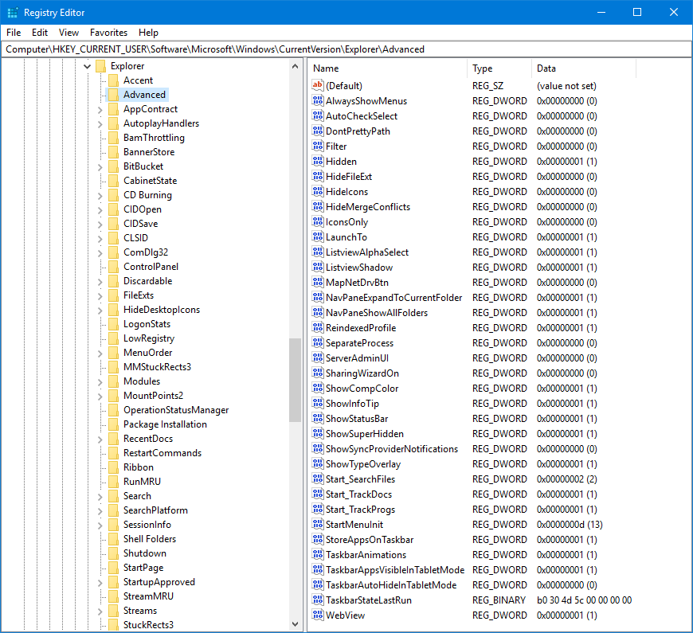
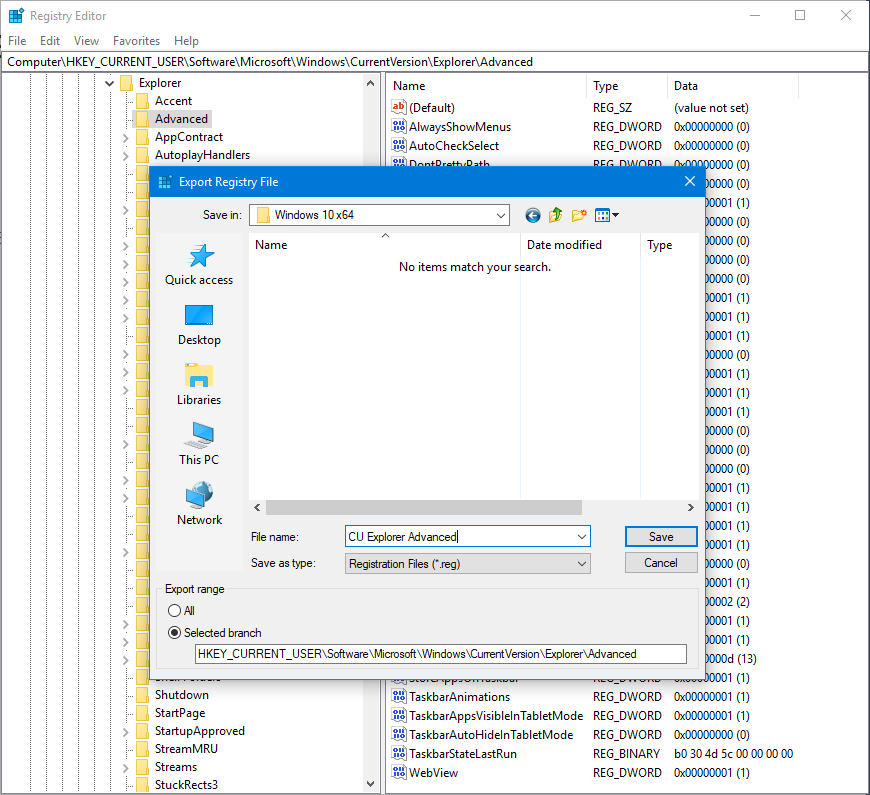
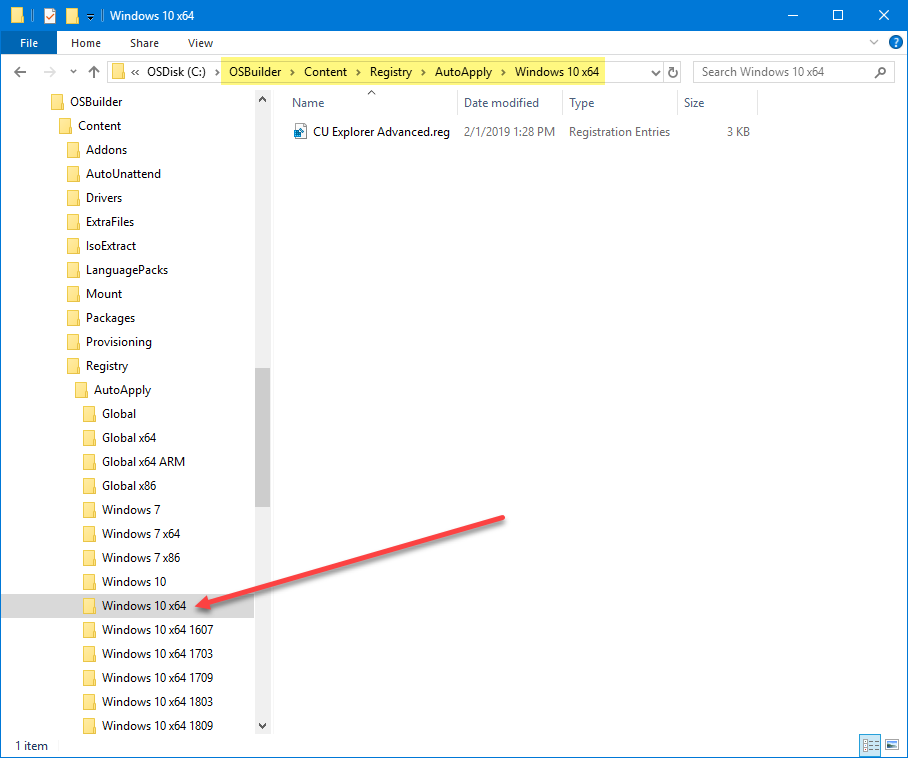
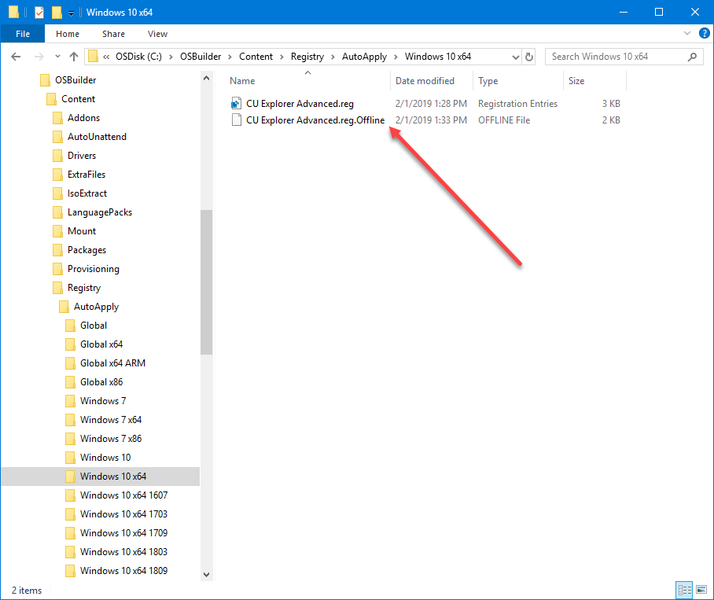
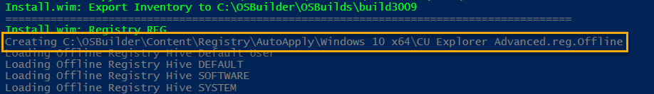
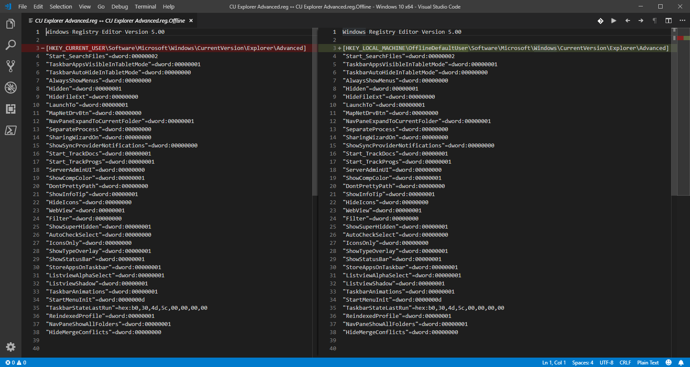
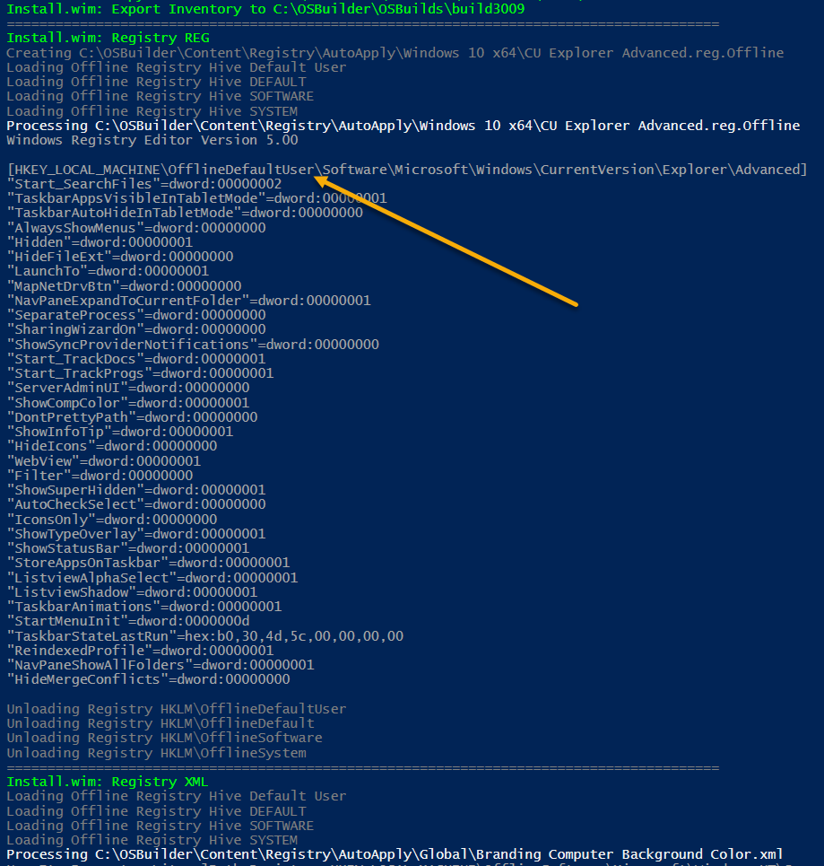

# OSBuild Registry REG


**OSBuilder 19.2.5 has moved Registry to OSBuilder\Templates\Registry  
This guide will be updated soon**



**Only Registry Keys that use these Paths are supported**  
HKEY\_CURRENT\_USER  
HKEY\_LOCAL\_MACHINE\SOFTWARE  
HKEY\_LOCAL\_MACHINE\SYSTEM  
HKEY\_USERS\.DEFAULT


I originally added Registry XML first to OSBuilder, and here is how working with REG files works.  In this example I want to take my Current User Windows Explorer settings and have them applied to the Default User in my OSBuild

## Regedit

In Regedit, I find the key that has the settings that I need

And simply export that key to a REG file

## AutoApply Filters

Since I want this REG file to be applied to every Windows 10 x64 that I create an OSBuild for, I need to add this to my AutoApply\Windows 10 x64 directory


You may need to modify the REG file to remove any subKeys that are not needed as they are exported by default


## Offline Convert

When New-OSBuild is executed, it will first go through all the REG files in the Registry\AutoApply directory and convert them to the Import format needed for the Offline Mounted Hives.  You will see that next to the REG file that was created, a REG.Offline file exists.  This is the file that will be imported

When there is a REG file that needs to be converted, you will see this in the Console

You can see the difference between the files when viewing a comparison

## Registry REG Processing

After the conversions take place \(if necessary\), the REG.Offline will be imported.  The content of the REG.Offline file will be displayed in the Console

## Conclusion

The only thing that I can conclude from this exercise is that it should be easy and painless to make registry changes to your custom OSBuilds.  Enjoy!

