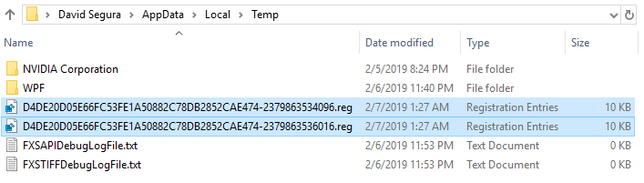

# Certificates

## Fan Request

This Guide is the result of this Tweet from [@Marctwain\_C](https://twitter.com/Marctwain_C) when he first asked me ...



And the additional bugging ...



While I don't have a need for this myself, I am not one to turn down an Offline Servicing challenge, so ...


## Traditional Certificate Installation

There are four methods for getting Certifications installed on an Enterprise Workstation

1. **Active Directory**
2. **Group Policy**
3. **Certificate File using CertUtil**
4. **OSBuilder**

But since we are talking about OSBuilder, I assume you are looking for a way to install Certificates through Offline Servicing.  Unfortunately the first two methods don't work until the computer is on the Domain, and CertUtil doesn't allow installation to a mounted Windows Image \(neither does DISM\), so we are going to have to work with OSBuilder

## Certificate Stores

Take a quick read about Certificate Stores so I don't have to repeat things too much



If you don't want to read everything, here is the important stuff


## Determining Origin

You need to know the method the Certificate was installed, so you can associate it with the proper Registry location.

In Certificates \(certlm\), change the **View Options** to show **Physical certificate stores** 


Now you can know where you should look in the Registry for the Certificate


## Thumbprints

Every Certificate has a Thumbprint.  You need to know the Certificate Thumbprint to find it in the Registry


Another method to get the Thumbprint is with PowerShell

```text
Get-ChildItem -Path Cert:\LocalMachine\Root -Recurse
```


## The Registry

Once you have found the Thumbprint for your Certificate, search the Registry for the Key.  You may find more than one.  These are the Registry Keys that need to be exported


## The OSDeploy Way

Ok, that was alot of work, which is not cool, so just copy the following code into PowerShell



This script will display all the Certificates in the Registry, allowing you to select the ones you need.  Duplicate entries are in multiple Registry locations, so you need all the ones that match the Thumbprint


After you press OK, the Registry Keys will be exported into your %Temp% directory




Which can then be easily copied into OSBuilder Registry Templates where it will be installed automatically


During New-OSBuild, these will be applied automatically.  Here's an example of what you will see


