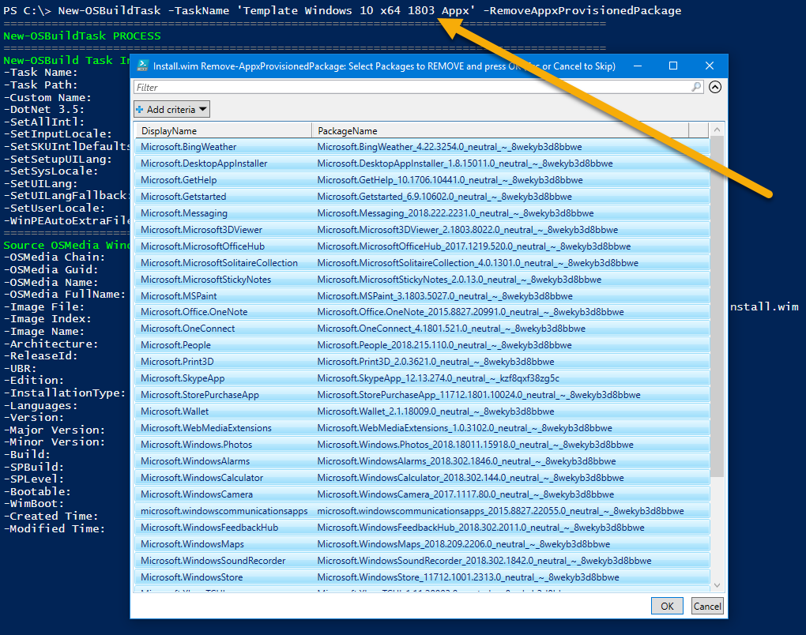

# OSBuild Templates

Creating a custom OSBuild in a single Task can get quite complicated, with more options to configure than an Apple Watch.  This is where **OSBuilder 19.1.31 "SASMUG"** makes things easier.

## Baby Steps

When working with Templates, Baby Steps are important.  Instead of trying to create the perfect OSBuild Task, which make take weeks to fully develop, spend time creating specific Templates that are perfected due to the smaller scope.

## New-OSBuildTask with Custom Name

Create a New-OSBuild Task without any customizations and give it a CustomName.  This will be used as a Control Task

```text
New-OSBuildTask -TaskName 'My Custom Windows 10 x64 1809' -CustomName 'My Custom Windows 10 x64 1809'
```


## Remove Appx Provisioned Package Template

By now you should know what Appx Provisioned Packages you want to remove.  Use the following PowerShell command line to create an OSBuild Task to remove the ones you don't want.

```text
New-OSBuildTask -TaskName 'Template Windows 10 x64 1809 Appx' -RemoveAppxProvisionedPackage
```

You will need to select an Operating System and then multi-select the Appx Provisioned Packages to remove and press OK


When complete, the Task will be saved in the OSBuilder Tasks directory.  Here is what the selection above looks like in the Task JSON file.  In this format, it should be easy to edit manually if you need to make changes


Move the Task JSON file into the OSBuilder Templates directory


## New-OSBuild -ByTaskName

You can easily validate the Template by using **`New-OSBuild`** with the **`ByTaskName`** parameter.  When using **`New-OSBuild`** without the **`Execute`** parameter, it will only validate the OSBuild, which is ideal for testing

```text
New-OSBuild -ByTaskName 'My Custom Windows 10 x64 1809'
```

The command above will start the **`New-OSBuild`** process.  The first step is to display the Task information


**`New-OSBuild`** will then select the latest UBR for this Task OSMedia automatically.  After the newest OSMedia is selected, Templates will be processed.  In the example below, the Appx Template that was create is applied


## Global Defaults Template

By design, all Templates will be applied to a matching **OSMedia Family**, meaning if you create a Template with Windows 10 x64 1809 the Template will only apply to that specific **&lt;OS&gt;&lt;Arch&gt;&lt;ReleaseId&gt;**

To create a Template for **All** OSBuilds, use the word **Global** \(not case sensitive\) in the **`TaskName`**

```text
New-OSBuildTask -TaskNAme 'Template Global Defaults' -EnableNetFX3 -WinPEAutoExtraFiles
```

The command above will allow me to ensure that all my OSBuilds have these two settings enabled


## Global Scripts Template

I have a few PowerShell scripts that I like to apply on all of my OSBuilds, so I can create a **`New-OSBuildTask`** for only my Global PowerShell Scripts.  Once created, I can move the OSBuild Task JSON file into my OSBuild Templates


## Global Testing

Time to do another round of testing with the new Templates

```text
New-OSBuild -ByTaskName 'My Custom Windows 10 x64 1809'
```

In the screenshot below, the two Global Templates were applied as well as the Appx Template.  The OSBuild Task Information shows the combination of all three Templates

**This is the proper way to Perfect an OSBuild**


## Damage Control \| Control Damage

Now let's make sure that we don't cause any Template bleed between Operating Systems.  I create a **`New-OSBuildTask`** for Windows 10 x64 1803 and remove everything for **`RemoveAppxProvisionedPackage`**



The Task JSON file clearly shows all the Appx Provisioned Packages being removed


I then move the Task JSON into Templates and test again with New-OSBuild.  This is the expected result, the Template is skipped because the OSMedia Family didn't match


Keep in mind that things change between Windows 10 Builds, so it is best to keep any settings matched to the Operating System Build

## SkipTemplates

Templates are always applied when creating a **`New-OSBuild`**, but in the event you don't want to use Templates, simply use the **`SkipTemplates`** parameter.  In this case, Templates will not be processed


## SkipTask

Skipping the Task is another helpful way to create a **`New-OSBuild`** without using any settings in an OSBuild Task.  Instead of being prompted for a Task, using the SkipTask parameter allows me to select an existing OSMedia.  In this example I have selected an old update of Windows 10 x64 1809, even though I have a newer one


Even though the old version was selected, **`New-OSBuild`** automatically selected the newer **OSMedia** automatically.  Templates are automatically applied \(unless I add the **`SkipTemplates`** parameter\)


## SkipUpdates

Testing and perfecting Templates takes a fair amount of Trial and Error.  To minimize the time in creating an OSBuild for Testing only use the **`SkipUpdates`** parameter.  This prevents the SSU, LCU, and other updates from being applied, which speeds up the build, but again, **TESTING ONLY**


## My Settings

Well Templates are new, but for me I keep two Global Templates, one for the OS, and the second for WinPE.  I keep it similar for the OSMedia Family specific settings, and always keep Appx separate


And here is what that looks like


