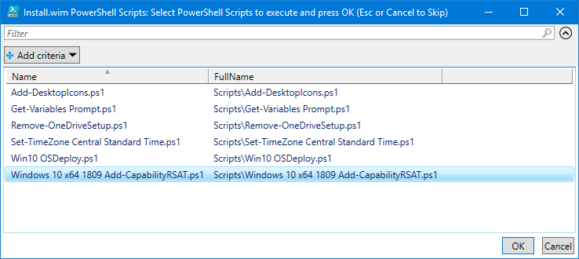
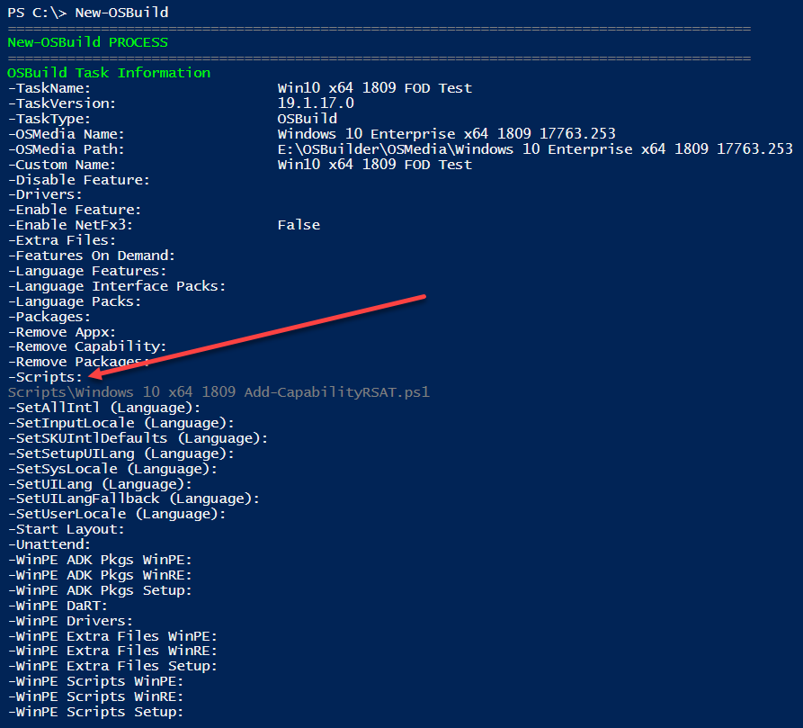
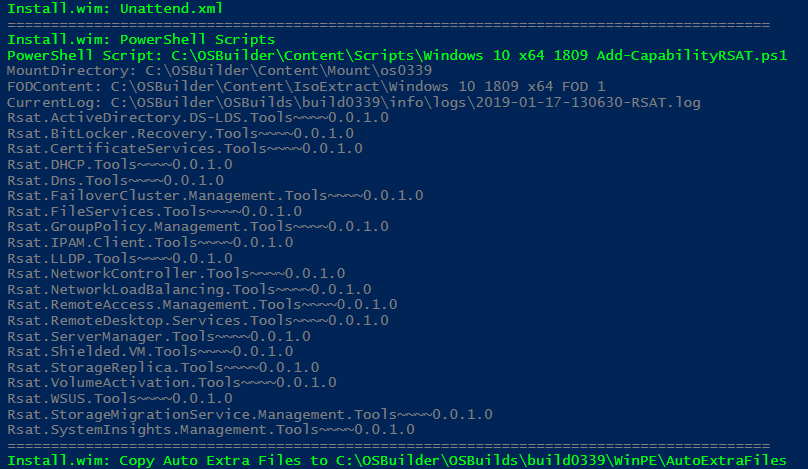

# Windows 10 1809 RSAT Capability


You need OSBuilder 19.1.17+ for this to function properly


To add the Windows 10 1809 RSAT Capability, I need to first download the Features on Demand ISO from MVLS



## Features On Demand Capabilities

Starting with Windows 10 1809, some Features on Demand are installed as a Windows Capability because they contain Satellite resources.  Even though RSAT is part of the Features on Demand ISO, they must be installed as a Capability.  OSBuilder does not include them as a Feature On Demand when selecting Features On Demand for an OSBuild Task.  Make sure you read about the changes to Features On Demand at this link



## PowerShell Script

The RSAT Capabilities must be installed using a separate PowerShell Script that is added to OSBuilder.  Use the following PowerShell script and save it to your [**OSBuilder PowerShell Scripts**](../functions/osbuild/new-osbuildtask-external-content/powershell-scripts.md) at  "C:\OSBuilder\Content\Scripts\Windows 10 x64 1809 RSAT.ps1"





## New-OSBuildTask

When creating a [**`New-OSBuildTask`**](../functions/osbuild/new-osbuildtask/), select the RSAT PowerShell Script

## New-OSBuild

When executing a New-OSBuild, you will see the PowerShell Script in the Task Information as well as during execution of the PowerShell script

## Testing

For a test, I can create an ISO using [**`New-OSBMediaISO`**](../functions/osbmedia/new-osbmediaiso.md) and when complete, I will install it on a Virtual Machine.  For proper testing, make sure to disable any Network connections to ensure that everything is installed Offline.  Looks perfect!

