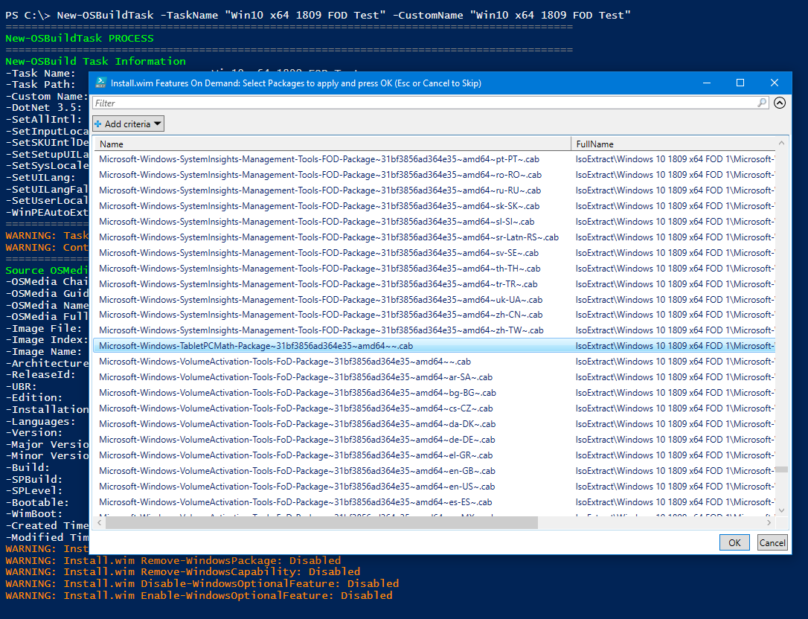
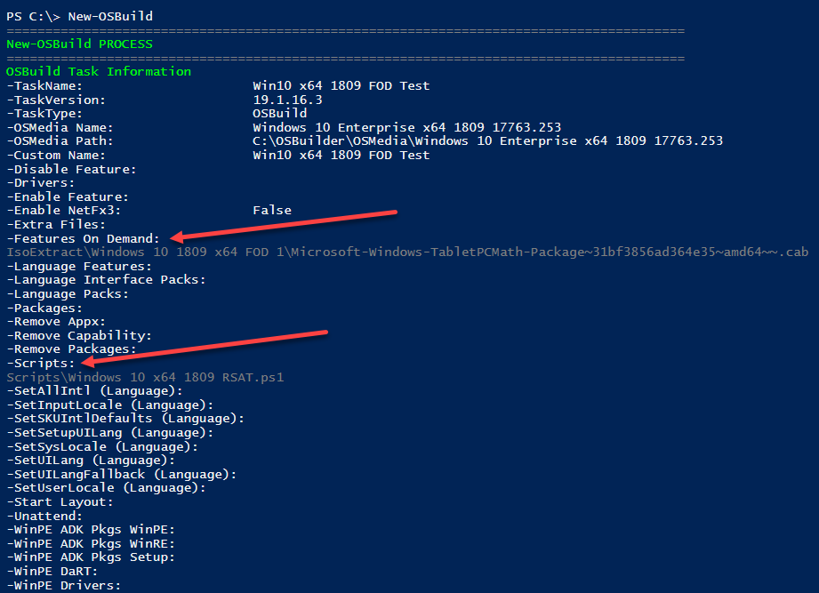
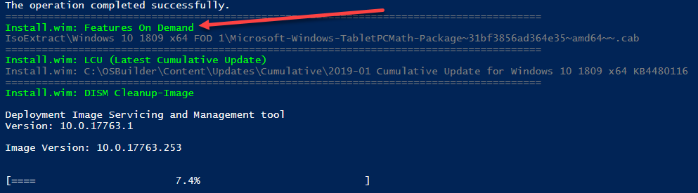
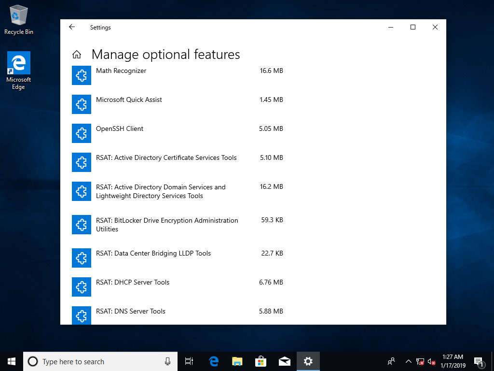

# Windows 10 1809 RSAT Capability

To add the Windows 10 1809 RSAT Capability, you must download the Features on Demand ISO



Starting with Windows 10 1809, Features on Demand are installed as a Capability because they contain Satellite resources.  Even though RSAT is part of the Features on Demand ISO, OSBuilder does not include them as they cannot be installed as Packages.  Make sure you read about the changes at this link



To install the RSAT Capabilities, use the following PowerShell script and save it to "C:\OSBuilder\Content\Scripts\Windows 10 x64 1809 RSAT.ps1"



## New-OSBuildTask

When creating a [**`New-OSBuildTask`**](../functions/osbuild/new-osbuildtask/), you will be prompted to select Features on Demand.  Make sure you do not include the Features that require Satellite Features \(RSAT\) or press Cancel to skip

For the Features on Demand, make sure you have a proper PowerShell Script selected when prompted

## New-OSBuild

I executing a New-OSBuild, you will see the Features on Demand as well as any PowerShell Scripts that are needed for Satellite Features

During execution you should see progress for the Features on Demand and the PowerShell Script

## Testing

For a test, I can create an ISO using [**`New-OSBMediaISO`**](../functions/osbmedia/new-osbmediaiso.md) and give it an install in a Virtual Machine.  I made sure to disable any Network connections to ensure that everything was installed Offline.  Looks perfect!

