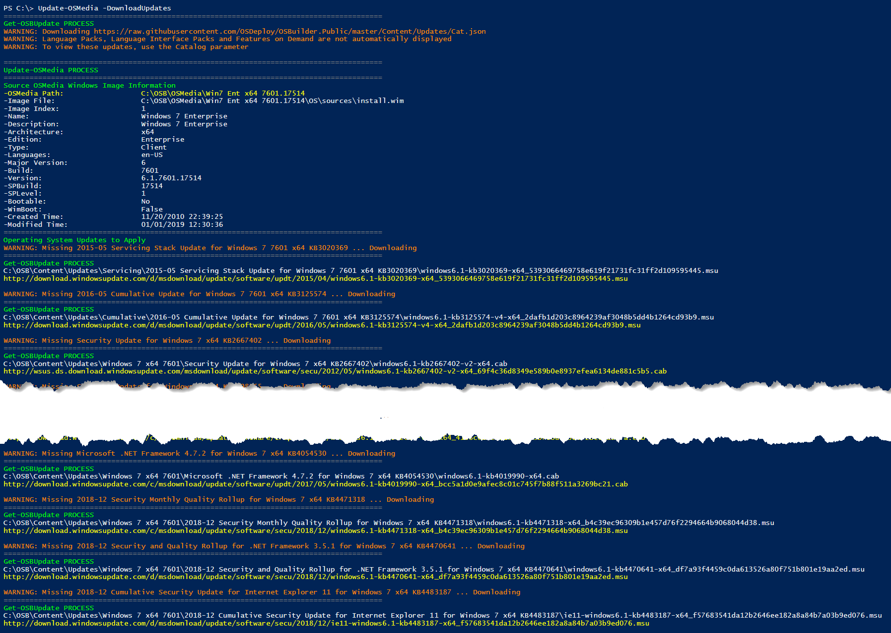
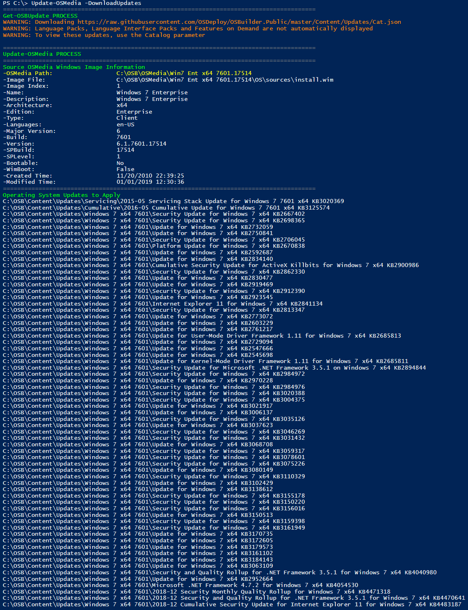

# Download Updates

Once Windows 7 has been imported, you can proceed to downloading the Microsoft Updates.  While you may think that downloading from [**`Get-OSBUpdate`**](../../functions/osbupdate/get-osbupdate.md) is how you do this, here is a tip ... use [**`Update-OSMedia -DownloadUpdates`**](../../functions/osmedia/update-osmedia/#update-osmedia-downloadupdates) instead

## Update-OSMedia -DownloadUpdates

This will automatically pull the latest Update Catalog and then download \(almost\) all the Microsoft Updates needed for updating Windows 7.  The first time you run it, it will look like this \(way too long\)

Once this is complete, run it a second time to see the full list of all Microsoft Updates that will be installed \(You may have to Right Click and open in a New Window to see it properly\)

