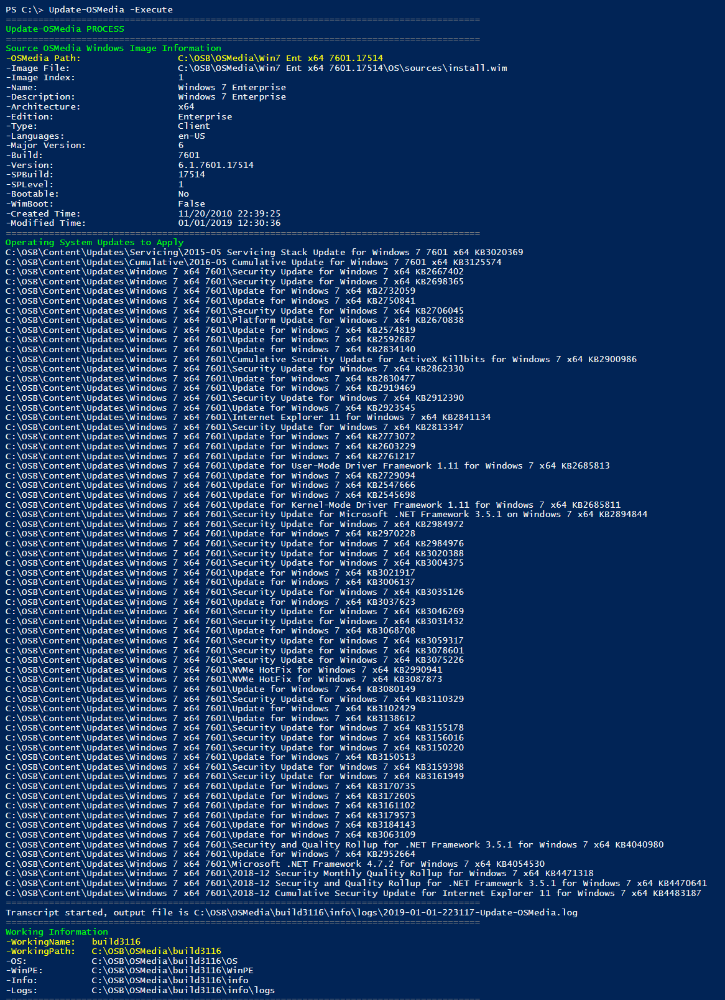
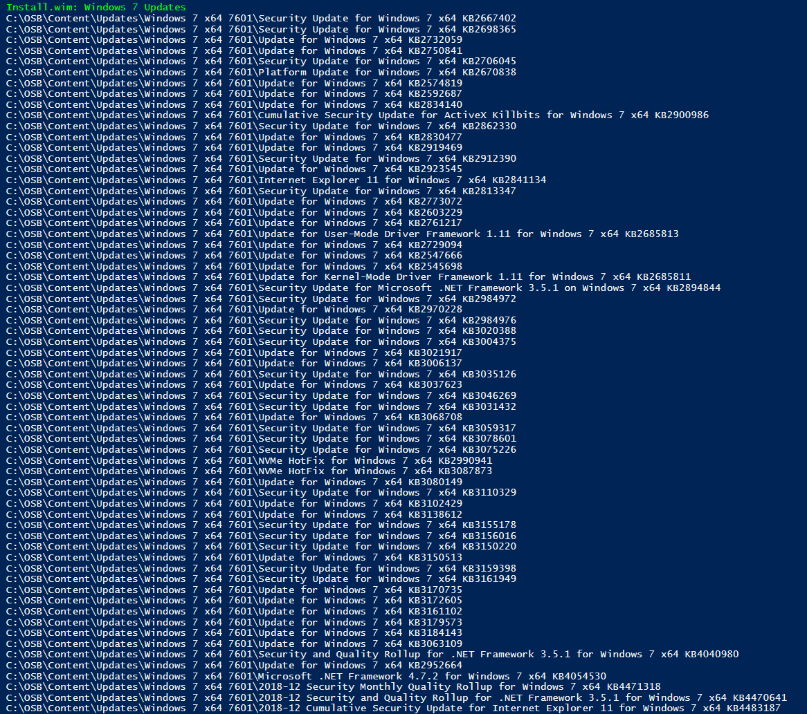
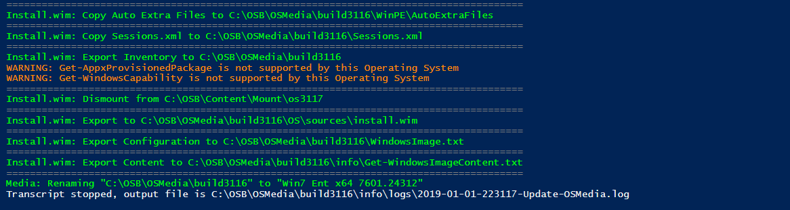

# Update OSMedia

Once you have all your Microsoft Updates downloaded, you can run [**`Update-OSMedia -Execute`**](../../functions/osmedia/update-osmedia/)**\`\`**

## Media and WinPE Phase

You can see the Servicing Stack, Cumulative Update, and NVMe Hotfix \(if added\) will be applied to all Windows 7 WinPE's

## Operating System Phase

The Install.wim will then be updated with the Servicing Stack and Cumulative Updates

The remaining updates will be applied

and then the image will be completed

