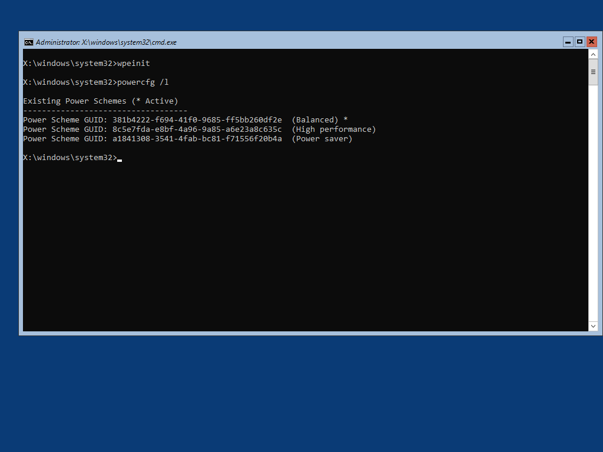
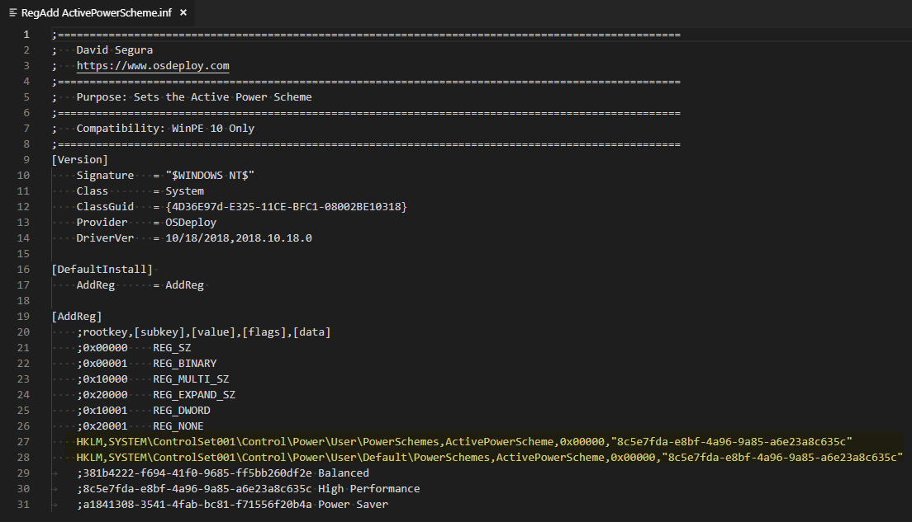

# RegAdd ActivePowerScheme



WinPE is set to use Balanced as the Default Power Scheme, but changing this to High Performance can cut down the OS Deployment time in WinPE.

This Driver will automatically set the Default Power Scheme to High Performance, without mounting the Registry or adding a Step in your Task Sequence.

## OSBuilder.Public Repository

This Driver is included in the OSBuilder.Public Repository at: **OSBuilder.Public\Content\WinPE\Drivers\RegAdd ActivePowerScheme**



## 

