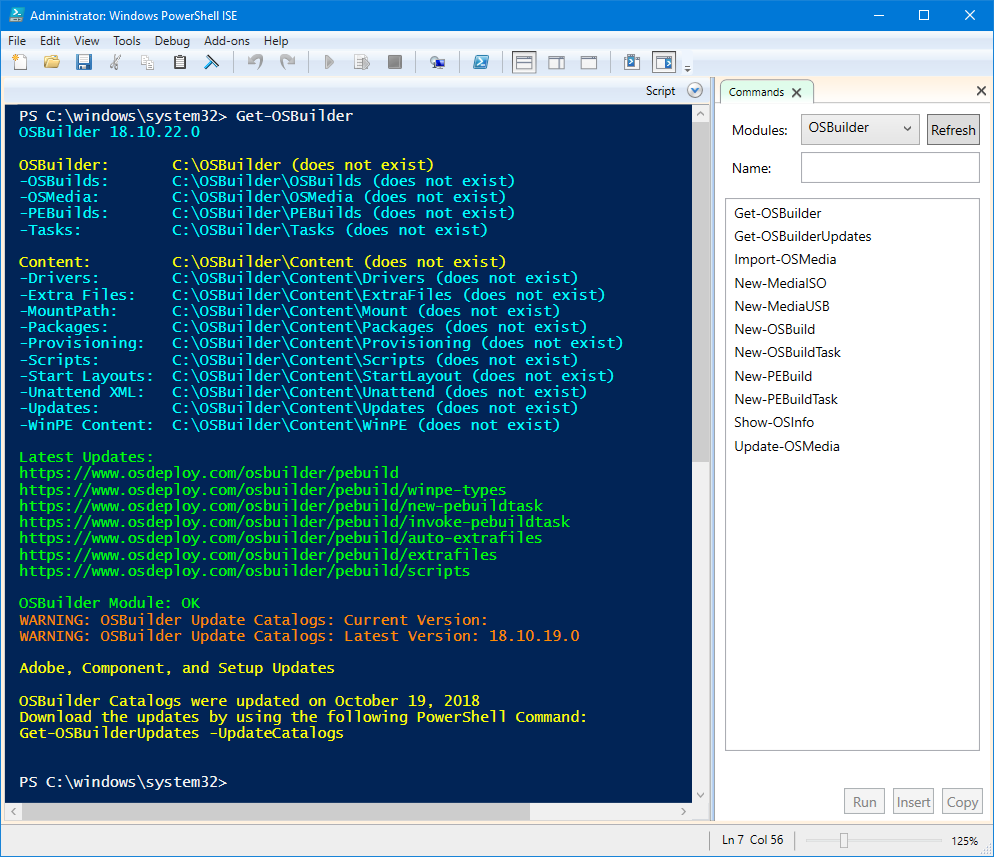

# Requirements

## OSBuilder in PowerShell ISE

OSBuilder needs to be executed in PowerShell ISE \(as Elevated Administrator\) due to GridView constraints.

## Admin Rights

OSBuilder requires Admin Rights in PowerShell as you will be manipulating Windows Images. Make sure you launch PowerShell ISE as Administrator when using OSBuilder.  This is a requirement of DISM

## Supported Operating Systems 

You can use the OSBuilder PowerShell Module on Windows 10.  Windows Server 2016, and Windows Server 2019 may be able to work, but this has not been tested.

_**Using the OSBuilder PowerShell Module on Windows 7 or Windows Server 2012 will only cause pain, grief, and sorrow.**_

You can use OSBuilder with Windows 10, Windows Server 2016, and Windows Server 2019 Media.

## Hardware Requirements

Offline Servicing of Windows 10 can take a considerable amount of time, especially on older releases. The process of Mounting a WIM, Applying a Cumulative Update, and performing DISM Image Cleanup will take as little as 30 minutes \(1803 x86\) on a healthy Intel Core i7 computer with a SSD, to almost 2 hours \(1607 x64\) on the same system.

I strongly recommend using a Workstation class system in performing these updates.

Since OSBuilder will mount Windows Images, I strongly recommend that you do not have any running Anti-Virus scanning files ON ACCESS. McAfee will prevent the dismounting of images properly.


OSBuilder works best on a stand alone Workgroup computer without an AntiVirus performing On Access Scanning.  Use a Virtual Machine \(with some power\) as an alternate solution


## OSMedia

If you used my previous attempt at this called OSMedia, you will need to get rid of it first.

