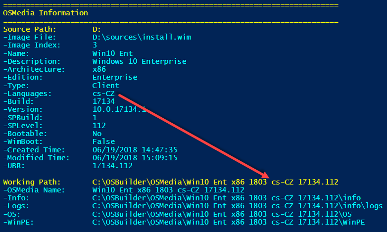
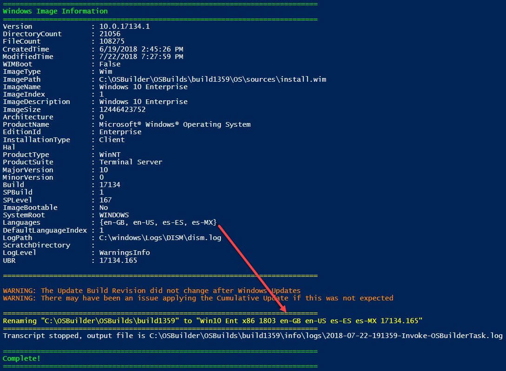
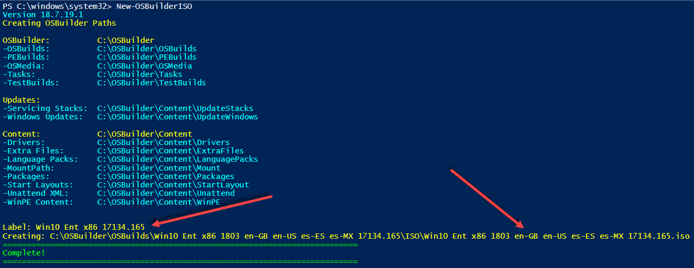
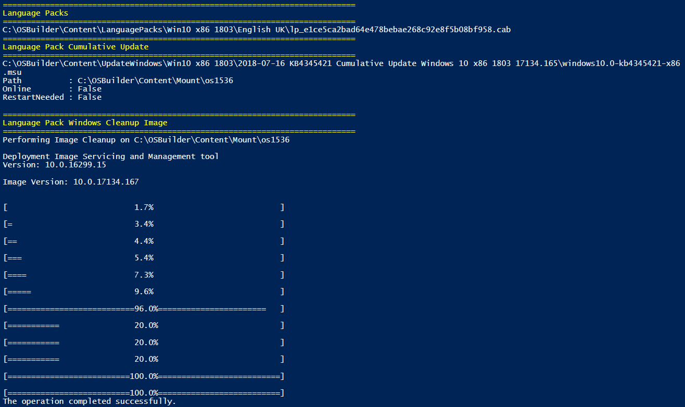

# Work with Languages

First things first, I must apologize. I live in an en-US world, and while I do create our Enterprise images, I do not create them in anything except en-US. [Manel Rodero](https://twitter.com/manelrodero) has done some testing with OSBuilder to improve on making it a little less en-US, and a little more glo-BAL. I hope this helps.

## Import-OSMedia

When importing an Operating System, OSBuilder will now add the Language to the imported media, **if it is not en-US**.

## Invoke-OSBuilderTask

In the case of a single Language, OSBuilds will include the Language in the new Build, **except en-US**. In the case of adding Language Packs where multiple languages are present, all Languages will be included in the Build Name

## New-OSBuilderISO

When creating an ISO, the ISO will have the name of the Languages, similar to Invoke-OSBuilderTask. The Label \(what you see when the ISO is mounted\) will not show any Language information due to the 32 character limitation

## Cumulative Updates

When adding a Language Pack, OSBuilder will reapply the Cumulative Update and run a Windows Image Cleanup. This is because the Cumulate Update will also update certain files that were added in a Language Pack. The CU and Cleanup process should only take 2 minutes to complete.

