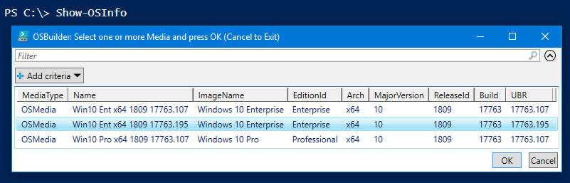

# Show-OSInfo

This function is used to display information about any **`OSMedia`**, **`OSBuild`**, or **`PEBuild`**.  If you want to know how this works, read [Knowledge: OSBuilder OS Information](../../knowledge/osbuilder-os-information.md)

## Show-OSInfo

When using **`Show-OSInfo`** without any parameters, you will be prompted to select an OSMedia, OSBuild, or PEBuild.  Select one or more and press OK



## Show-OSInfo -FullName

When using the **`-FullName`** parameter, use the path of the imported Media \(not the install.wim\)

```text
Show-OSInfo -FullName 'C:\OSBuilder\OSBuilds\Win10 Ent x64 1803 17134.167'
```

## Output

The following is an example of what is displayed when using **`Show-OSInfo`**


