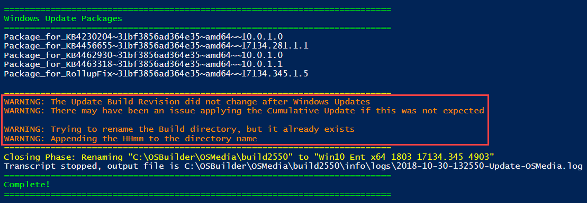
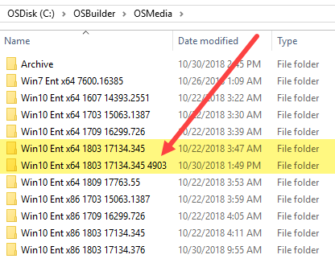
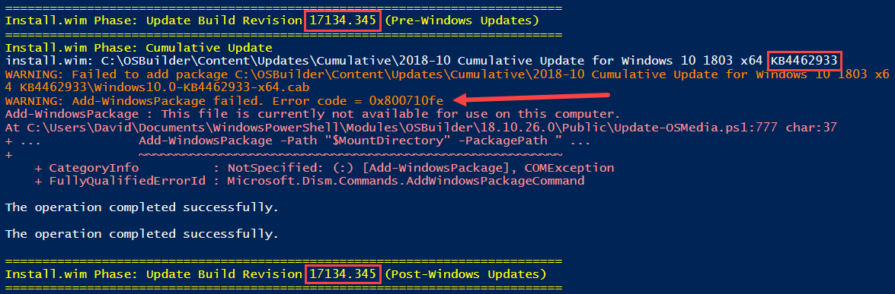
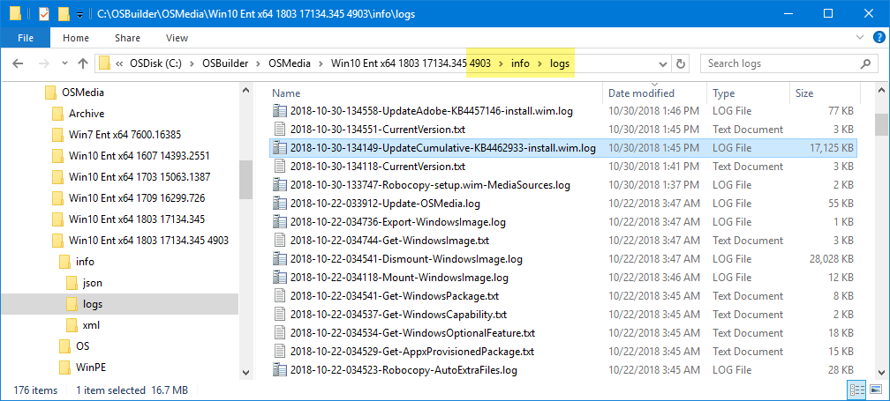
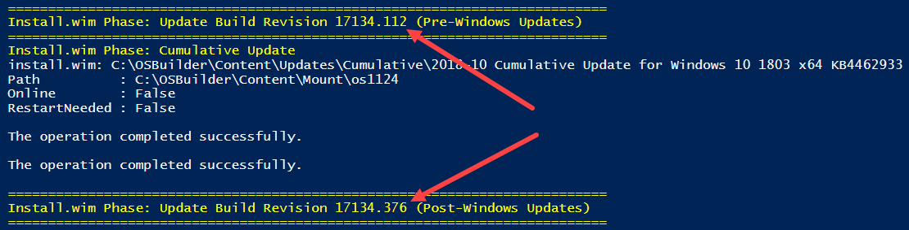

# OSMedia Failed UBR Change

Occasionally performing an [**`Update-OSMedia`**](../functions/osmedia/update-osmedia/) will generate a **WARNING** message that the Update Build Revision did not change.

This will also result in the creation of an OSMedia with 4 digits added to the end.  This is due to there being an existing directory with the same name \(which would not have happened if the UBR was changed\)

## Error Message

The Console may show an error message if you check the Cumulative Update step

## Troubleshooting

Look in the **info\logs** directory for **\*UpdateCumulative\*.log** and see if you can figure things out

## Previous OSMedia

But I tend to find the troubleshooting takes a bit of time and it may be easier to restore a previous OSMedia from my [**OSMedia Archive**](osmedia-archive.md) and test again.  In this case that seemed to do the trick

