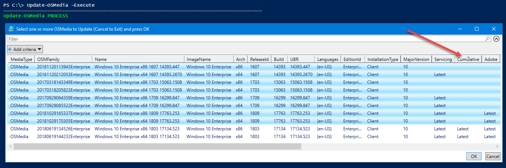

# OSMedia Updating

When new Microsoft Updates are released, its time to update all my Operating Systems.  This is actually quite easy to do.  To keep from having a long list of OSMedia, its a good idea to Archive old revisions in an OSMedia subdirectory



I typically move my Imported OSMedia that hasn't been modified into an ImportMedia directory.  Previous OSMedia versions that have been superseded get moved into Archive where I will delete as needed.  I usually keep one month back just in case things don't update properly with my latest existing OSMedia

## Update-OSMedia -DownloadUpdates

This is the command that will download all the updates I need to get things up to date.  I can select all if I want, or just select the ones that do not show Latest on all existing updates.  These are the ones that you need.  Multi-select the OSMedia and press OK

After pressing OK, all the selected OSMedia will be checked for required Updates and download what is needed

## Update-OSMedia -Execute

This is the command that will update the OSMedia.  In this case I sorted by the ones missing the Cumulative update and pressed OK.  Now time to get some sleep and see all my updated OSMedia in the morning.

## Easy

Yes, its that easy getting everything up to date.  Tomorrow I'll update my OSBuilds.  Enjoy!

