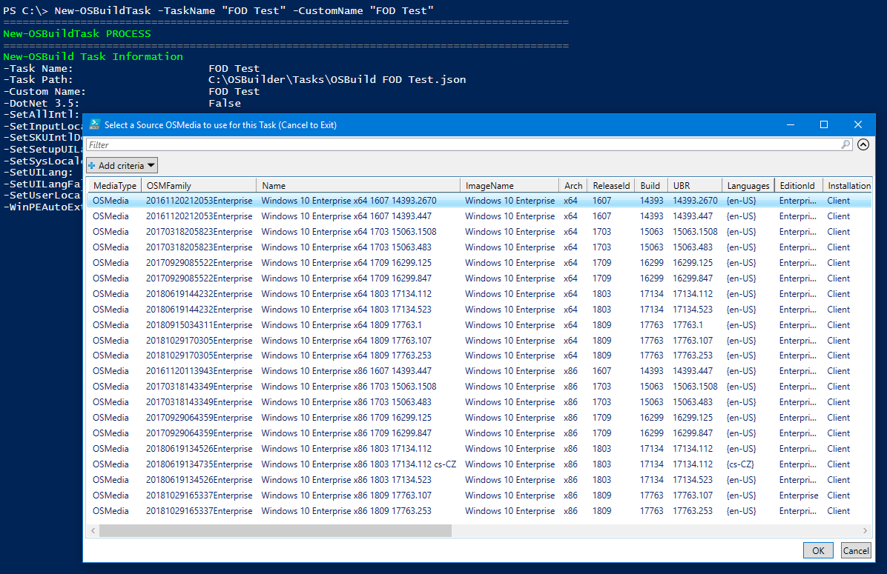
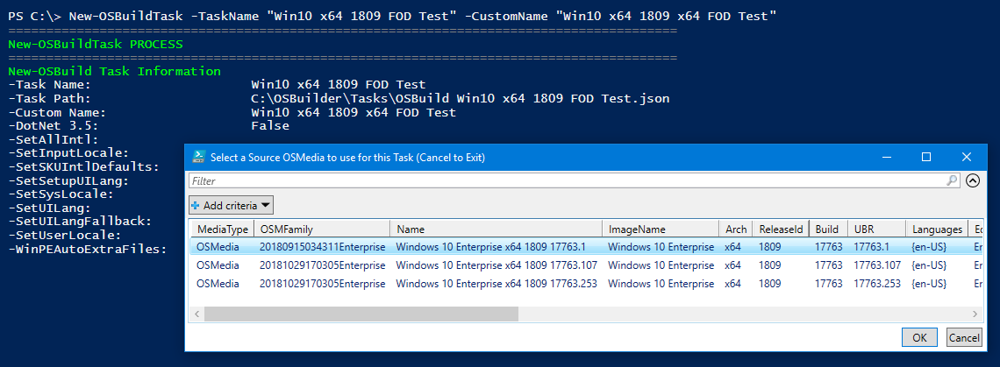

# Task Naming

When creating a [**`New-OSBuildTask`**](../functions/osbuild/new-osbuildtask/) or [**`New-PEBuildTask`**](../functions/pebuild/new-pebuildtask/) you will always need to select an [**`OSMedia`**](../functions/osmedia/) to use.  This list can get quite lengthy if you manage multiple versions

Try giving your Task a **TaskName** that includes the **ReleaseId** and **Architecture.**  Your list of [**`OSMedia`** ](../functions/osmedia/)to select will be automatically filtered

