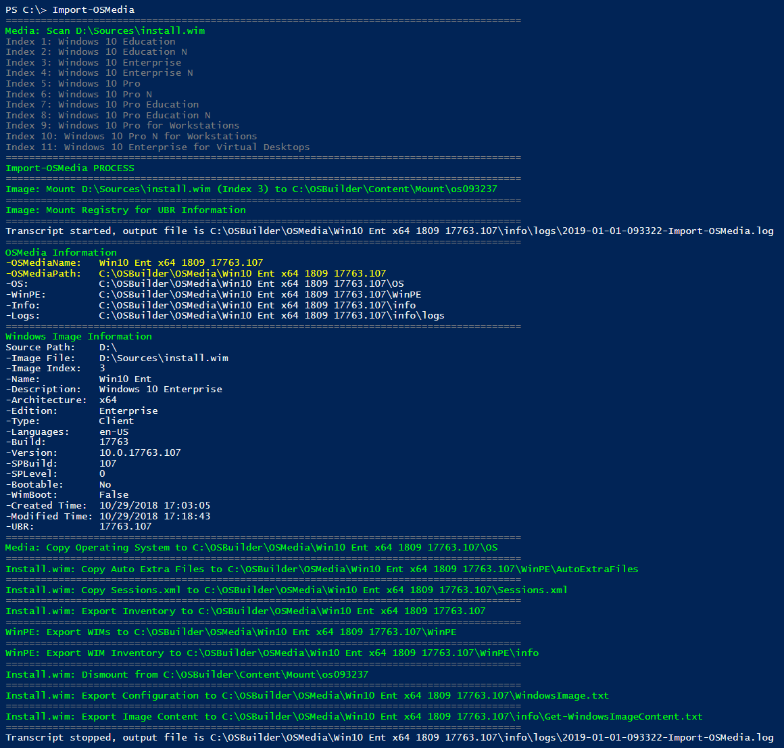
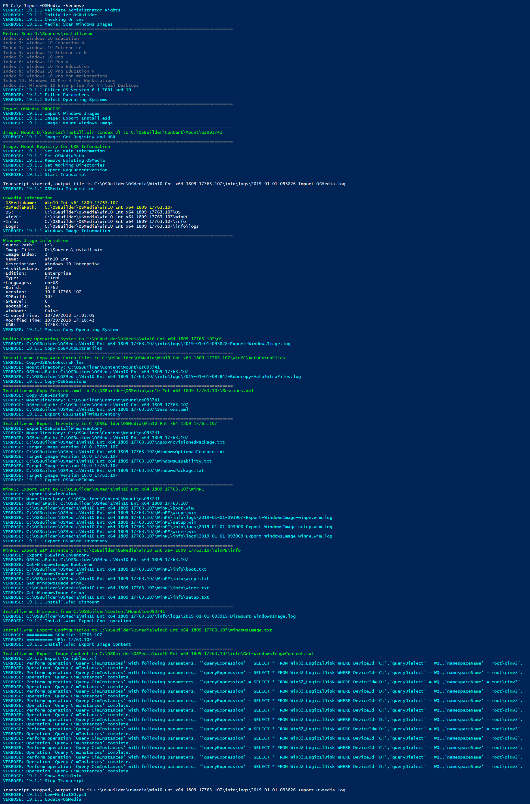

# Verbose

If you want more details on any of the OSBuilder Functions, consider adding the Verbose parameter.  This will display more details and include Log paths.  Here's an example of Import-OSMedia \(right click and open in new window\)

