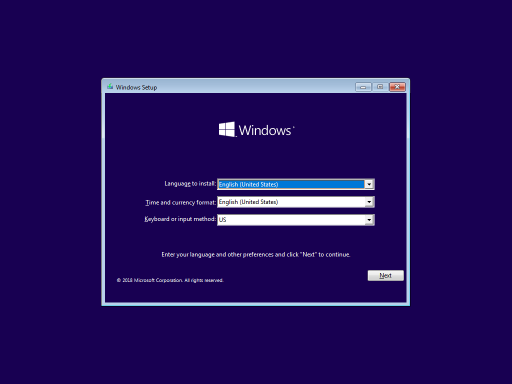
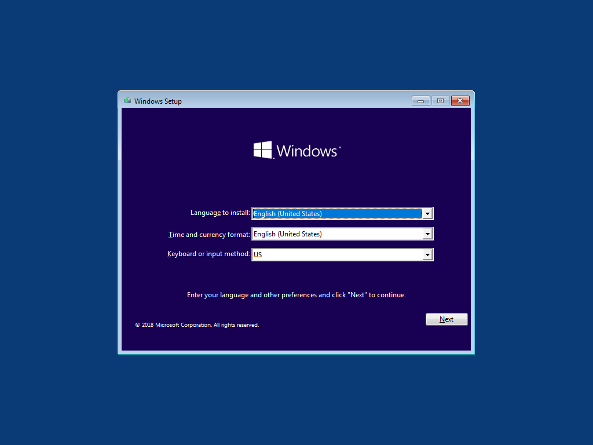
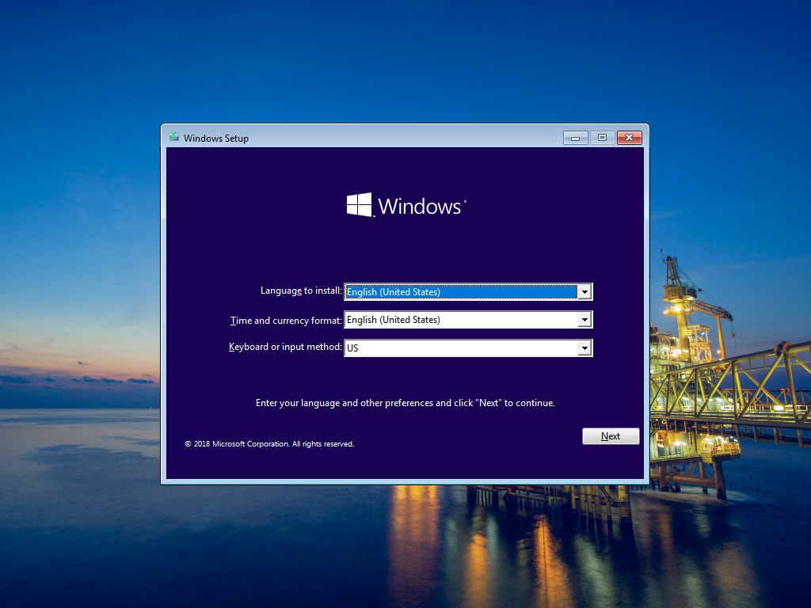

# Windows Setup Wallpaper

When booting to Windows Setup, it is impossible to tell if you are using a Customized OSBuild or not as there are no clues when presented with the Windows Setup wizard.

Consider changing the Windows Setup wallpaper to something different, so you can easily distinguish the difference between a Microsoft ISO and a customized OSBuild ISO

Or take the time to use one of your Company Wallpapers so you can make your OSBuild completely stand out

Making this change is easy using [**`WinPE Extra Files`**](../functions/osbuild/new-osbuildtask-winpe/winpe-extrafiles.md), simply replace the **Windows\System32\Setup.bmp** with your own file.  The default size is 1024 x 768, but be aware that the Wallpaper will be centered and not stretched, so when booting to a high resolution screen like a Surface Pro, results may vary.

