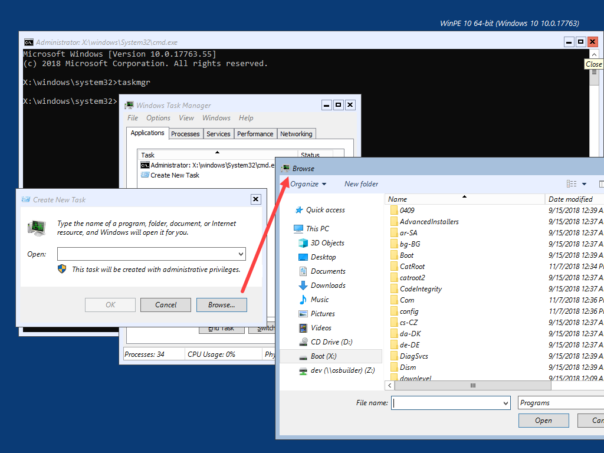
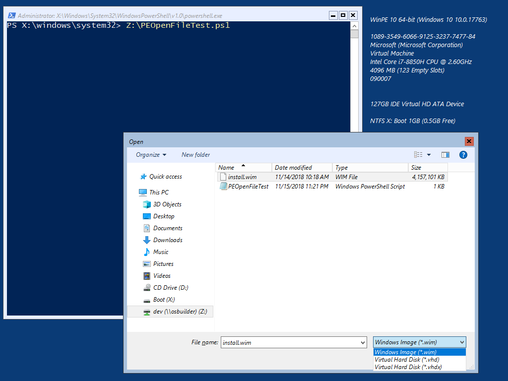
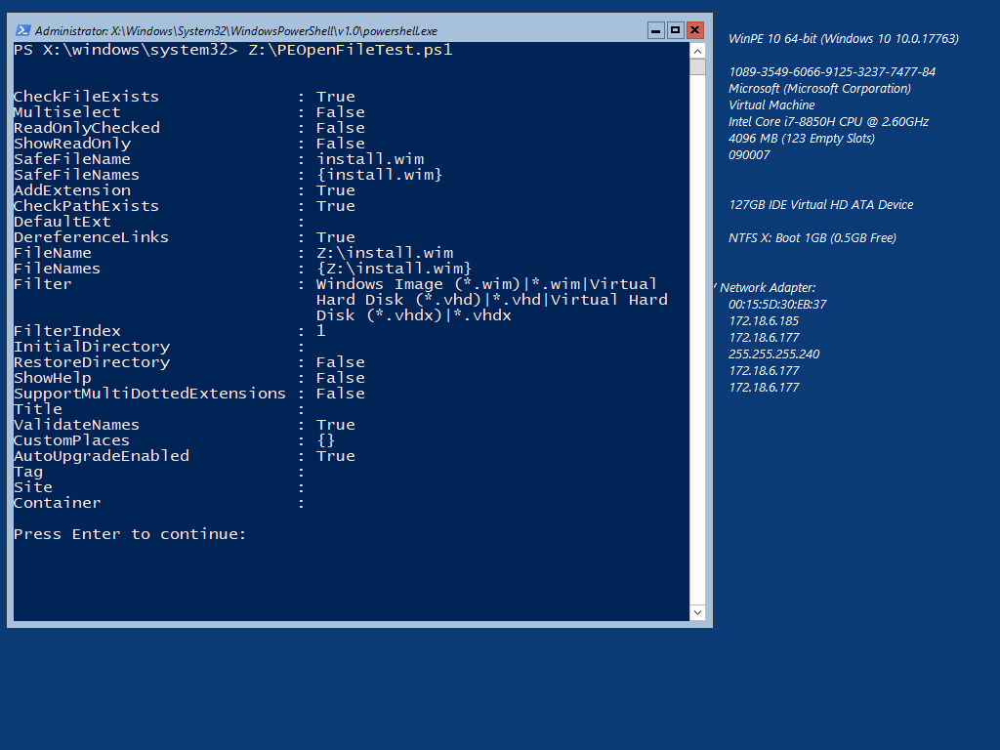
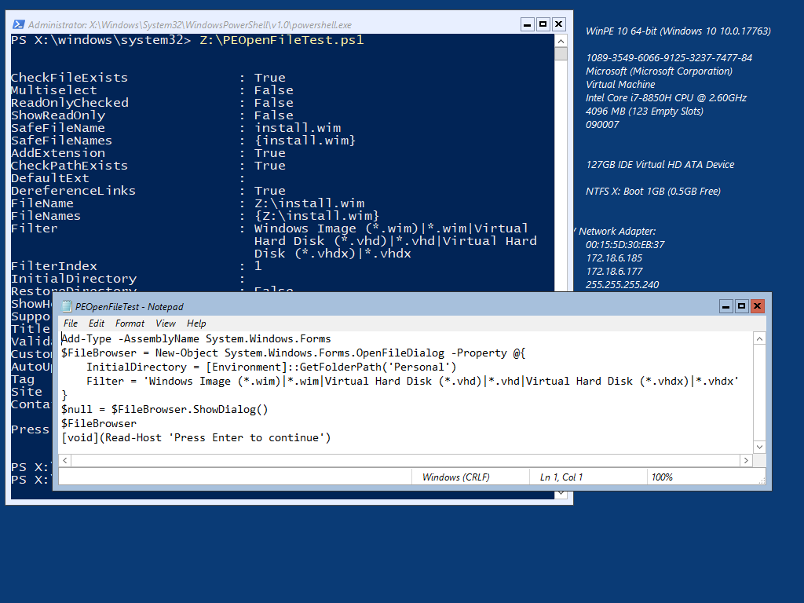

# RegAdd Browse



If you want to restore the ability to Browse for files in WinPE, you will need to add this Driver and the following files to System32 \(including MUI\):

* shellstyle\*
* explorerframe\*
* StructuredQuery\*
* edputil\*

These files are automatically collected by [**Auto ExtraFiles**](../auto-extrafiles.md) so they can be easily added to WinPE

A quick test in WinPE is to open TaskMgr and Run a New Task.  After adding this Driver and the above files, you can now Browse for files.

## PowerShell

And yes, you can even use this with PowerShell, so now you can make a proper WIM Backup and Restore GUI

## OSBuilder.Public Repository 

This Driver is included in the OSBuilder.Public Repository at: **OSBuilder.Public\Content\WinPE\Drivers\RegAdd Browse**

{% embed url="https://github.com/OSDeploy/OSBuilder.Public/tree/master/Content/WinPE/Drivers/RegAdd%20Browse" %}

