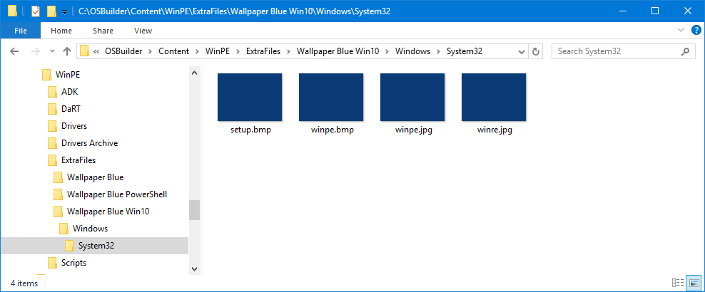

# Wallpaper

Looking to add some color to WinPE?  Simply add your Wallpaper as ExtraFiles making sure that your wallpaper will overwrite the ones in WinPE \(Windows\System32\).  Your Wallpaper should be 1024 x 768.  WinPE will stretch the Wallpaper, so I recommend using a SOLID color.

You will need to create files to replace the following files

```text
Windows\System32\setup.bmp
Windows\System32\winpe.bmp
Windows\System32\winpe.jpg
Windows\System32\winre.jpg
```

Make sure you place your files in the following directory structure \(modify path as needed\)

```text
C:\OSBuilder\Content\WinPE\ExtraFiles\Wallpaper Name\Windows\System32\setup.bmp
C:\OSBuilder\Content\WinPE\ExtraFiles\Wallpaper Name\Windows\System32\winpe.bmp
C:\OSBuilder\Content\WinPE\ExtraFiles\Wallpaper Name\Windows\System32\winpe.jpg
C:\OSBuilder\Content\WinPE\ExtraFiles\Wallpaper Name\Windows\System32\winre.jpg
```



When creating your New-PEBuildTask, select the Wallpaper Directory when prompted to add WinPE Extra Files


## Sample Content

You can clone my OSBuilder Public Repository and copy the files in Content\WinPE\ExtraFiles



## Examples


