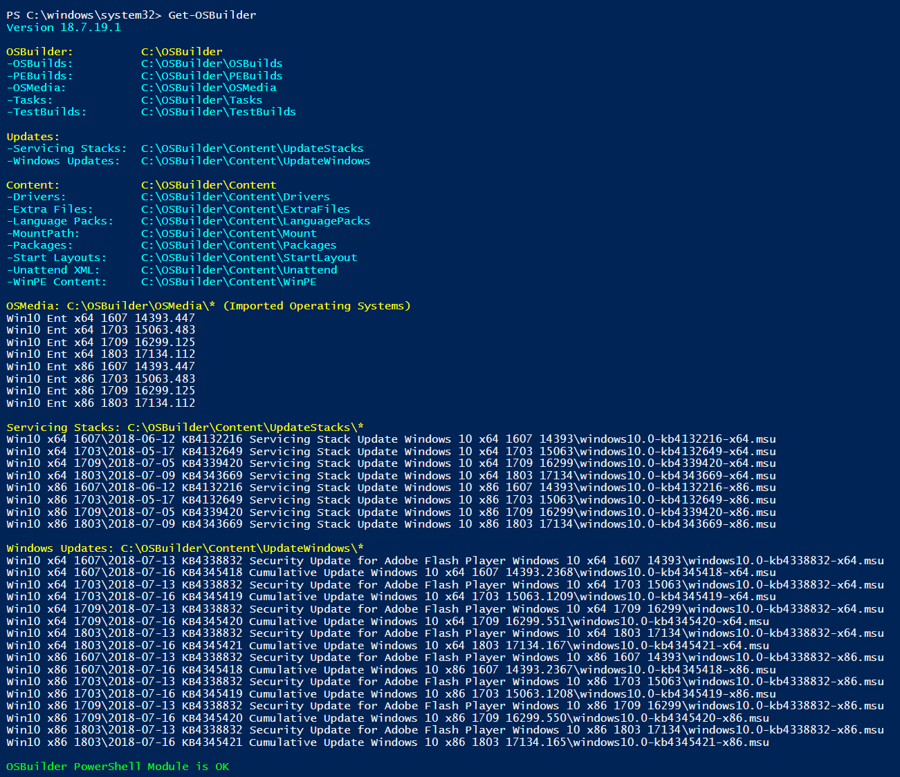
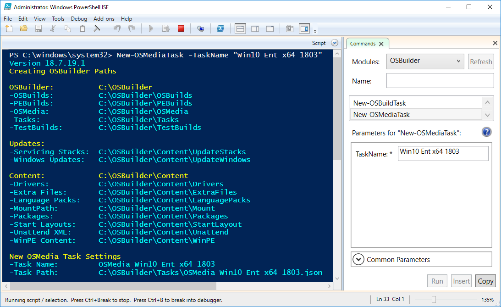
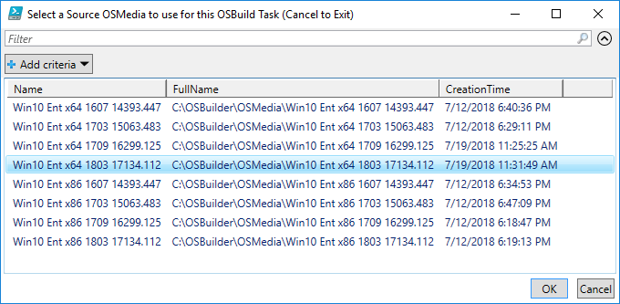
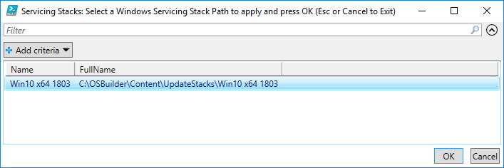
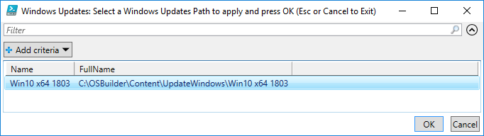
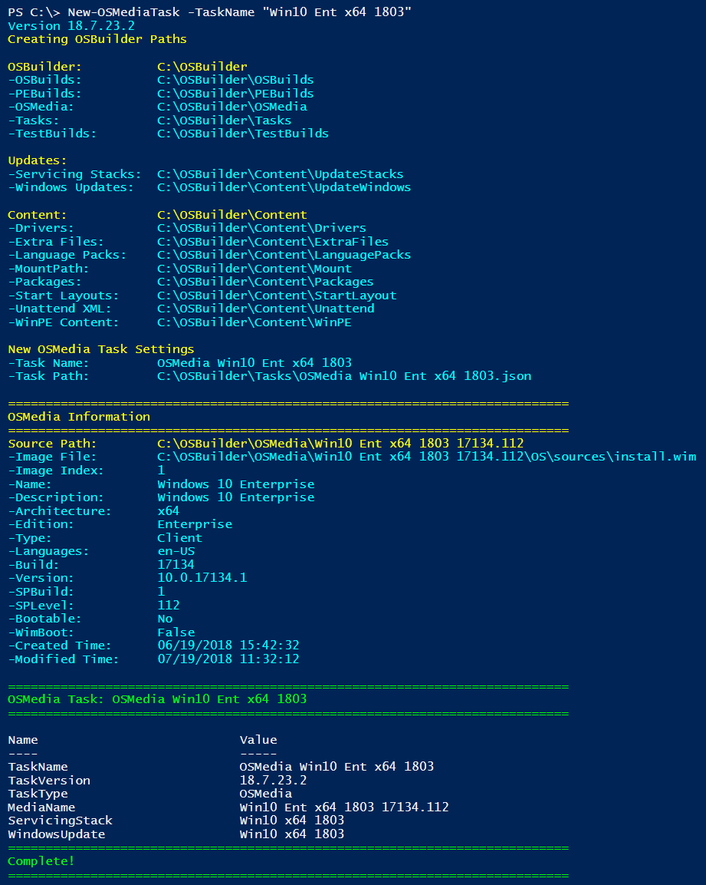
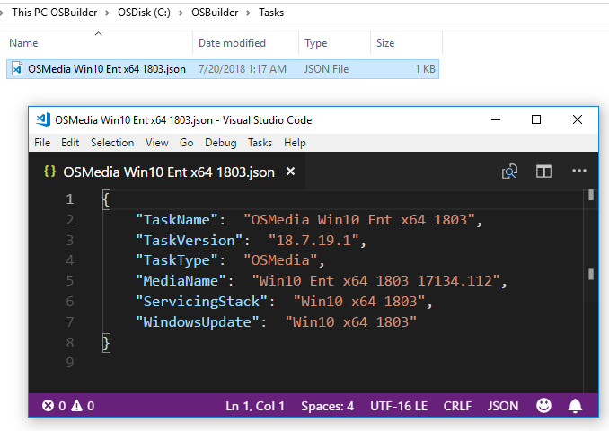
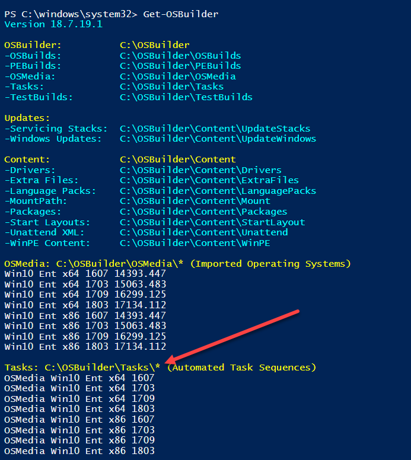

# Create an OSMedia Task

You can update existing OSMedia by performing the following tasks

* Apply the latest Servicing Stack to Windows
* Apply the latest Cumulative Updates and Adobe Flash Updates to Windows
* Dism /Image-Cleanup
* All WinPE's applied with the latest SSU and CU's
  * WinPE \(Boot.wim Index 1\)
  * Windows Setup \(Boot.wim Index 2\)
  * WinRE
* Sources directory on the Media will be updated

An OSMedia Task does NOT perform any additional customizations \(that would be an OSBuild\)

## Prerequisites

Before getting started you need to have these three things ready

* Servicing Stacks
* Windows Updates \(Cumulative and Adobe\)
* OSMedia \(Imported Operating Systems\)

Get-OSMedia will show me what I have imported. In the image below I have 8 different Windows 10 Operating Systems. I have a matching number of Servicing Stacks, Cumulative Updates, and Adobe Flash Security Updates.

**Right click and open the following image in a new tab for a better look at the output**

## New-OSMediaTask -TaskName "Win10 Ent x64 1803"

A simple TaskName is always best. I select one that matches the name of my OSMedia

## Select a Source OSMedia

Select a single existing OSMedia to use for this Task and press OK

## Select Servicing Stack Directory

Since OSBuilder recognizes the Build and Architecture of your Task, it does not show incompatible Servicing Stacks. Select the Servicing Stack and press OK. Make sure the contents of this directory are up to date

Future updates to OSBuilder may skip this prompt entirely

## Select Windows Update Directory

Just like the Servicing Stack selection, the Windows Update is the same. Make sure the contents of this directory are up to date.

## Complete

When finished, the Task will be created. OSMedia is added at the beginning of the TaskName automatically

**Right click and open in a new window if the image is too small**

## Task Location

Tasks are saved in the Tasks directory in OSBuilder as a JSON file with all the information needed for performing the OSMedia update.

## Wash, Rinse, and Repeat

Take the time now to repeat this step for every Operating System you imported You will probably spend 2 minutes total on this process.

