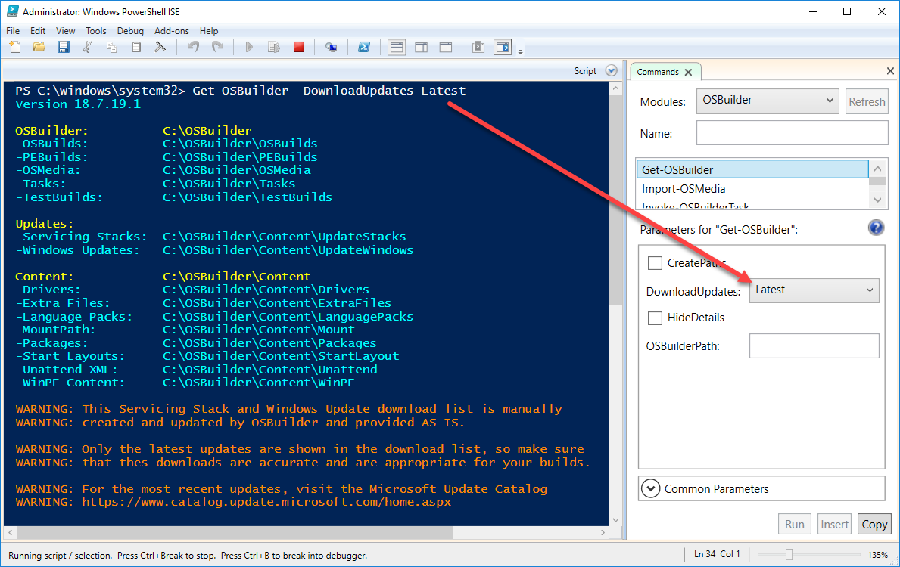
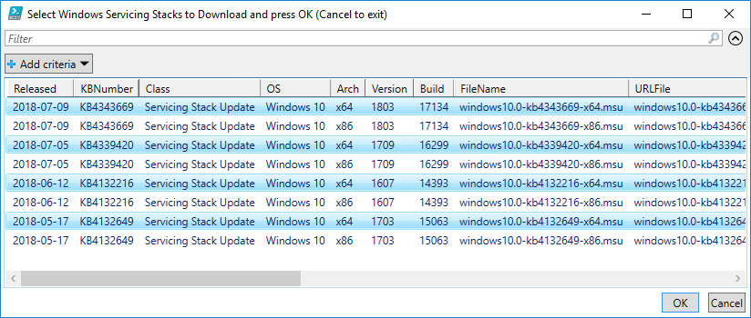
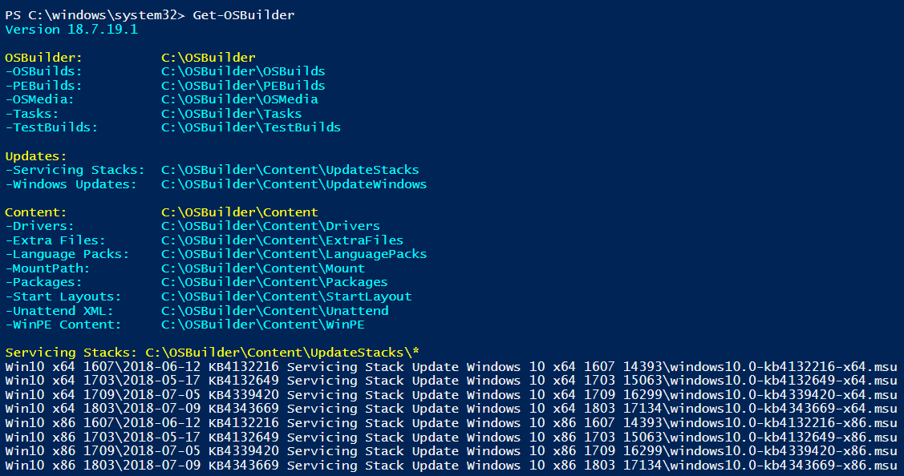

# Download Servicing Stacks

To ensure you don't run into any problems when Servicing a Windows Image Offline, you need to ensure that you have the latest Servicing Stacks.

I strongly recommend you check the Microsoft Update Catalog for additional Critical and Adobe Security Updates at

[https://www.catalog.update.microsoft.com/Home.aspx](https://www.catalog.update.microsoft.com/Home.aspx)

Place them in your OSBuilder\Content\UpdateStacks directory. Each update should be placed in a separate directory matching the supported Operating System

## Get-OSBuilder -DownloadUpdates Latest

I publish a list of current Servicing Stacks online at [https://www.osdeploy.com/osbuilder/stacks.json](https://www.osdeploy.com/osbuilder/stacks.json)

This list is automatically used by OSBuilder so you can download using Get-OSBuilder

## Select Servicing Stacks

Select what you need, or all of them, and press OK.

## Get-OSBuilder

You can verify you have Servicing Stacks in OSBuilder by simply running Get-OSBuilder

