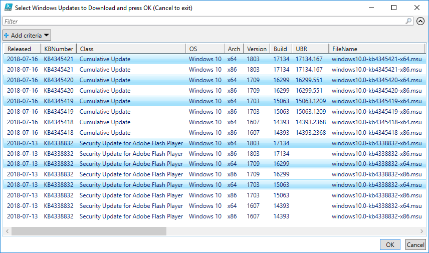
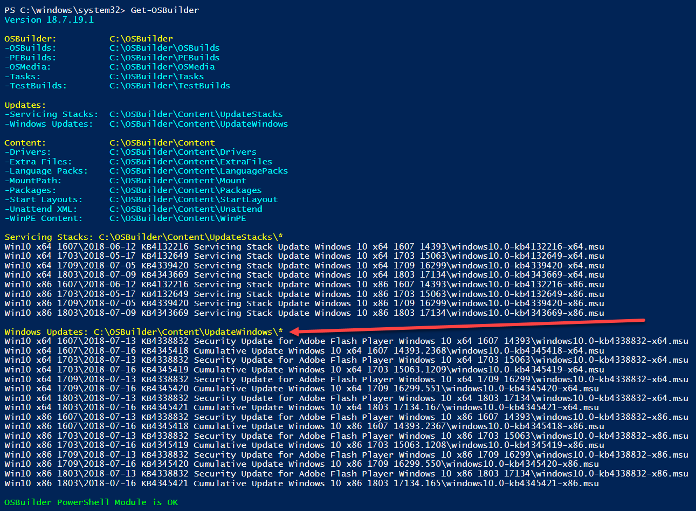

# Download Windows Updates

Always check the Microsoft Windows 10 Update History pages for the latest Cumulative Updates for Windows 10

[https://support.microsoft.com/en-us/help/4099479](https://support.microsoft.com/en-us/help/4099479)

In addition you will also need to check for Critical Updates and Adobe Security Updates at the Microsoft Update Catalog

[https://www.catalog.update.microsoft.com/Home.aspx](https://www.catalog.update.microsoft.com/Home.aspx)

Place the Windows Updates in your OSBuilder\Content\UpdateWindows directory. Each update should be placed in a separate directory matching the supported Operating System

## Get-OSBuilder -DownloadUpdates Latest

I publish a list of current Cumulative Updates and Adobe Flash Security Updates online at [https://www.osdeploy.com/osbuilder/updates.json](https://www.osdeploy.com/osbuilder/updates.json)

This list is automatically used by OSBuilder so you can download using Get-OSBuilder

## Select Updates

Select what you need, or all of them, and press OK.

## Get-OSBuilder

You can verify you have Servicing Stacks in OSBuilder by simply running Get-OSBuilder

