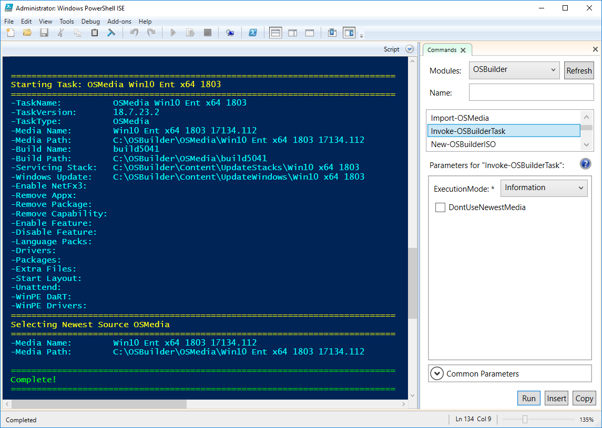

# ExecutionMode - Information

There are multiple Execution Modes that can be used when executing a Task. Let's start with the **Information** option. This will simply read the Task and output the settings. OSBuilder will always try to find a newer UBR than what is specified in the Task which you will see at the bottom under "Selecting Newest Source OSMedia". If you would prefer that OSBuilder stick with the specific OSMedia specified in the Task, then use the **-DontUseNewestMedia** parameter. There is no further action when choosing **Information** as the **ExecutionMode**.

