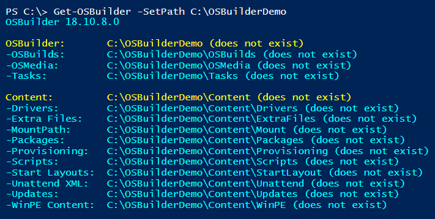

# Change the OSBuilder Path

OSBuilder defaults to C:\OSBuilder.  While this works for most people, it may be necessary to change this from the default.  Here are some examples of why you would want to change the path

* Moving OSBuilder to a larger secondary Drive
* Changing between different OSBuilder instances
  * Separate Windows 10 from Windows Server
  * Manage OSBuilder on an External Drive
  * Present a Demo for a Presentation or Training

To change the OSBuilder path simply use **Get-OSBuilder** with the **SetPath** Parameter

