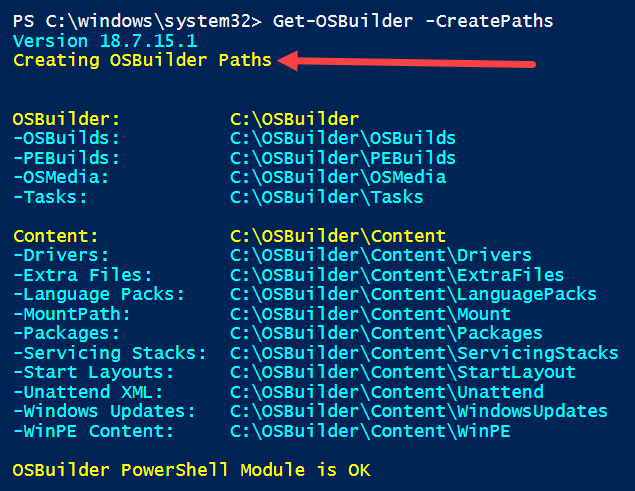

# Get OSBuilder

Start by opening PowerShell ISE as Elevated \(Run as Administrator\). Select the OSBuilder Module and then Get-OSBuilder

When executing Get-OSBuilder without any parameters, it will display a few things:

* OSBuilder PowerShell Module Version Information
* Directory Structure
  * \(does not exist\) is self explanatory
* Update Information \(OSBuilder PowerShell Module is OK\)

## Get-OSBuilder -OSBuilderPath

If you want to redirect OSBuilder to a different location, use this parameter

## Get-OSBuilder -CreatePaths

This will create the OSBuilder directory structure

And the same structure in Windows Explorer

## Updates

If OSBuilder is up to date, this will be displayed as a message on the bottom

If a newer version is released, this will change to a Warning message

If Servicing Stacks or Windows Updates have changed, a Warning message will be displayed as well

