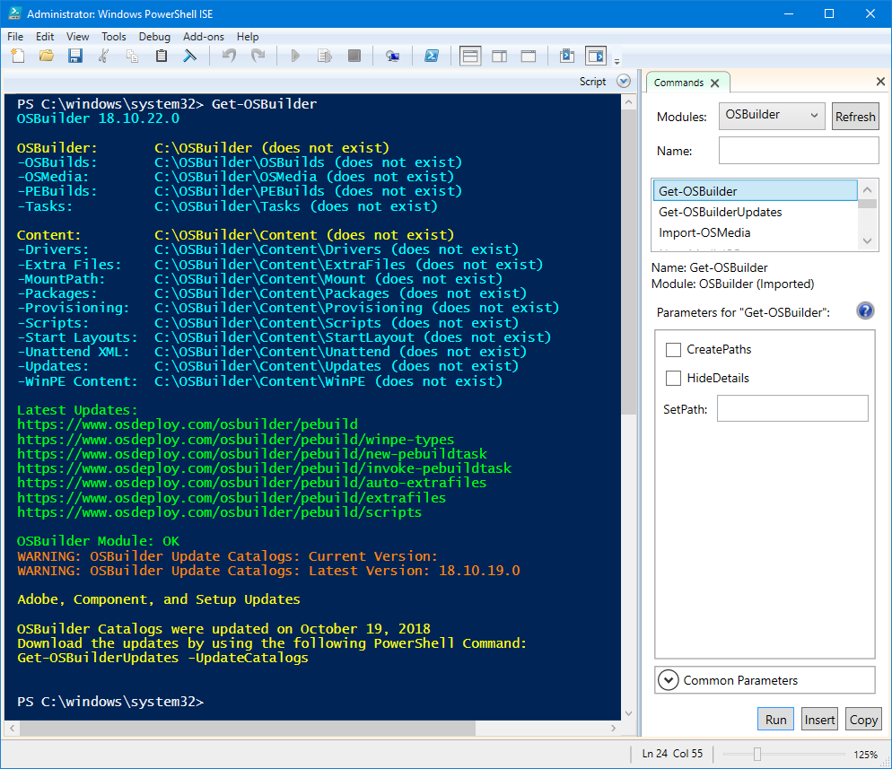
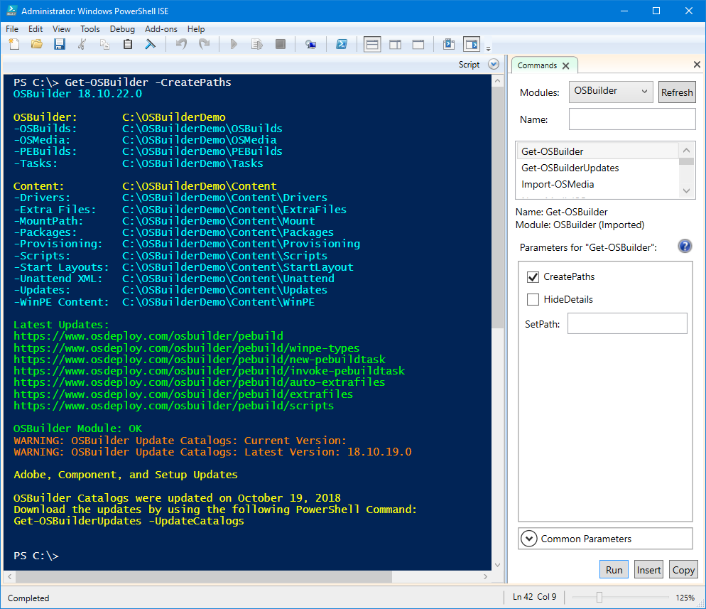
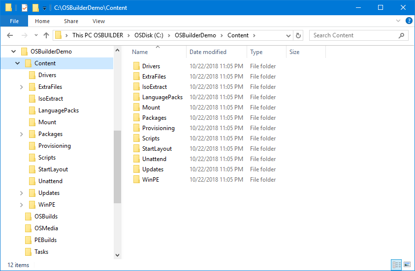
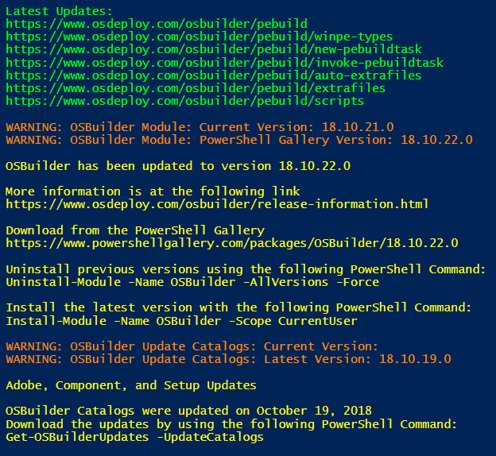

# Get-OSBuilder

Start by opening PowerShell ISE Elevated \(Run as Administrator\). Select the OSBuilder Module and then Get-OSBuilder.  Run

When executing Get-OSBuilder without any parameters, it will display a few things:

* OSBuilder PowerShell Module Version Information
* Directory Structure
* Update Information \(OSBuilder PowerShell Module is OK\)

## Get-OSBuilder -CreatePaths

This will create the OSBuilder directory structure

And the same structure in Windows Explorer

## Get-OSBuilder -HideDetails

This parameter does not output any information and is used by other functions to populate OSBuilder variables

## Additional Information

Latest Updates will be displayed.  This is typically reserved for updated documentation.  OSBuilder Module information will be displayed indicating if there is an update on PowerShell Gallery.  Update Catalogs are checked as well, to make sure you have the latest Cumulative Updates.

If you don't receive any Warnings, then everything is good!

