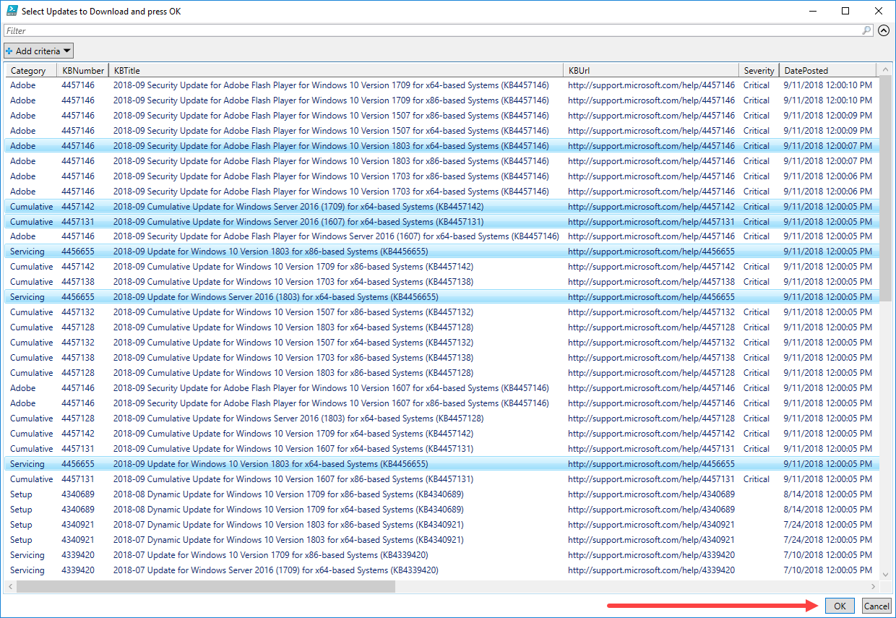

# Get-OSBuilderUpdates

Get-OSBuilderUpdates was released in OSBuilder 18.9.12.  Updates are downloaded into the Content\Updates directory.  When running Get-OSBuilder for the first time you will receive a message that Microsoft Updates are missing.

## Update Catalog

OSBuilder downloads a list of current Microsoft OS updates into an XML and a JSON file.  This is known as the Update Catalog \(think Microsoft Update Catalog\).  Once these files are downloaded, a list of available downloads will be displayed.

## Catalog Update

You can update the Catalog by using the -CatalogUpdate parameter

## Filter Updates

Its much easier to see the Filters that can be used in PowerShell ISE

## Download Updates

Once you have your proper Filters, the -Download parameter will get the updates for you

## Filter By Keywords

If you are feeling brave, you can also Filter by using Keywords

## PowerShell ISE GridView

If you are in PowerShell ISE, you can use the **IseGridView** parameter to display a list of available updates.  Select the ones you want to download \(use the **Download** parameter\) and press OK

## Remove Superseded

When Catalogs get new updates, old updates will need to be removed.  They will be displayed and you can use the **RemoveSuperseded** parameter to delete them

