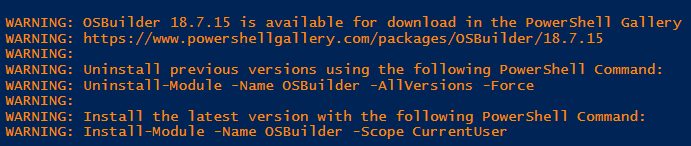

# Getting Started

I recommend running OSBuilder in PowerShell ISE \(as Administrator\) until you get familiar with the steps. The first step of using OSBuilder is to run Get-OSBuilder.

## Hardware Requirements

Offline Servicing of Windows 10 can take a considerable amount of time, especially on older releases. The process of Mounting a WIM, Applying a Cumulative Update, and performing DISM Image Cleanup will take as little as 30 minutes \(1803 x86\) on a healthy Intel Core i7 computer with a SSD, to almost 2 hours \(1607 x64\) on the same system.

I strongly recommend using a Workstation class system in performing these updates.

Since OSBuilder will mount Windows Images, I strongly recommend that you do not have any running Anti-Virus scanning files ON ACCESS. McAfee will prevent the dismounting of images properly.


OSBuilder works best on a stand alone Workgroup computer without an AntiVirus performing On Access Scanning.  Use a Virtual Machine \(with some power\) as an alternate solution


## Admin Rights

OSBuilder requires Admin Rights in PowerShell as you will be manipulating Windows Images. Make sure you launch PowerShell ISE as Administrator when using OSBuilder

## Supported Operating Systems

OSBuilder run perfectly in Windows 10.  You can work with Images based on Windows 10 or Windows Server 2016.

## OSMedia

If you used my previous attempt at this called OSMedia, you will need to get rid of it first.

## Get-OSBuilder

Start by opening PowerShell ISE as Elevated \(Run as Administrator\). Select the OSBuilder Module and then Get-OSBuilder

When executing Get-OSBuilder without any parameters, it will display a few things:

* OSBuilder PowerShell Module Version Information
* Directory Structure
  * \(does not exist\) is self explanatory
* Update Information \(OSBuilder PowerShell Module is OK\)

## Get-OSBuilder -OSBuilderPath

If you want to redirect OSBuilder to a different location, use this parameter

## Get-OSBuilder -CreatePaths

This will create the OSBuilder directory structure

And the same structure in Windows Explorer

## Updates

If OSBuilder is up to date, this will be displayed as a message on the bottom

If a newer version is released, this will change to a Warning message

If Servicing Stacks or Windows Updates have changed, a Warning message will be displayed as well

