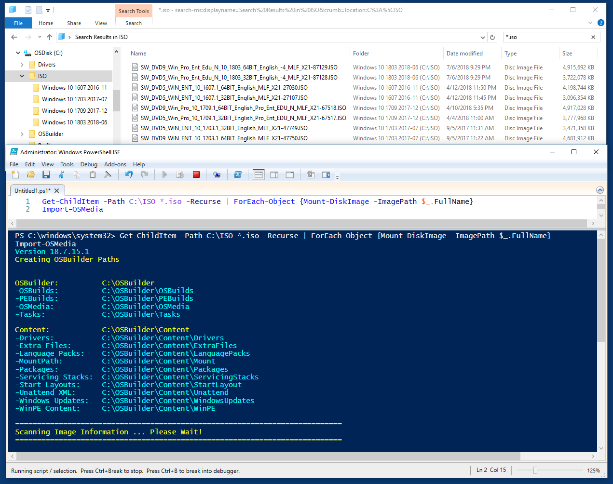
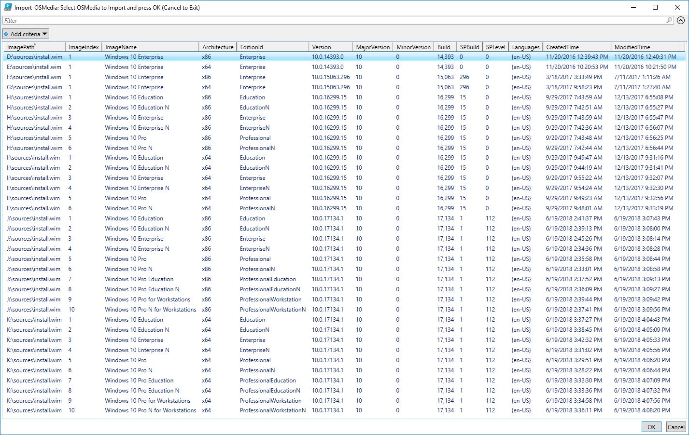
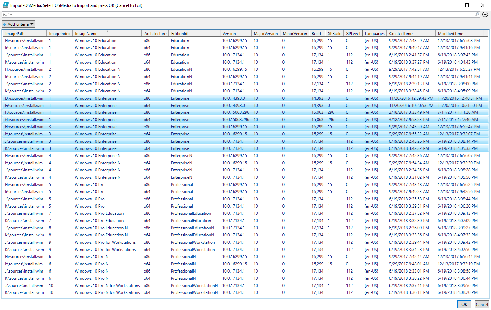

# Batch Import-OSMedia

Let's say I want to import all my Windows 10 Operating Systems into OSBuilder from ISO's. This can be easily done with two lines of PowerShell. Replace C:\ISO with the path to your Windows 10 ISO's. It will take a minute or so for OSBuilder to check all the install.wim's

```text
Get-ChildItem -Path C:\ISO *.iso -Recurse | ForEach-Object {Mount-DiskImage -ImagePath $_.FullName}
Import-OSMedia
```



## Select Operating Systems

OSBuilder will return a list of all Install.wim indexes.



Easy enough to sort them by ImageName and select the ones I want before pressing OK.



## Results

Easy enough to import. Since the OS's will be mounted and dismounted, the process will take about 5-10 minutes per Import, so go take a lunch if you have quite a few. Its a similar process to dismount the ISO's

```text
Get-ChildItem -Path C:\ISO *.iso -Recurse | ForEach-Object {Dismount-DiskImage -ImagePath $_.FullName}
```

