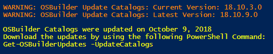
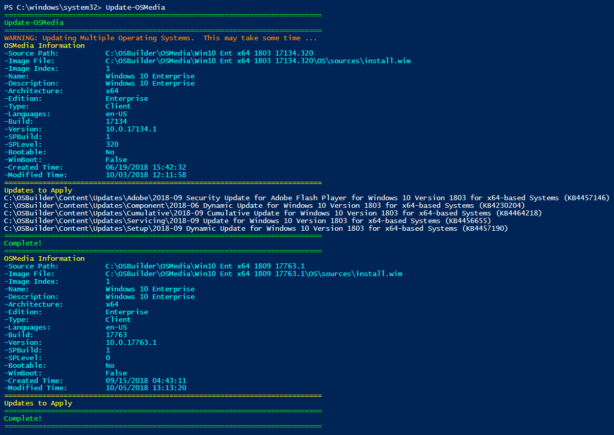
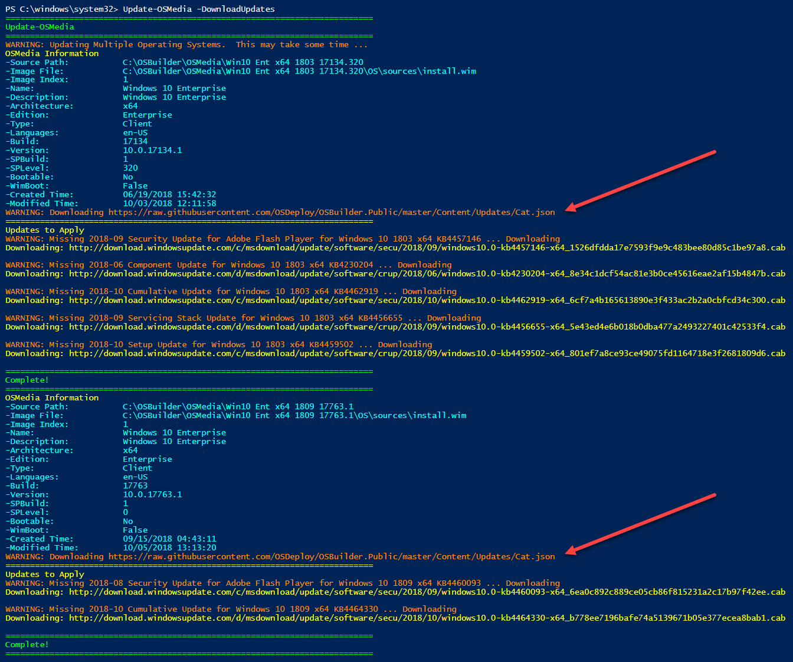

# Download - Necessary Updates

Updates can change frequently.  If new Updates are available, running **Get-OSBuilder** \(connected to the internet\) is an easy way to check if you need an update.

## Update-OSMedia

Let's say I have Windows 10 1803 x64 and Windows 10 1809 x64 and I want to just download the necessary updates.  I can select all my OSMedia Operating Systems at the same time and it will show me my required updates for both Operating Systems using my existing Update Catalogs.

## Update-OSMedia -DownloadUpdates

When running **Update-OSMedia** with the **DownloadUpdates** parameter, the Catalogs will be automatically updated to ensure they are on the latest version, then the required Updates will be downloaded.  You cal also add the **Execute** parameter to apply the Updates to your OSMedia

