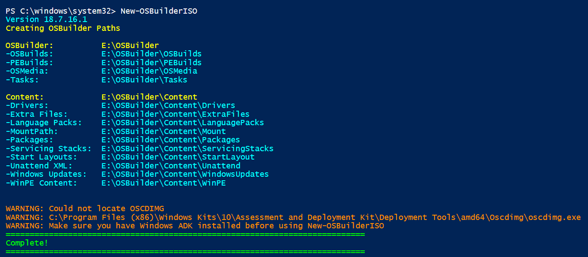
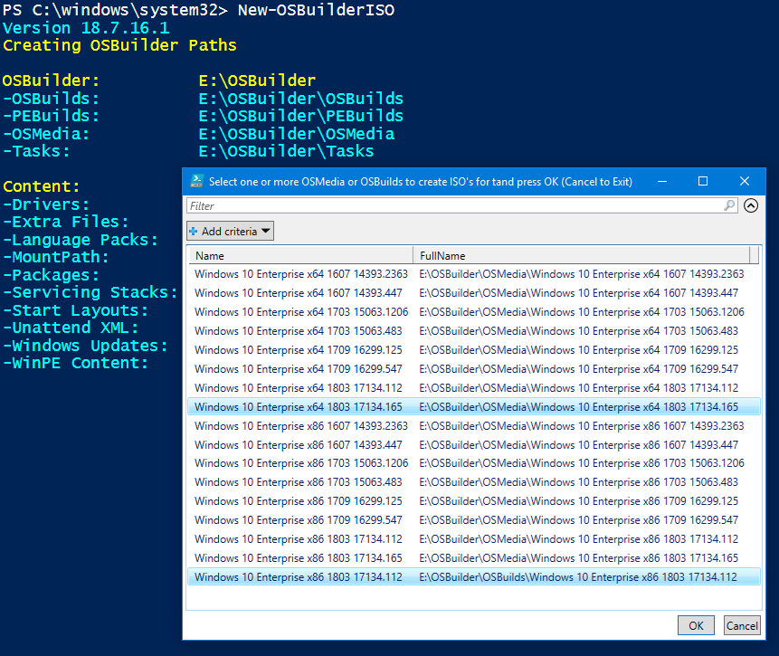
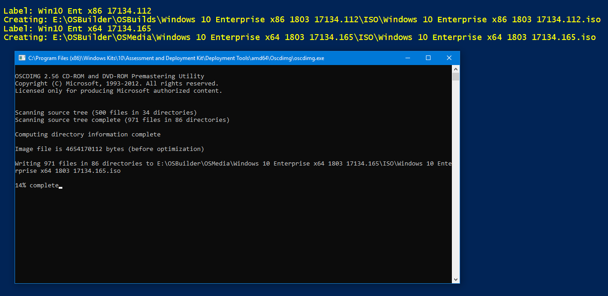
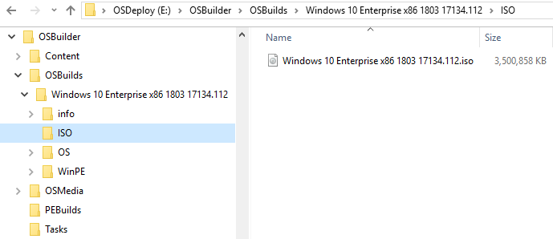

# New-OSBuilderISO

Starting in OSBuilder 18.7.16.1, you can now create an ISO from any OSMedia or OSBuild using **New-OSBuilderISO**

## ADK Required

You need to have ADK installed first or you will get a Warning message

## New-OSBuilderISO

There are no parameters. When running, simply multi-select the OSMedia or OSBuild you want to create an ISO for and press OK

The ISO's will automatically be generated

And saved within an ISO directory of your OSMedia or OSBuild. Enjoy!

