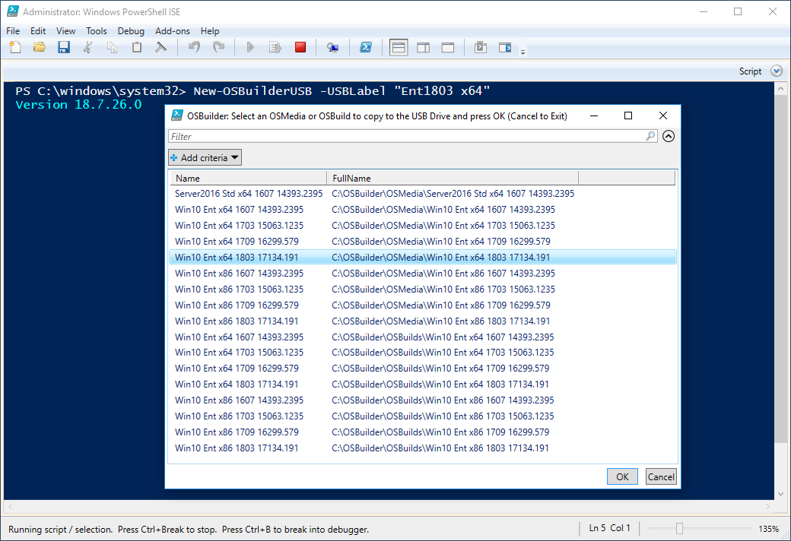
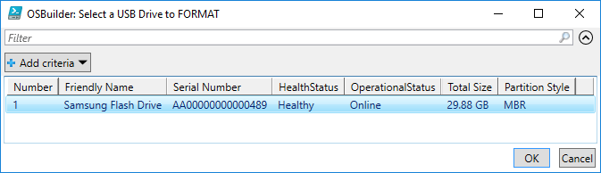
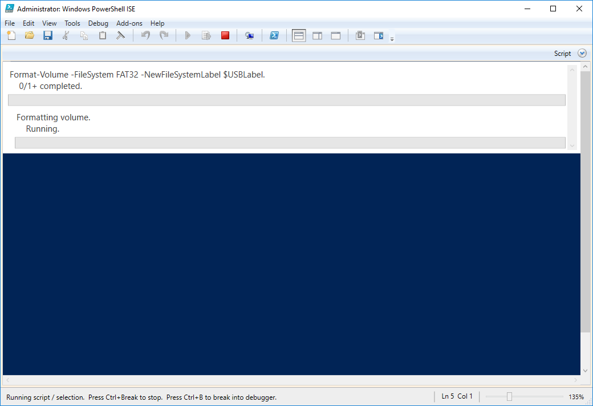
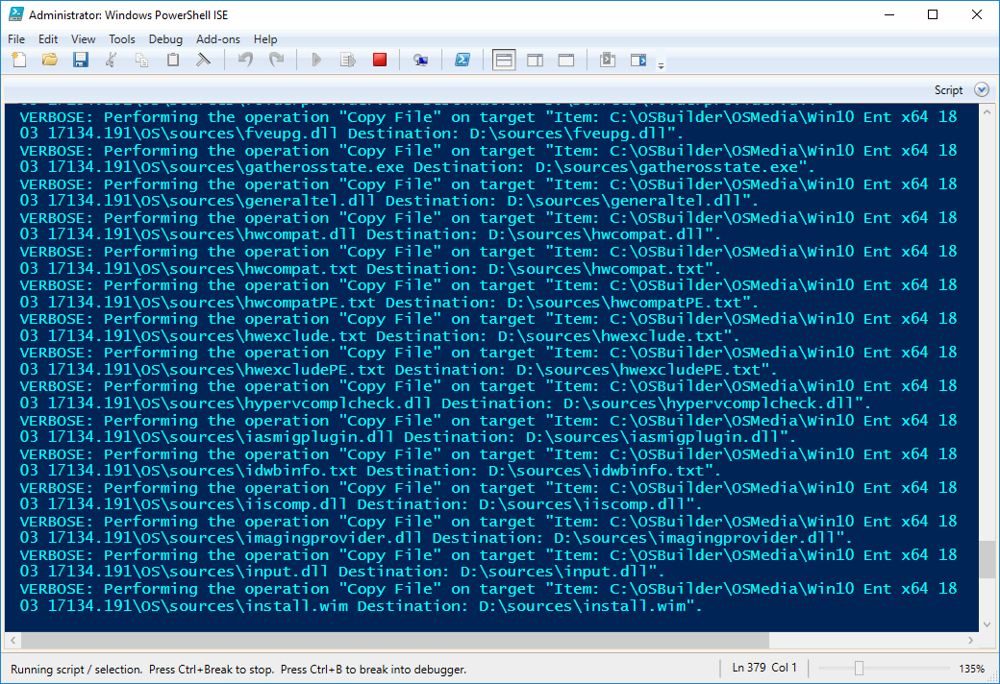

# New-OSBuilderUSB

> OSBuilder 18.7.26+

You can easily create a USB of your OSMedia or OSBuild using **New-OSBuilderUSB**. Since the USB will be formatted in FAT32, it must be 32GB or smaller, but large enough to fit your OS.  Make sure you use an 8-32GB USB Drive!

## Admin Rights

Yes you need it

## -USBLabel "Ent1803 x64"

The USB Drive Label cannot exceed 11 characters \(FAT32 limitation\). You have been warned.

## Select OSMedia or OSBuild

Select a single OSMedia or OSBuild to copy to the USB

## Select USB Drive to FORMAT

Warning, this will replace everything on the USB Drive so be careful

## Execution

Your USB Drive will be wiped

And files will be copied. Be patient, especially when it starts copying the Install.wim

## Complete

Enjoy!

