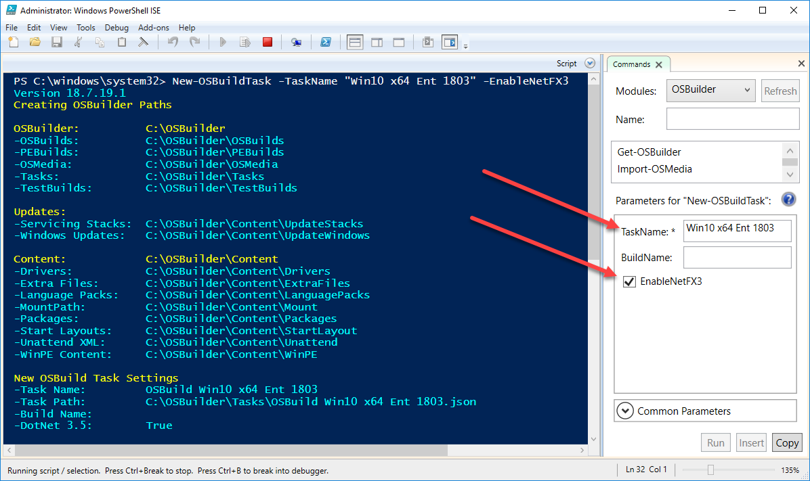
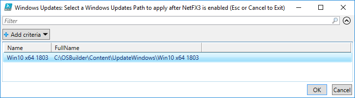
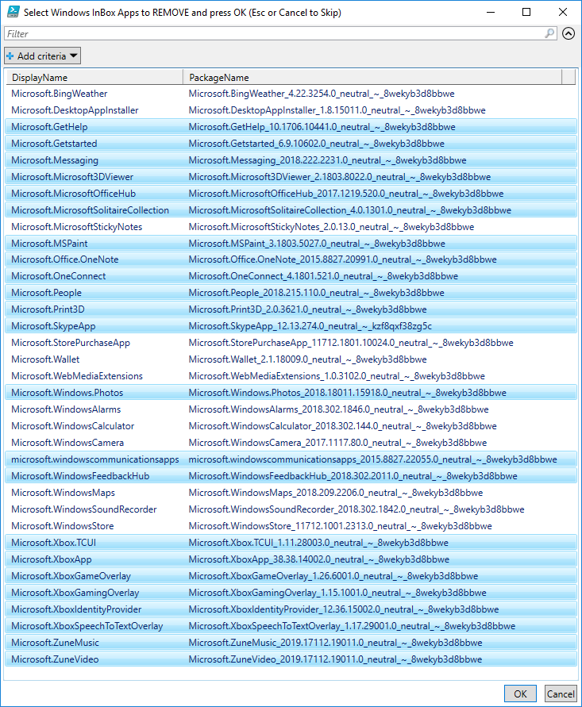
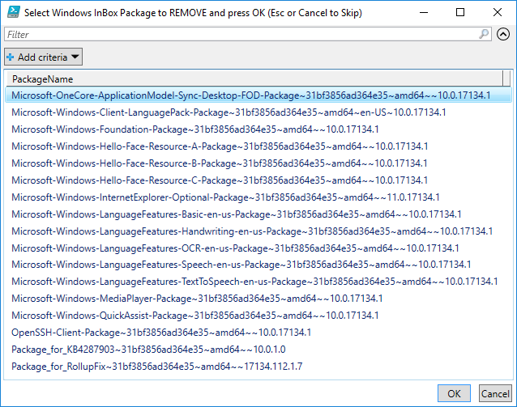
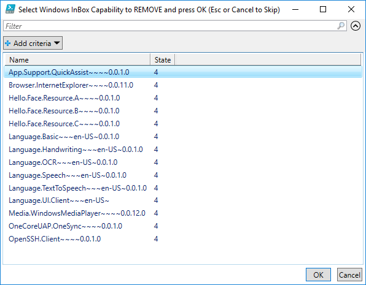
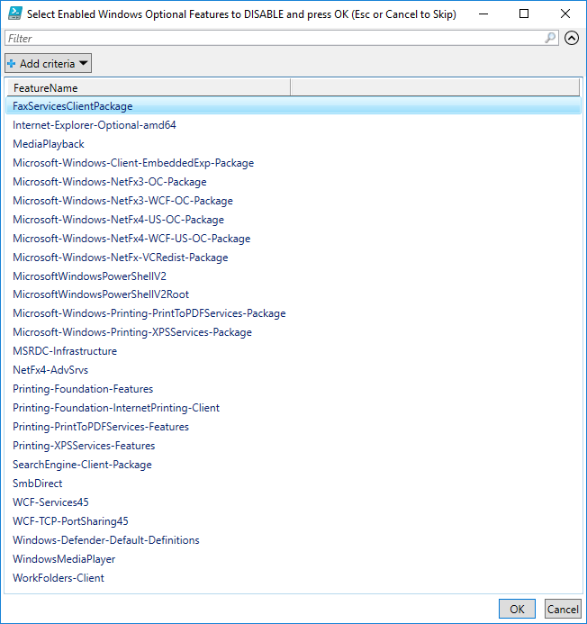
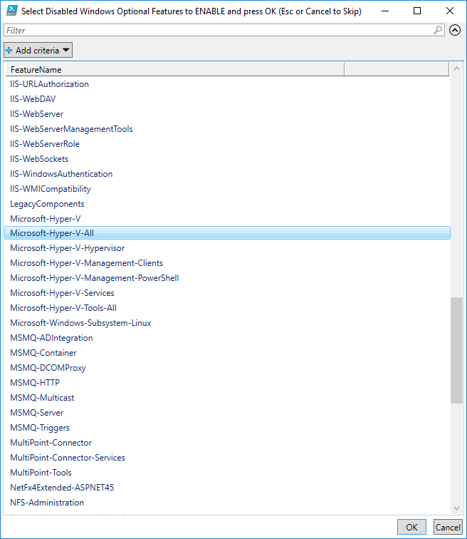
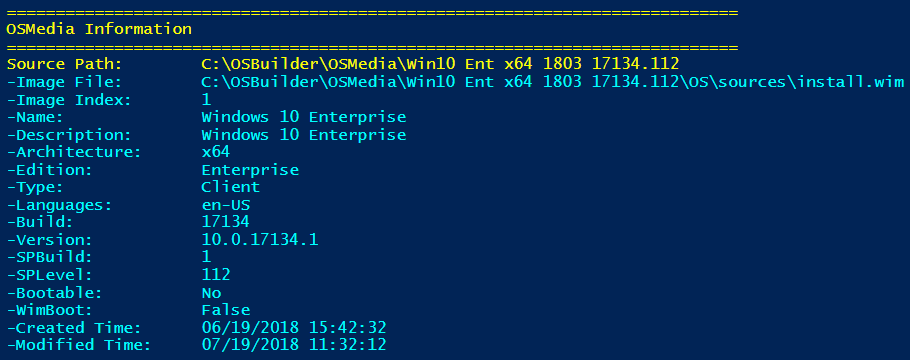
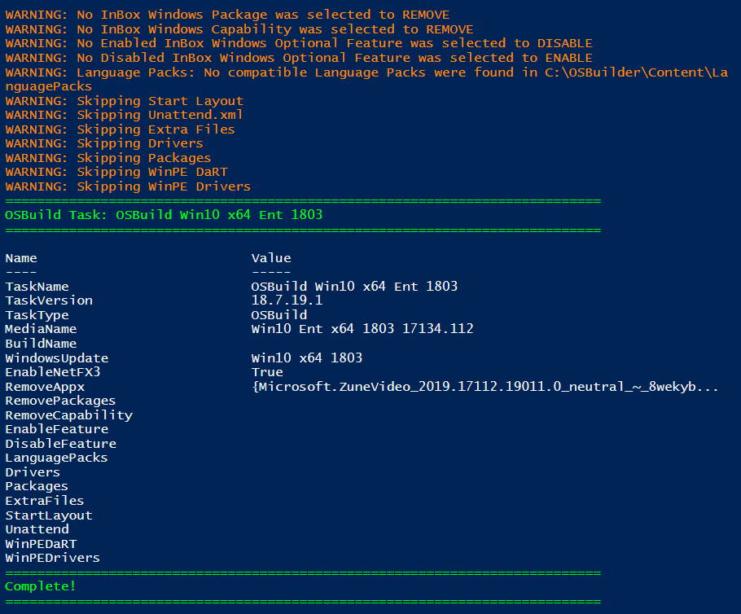

# New-OSBuildTask

An OSBuild Task will take an existing OSMedia and apply customizations. You can leave the BuildName blank, unless you have two different configurations where they will be named the same.

* Enable NetFX3
  * Reapply the latest Cumulative Update

## New-OSBuildTask -TaskName "Win10 x64 Ent 1803" -EnableNetFX3

The only requirement is a TaskName. I selected the same name as my OSMedia Task. Additionally I selected to EnableNetFX3

## Select a Source OSMedia

Select a single existing OSMedia to use for this Task and press OK

## Select Windows Update Directory

If NetFX3 was enabled, you will be prompted to select a Windows Updates directory. Make sure the contents of this directory are up to date.

## Select Inbox Apps to Remove

If you feel like removing any of the Appx Provisioned Packages from the Windows Image, select them from the list and press OK. I have selected the ones that I commonly remove without issue.

## Select Inbox Packages to Remove

I generally press Esc or Cancel as I leave these alone

## Select Inbox Capabilities to Remove

I generally press Esc or Cancel as I leave these alone. Give Quick Assist a try, it works quite well.

## Select Windows Optional Features to Disable

These are the Windows Optional Features that are ENABLED in the Offline Windows Image. If you want to DISABLE any, select them and press OK. I generally leave these alone.

## Select Windows Optional Features to Enable

These are the Windows Optional Features that are DISABLED in the Offline Windows Image. If you want to ENABLE any, select them and press OK. I generally leave these alone.

## Complete Task

The following is what you should see when you create the Task.

