# Update an Imported Operating System

You should repeat this process after new Cumulative Updates are released every Monthly Patch Tuesday

## Update-OSMedia

Update-OSMedia is used to apply Patches to an imported OSMedia.  Previous versions of OSBuilder required the creation of a Task to specify the Update sources, but this is no longer required.

Simply execute Update-OSMedia without any Parameters.  You will be prompted to select an imported OSMedia \(PowerShell ISE is required to select the Operating System for now\).  Make a selection and press OK.

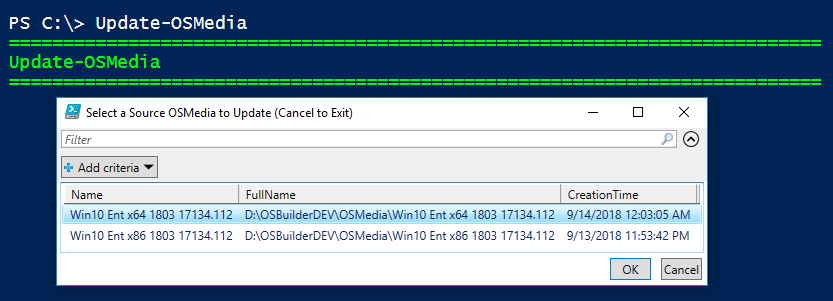

When running Update-OSMedia without any parameters and selecting an Operating System, information will be displayed.  This will also include a list of Microsoft Updates that will be applied.

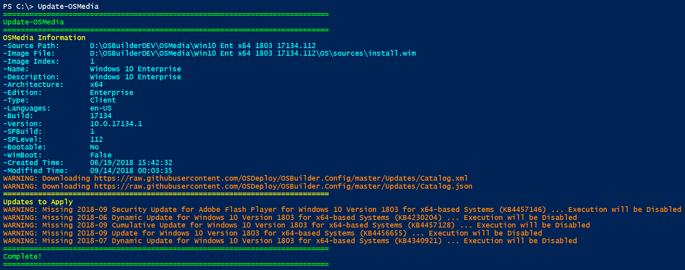

## Multiple OS Selection

You can update multiple OSMedia to update by multi-selecting the OSMedia

## Update-OSMedia -DownloadUpdates

Using this parameter will automatically download the required Microsoft Updates.  When using the **DownloadUpdates** parameter, the Update Catalog will be updated with the latest version.

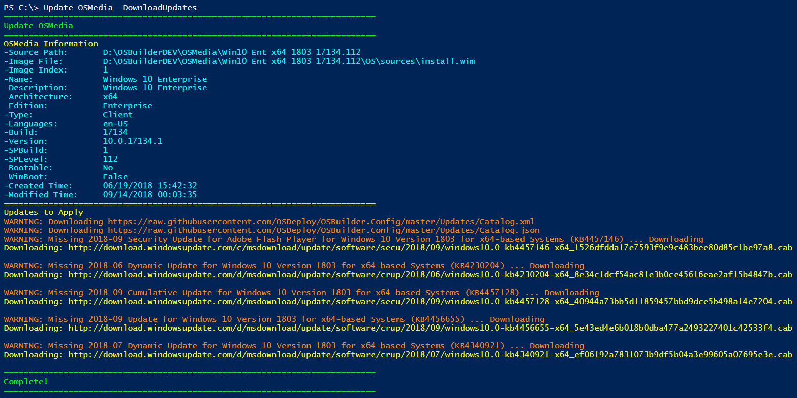

## Update-OSMedia -Execute \(Without Updates\)

When you are ready to perform the Update, use the **Execute** parameter.  You won't get far if you don't have the Microsoft Updates downloaded first

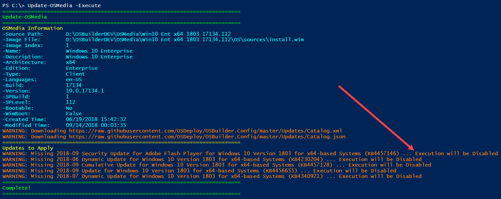

## Update-OSMedia -DownloadUpdates -Execute

Using this combination will download the Microsoft Updates and start the Update process.  This will take between 10-80 minutes depending on how many Updates need to be applied.

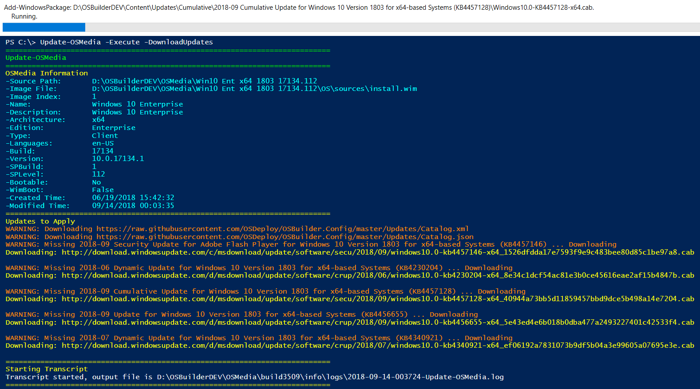

## Execute WinPE Phase

When the execution starts, information about the OS will be displayed and Microsoft Updates will be downloaded if needed

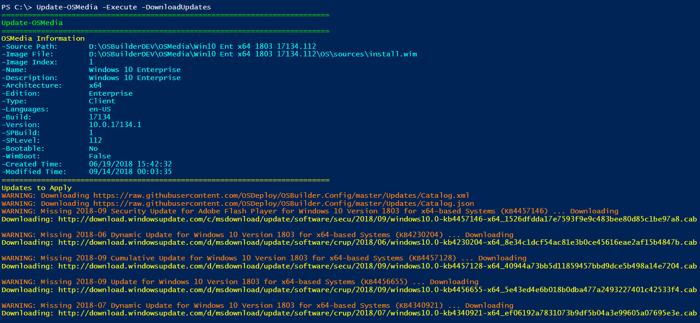

Once the Microsoft Updates are ready, the Transcript will start and the OS will be copied into a Working Directory.  If Setup Updates are necessary, they will be extracted into the Sources directory

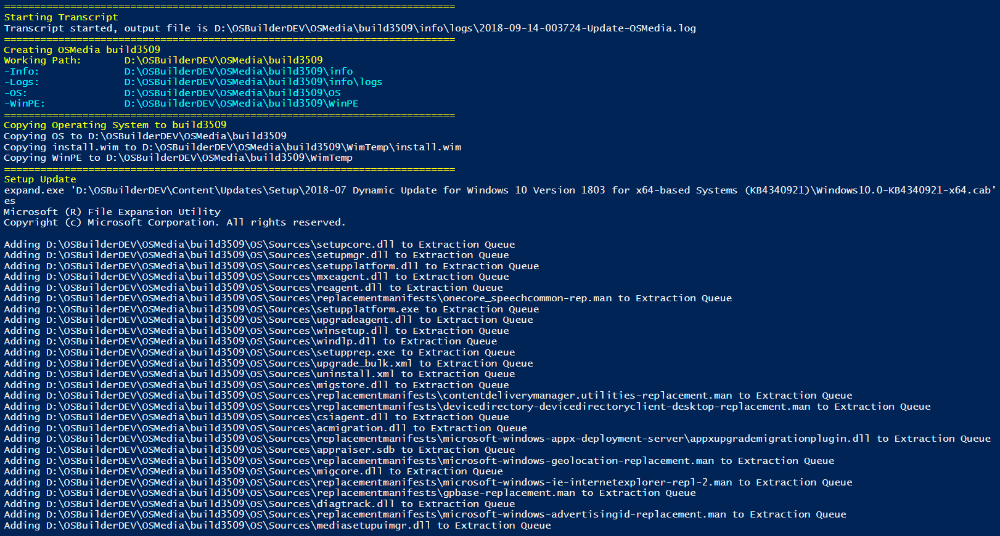

The WinPE wims will be mounted and the Sources directory will be compared with the mounted Setup wim

The latest Servicing Stack Update will be installed

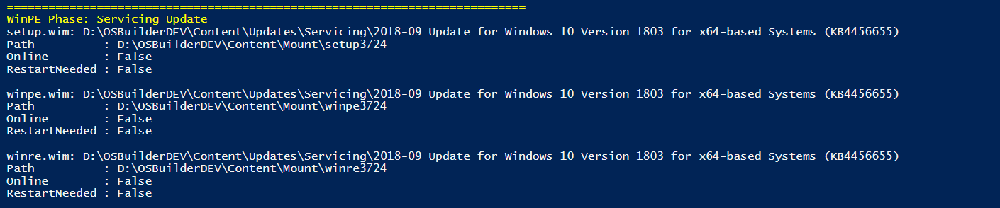

Followed by the latest Cumulative Update and Dism to perform an Image Cleanup

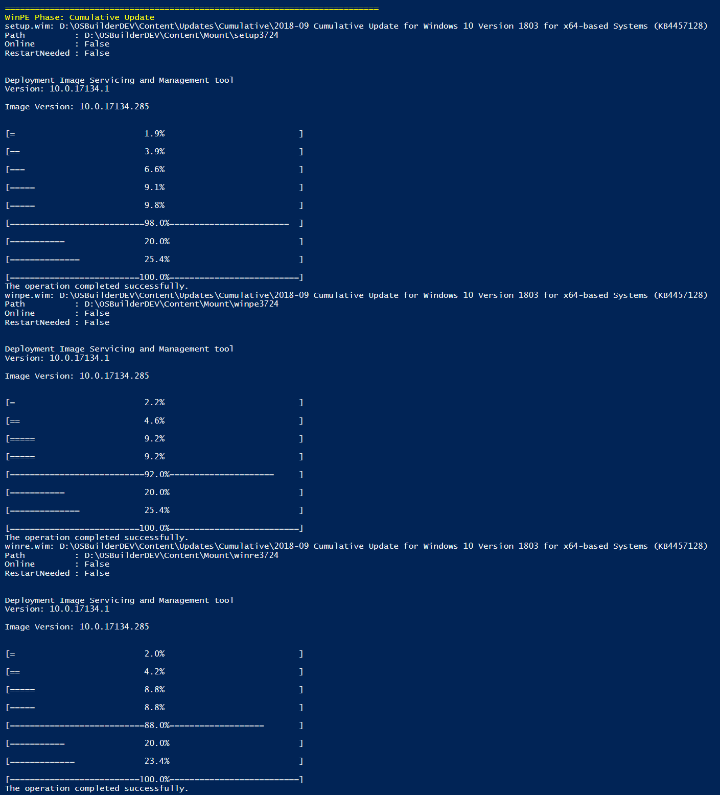

Sources will be updated with the Cumulative Updates files

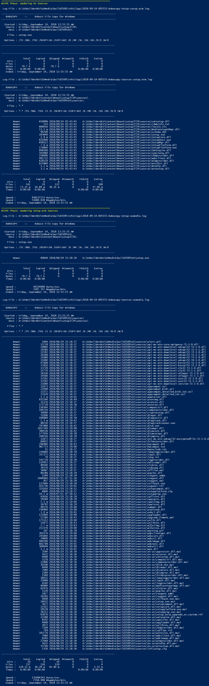

An inventory will be performed and the wims will be Dismounted and Saved

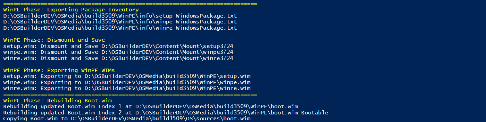

## Execute Install.wim Phase

