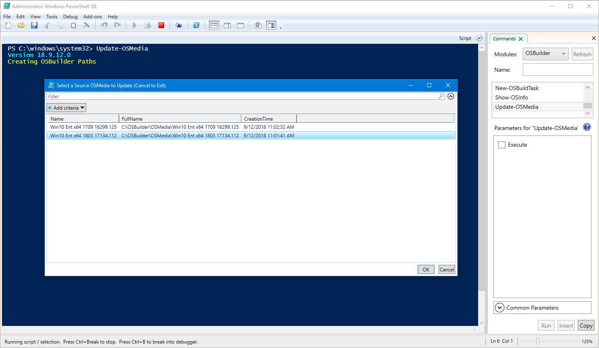
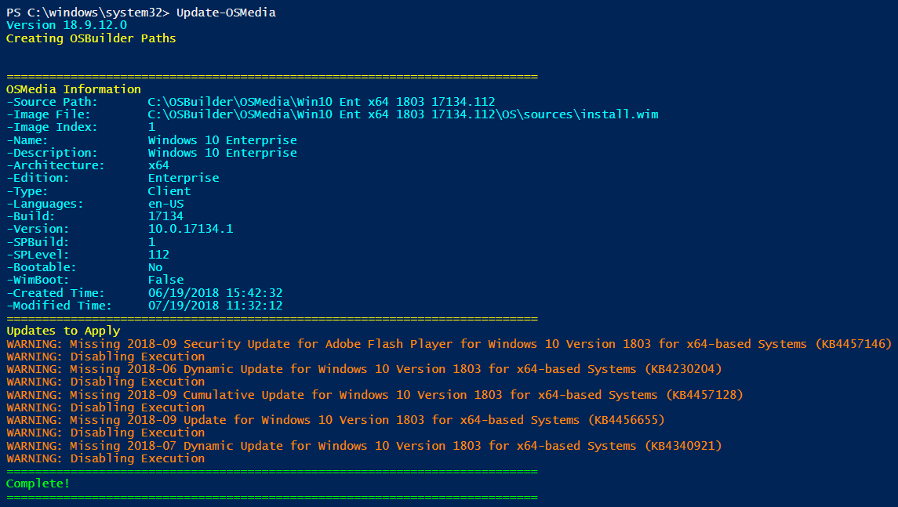
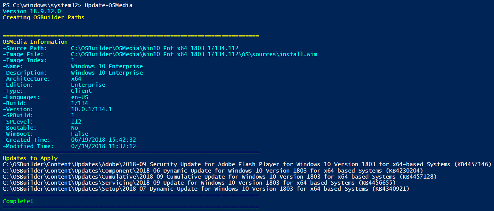
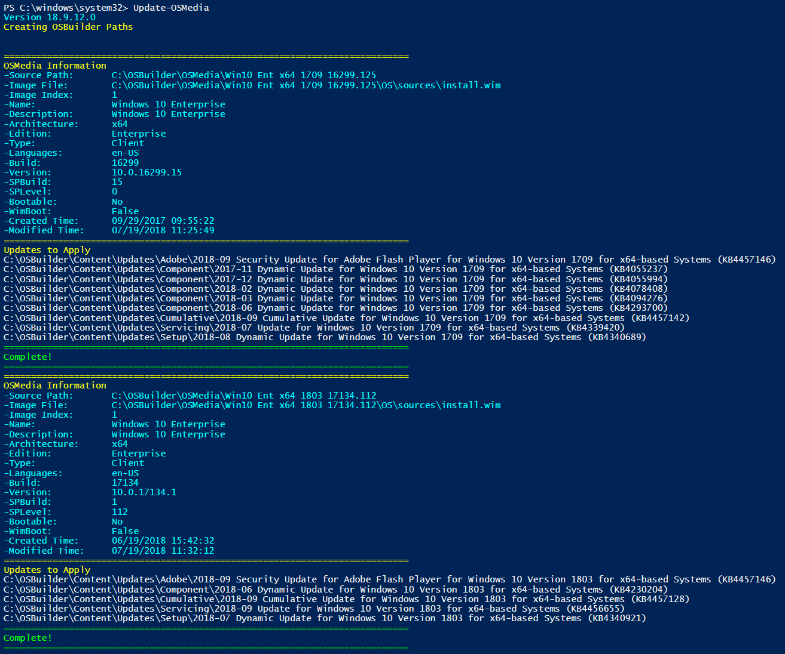
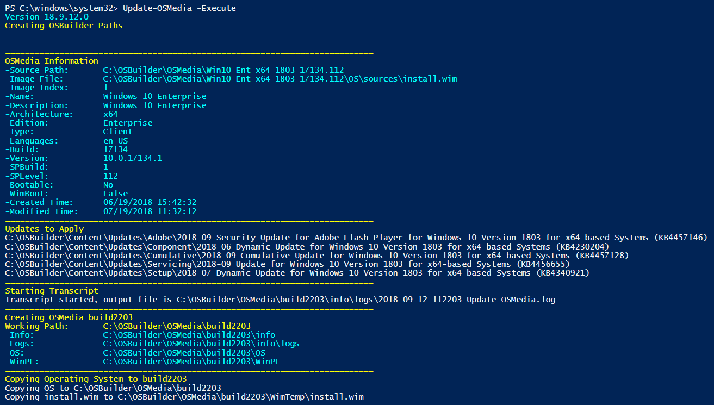

# Updated an Operating System

You should repeat this process after new Cumulative Updates are released every Monthly Patch Tuesday

## Update-OSMedia

Update-OSMedia is used to apply Patches to an imported OSMedia.  Previous versions of OSBuilder required the creation of a Task to specify the Update sources, but this is no longer required.

Simply execute Update-OSMedia without any Parameters.  You will be prompted to select an imported OSMedia \(PowerShell ISE is required to select the Operating System for now\).  Make a selection and press OK.

## Missing Updates

In the example below, I have not downloaded any updates and have received a Warning.  If the required Updates are not downloaded, you will not be able to Execute an Update

## Valid Updates

If all the required Updates are in place, then everything will check out

## Multiple Selection

You can update multiple OSMedia consecutively by multi-selecting the OSMedia

## Execution

If everything looks good, add the **Execute** Parameter to kick things off

