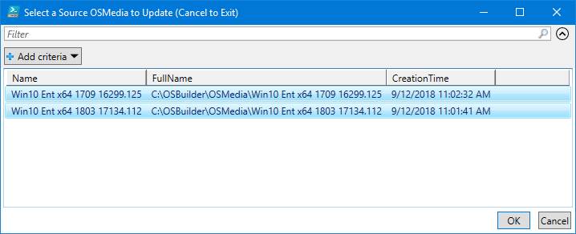

# Update an Imported Operating System

You should repeat this process after new Cumulative Updates are released every Monthly Patch Tuesday

## Update-OSMedia

Update-OSMedia is used to apply Patches to an imported OSMedia.  Previous versions of OSBuilder required the creation of a Task to specify the Update sources, but this is no longer required.

Simply execute Update-OSMedia without any Parameters.  You will be prompted to select an imported OSMedia \(PowerShell ISE is required to select the Operating System for now\).  Make a selection and press OK.

When running Update-OSMedia without any parameters and selecting an Operating System, information will be displayed.  This will also include a list of Microsoft Updates that will be applied.

## Update-OSMedia -DownloadUpdates

Using this parameter will automatically download the required Microsoft Updates.  When using the **DownloadUpdates** parameter, the Update Catalog will be updated with the latest version.

## Update-OSMedia -Execute \(Without Updates\)

When you are ready to perform the Update, use the **Execute** parameter.  You won't get far if you don't have the Microsoft Updates downloaded first

## Update-OSMedia -DownloadUpdates -Execute

Using this combination will download the Microsoft Updates and start the Update.

## 

## Multiple Selection

You can update multiple OSMedia to update by multi-selecting the OSMedia

