# Execute

When you are ready to update the imported OSMedia, use the **Execute** parameter

## Missing Updates

If you do not have the required updates downloaded, then Execution will be disabled.  In this case either download the required Updates using **Get-OSBuilderUpdates** or **Update-OSMedia** with the **Download** parameter

## Execution

If the updates aren't a problem, then you are clear to use the **Execute** parameter.  In the example below, the **Download** parameter was used to ensure that missing Updates were automatically downloaded

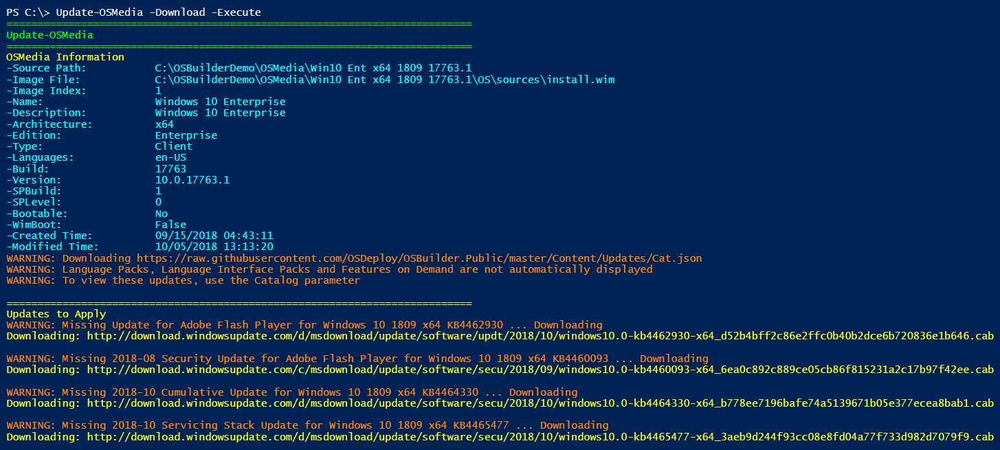

The PowerShell Transcript will be started and the Operating System to be updated will be copied to a Working Directory.

After the copy is complete, the WinPE Wims will be mounted

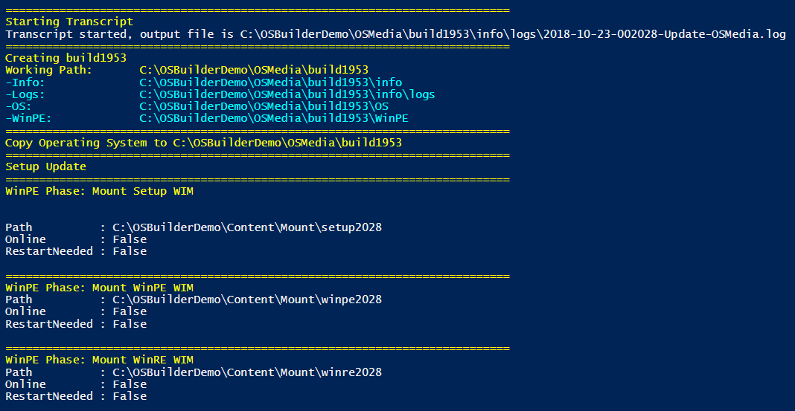

## WinPE Phase:  Servicing Update

The Servicing Stack Update will be applied to the mounted WinPE Wims

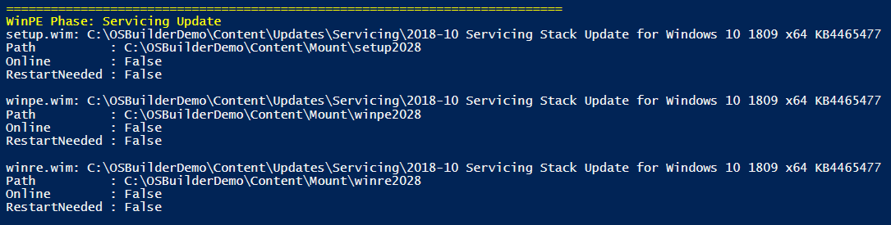

## WinPE Phase:  Cumulative Update

The Cumulative Update will be applied and DISM Image Cleanup will be performed on the WinPE Wims

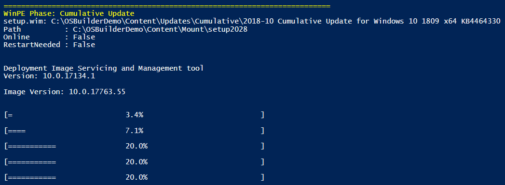

## WinPE Phase:  Setup Sync

Setup.exe and SetupHost.exe from the Setup.wim will be synchronized with the Media.  If this step is not completed, then you may receive errors when booting from the updated OSMedia to install the Operating System.

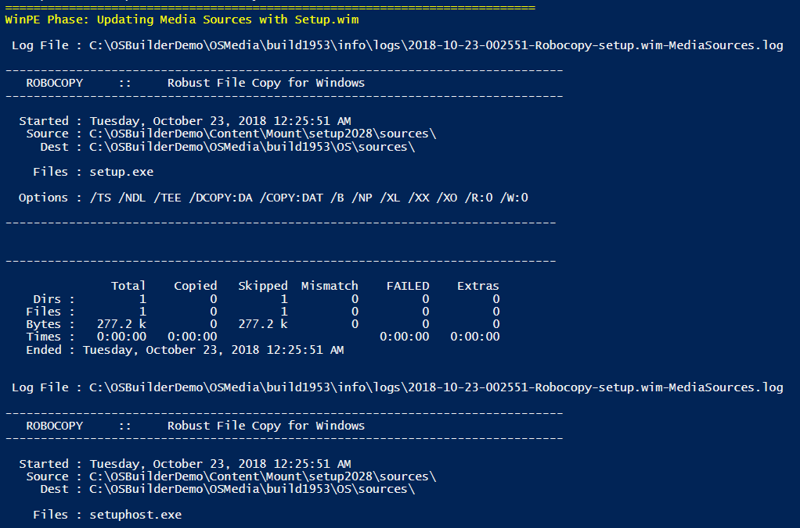

## WinPE Phase:  Completing Update

Once the updates to WinPE are complete, a Package inventory is created from the mounted WinPE Wims.  The Wims are Dismounted, Exported \(to compress\), and the Boot.wim is rebuilt.

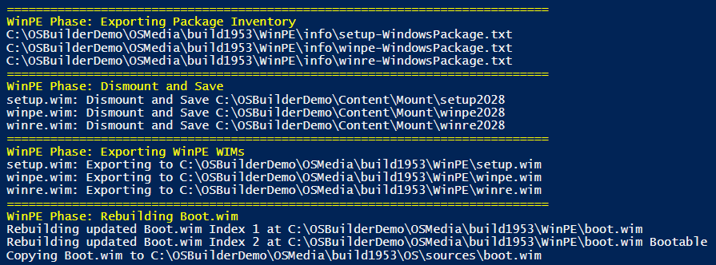

## Install.wim Phase:  Mount

The Install.wim will be mounted, and the updated WinRE.wim will be injected

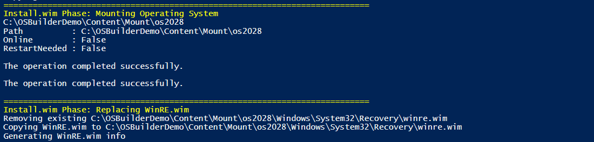

## Install.wim Phase:  Updates

In this phase, any needed Servicing Stacks, Component Update, Cumulative Update, and Adobe Updates will be applied.

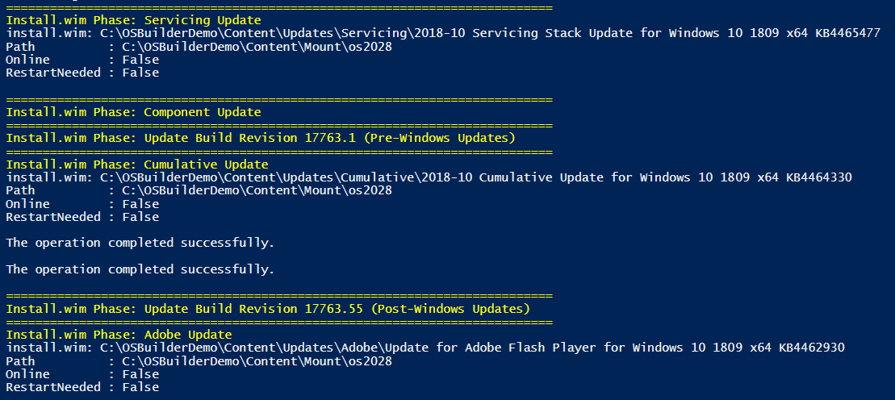

## Install.wim Phase:  Image Cleanup

This step will take an incredible amount of time.  Take a break

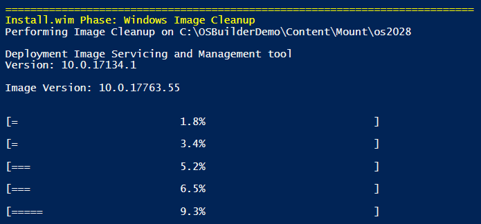

## Install.wim Phase:  Capture Auto ExtraFiles

Auto ExtraFiles will be copied from the mounted Install.wim

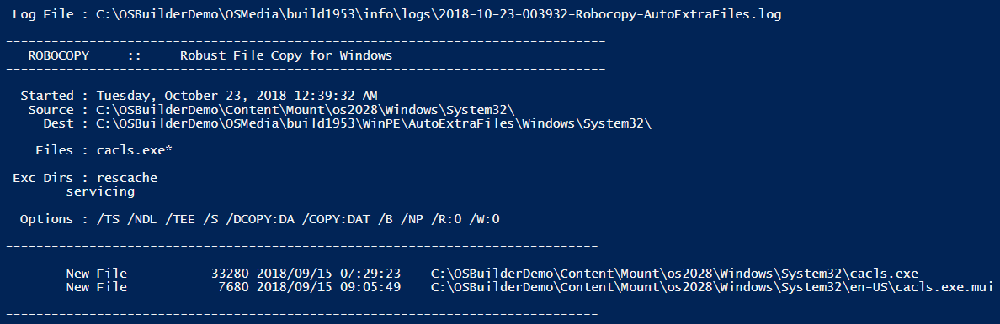

## Install.wim Phase:  Dismount and Save

The Install.wim will be dismounted and exported \(to compress\).  Image information will be captured.

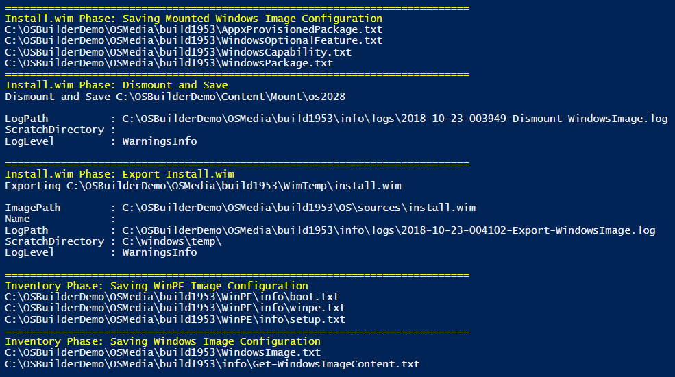

## Complete

Information about the Install.wim will be displayed as well as a listing of the installed Packages.  The Working Directory will be renamed to match the Windows Image information including the UBR.

This image can now be imported into ConfigMgr or MDT, or you can even customize this as an OSBuild.

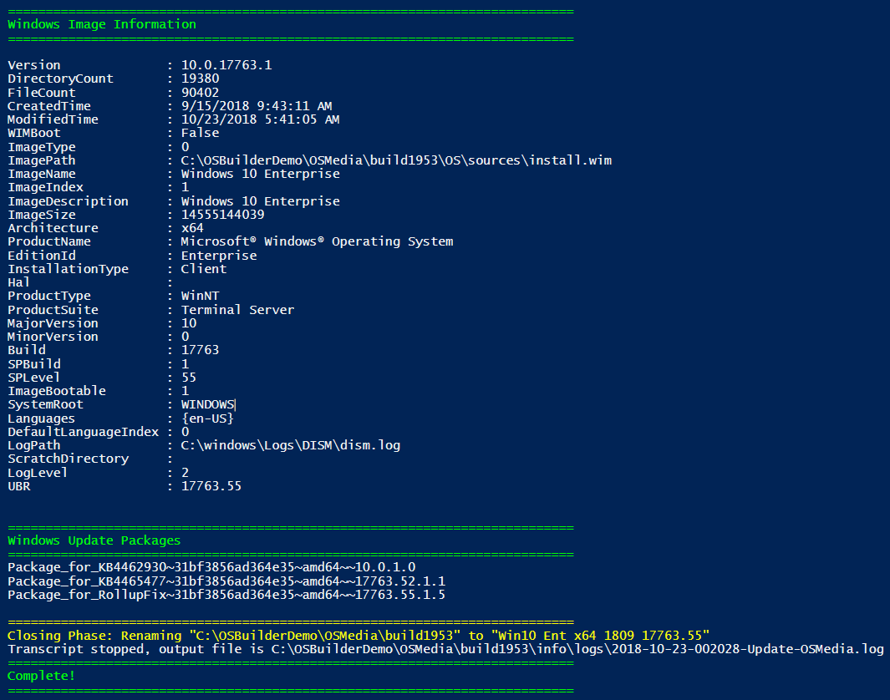

